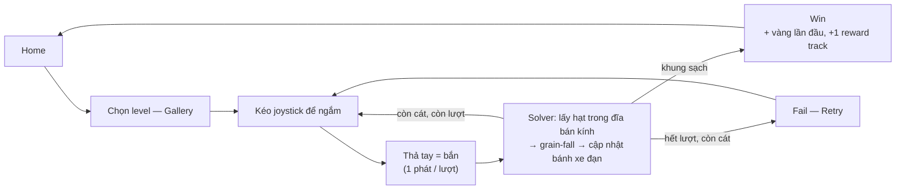
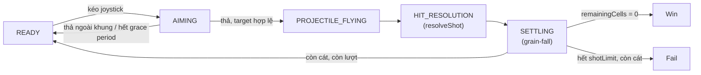
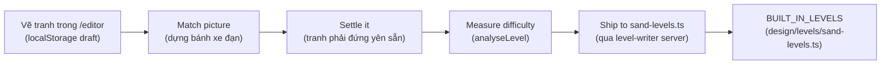
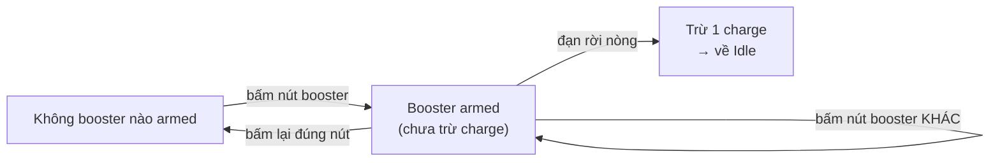
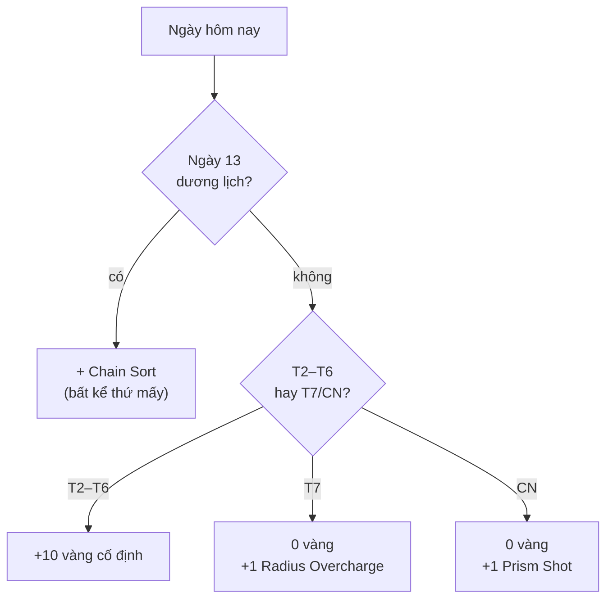
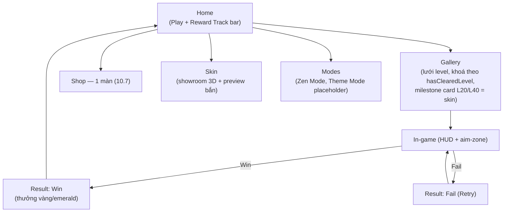
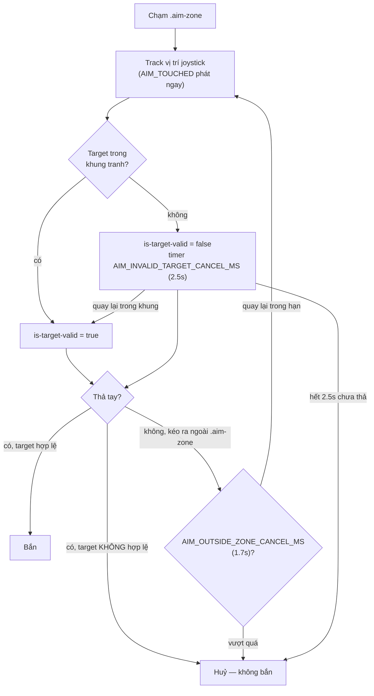
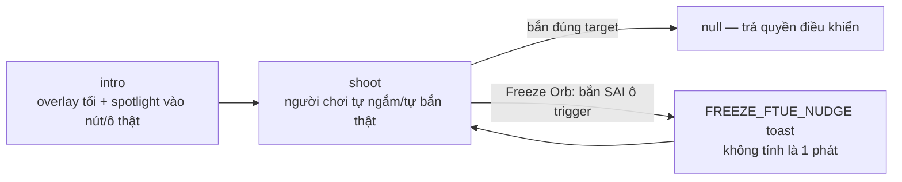
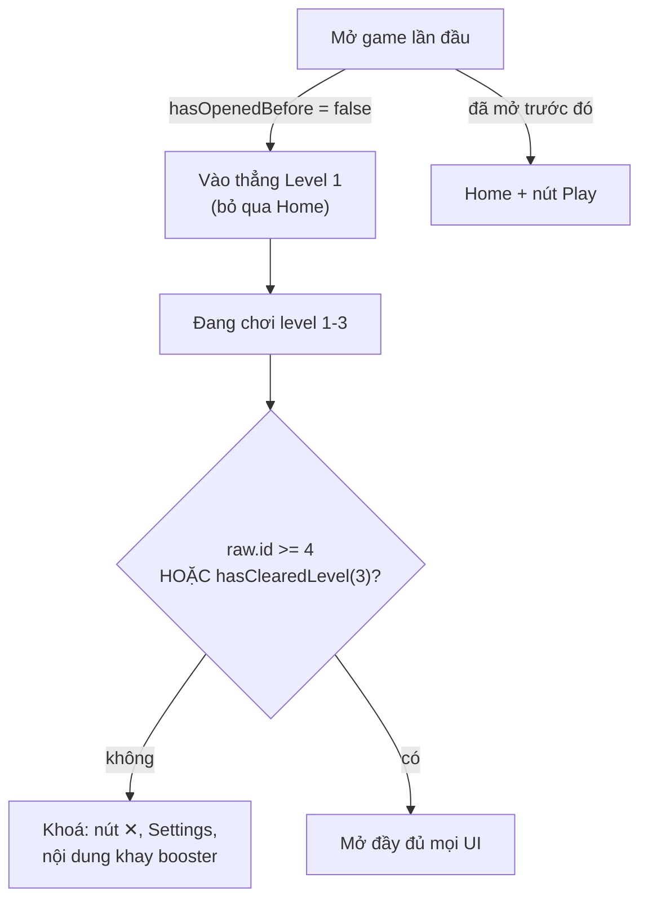
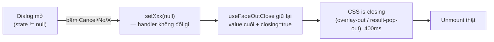

# Game Design Document — 3D Sand Cannon Sort

> Trạng thái: khớp với source tại nhánh `main`. Core cũ (xoay model, Goal/Batch, Weak Point, Rainbow
> Target) đã bị gỡ khỏi source sau pivot sang gameplay "bắn theo bán kính" — không tồn tại trong code.
> Tài liệu này mô tả **thiết kế hiện tại**, không phải nhật ký thay đổi. Lịch sử/lý do từng quyết định
> nằm ở [CHANGELOG.md](CHANGELOG.md); kiến trúc code ở `README.md`; spec kỹ thuật
> từng hệ thống ở `docs/features/*.md`. Một con số chỉ sống đúng một chỗ — tài liệu này trỏ vào nguồn,
> không chép lại.

## Mục lục

1. [Tầm nhìn & Pillar](#1-tầm-nhìn--pillar)
2. [Core loop](#2-core-loop)
3. [Luật lõi](#3-luật-lõi)
4. [Thông số & tuning](#4-thông-số--tuning)
5. [Map mechanic](#5-map-mechanic)
6. [Level authoring pipeline](#6-level-authoring-pipeline)
7. [Beat chart — 50 level](#7-beat-chart--50-level)
8. [Đường cong độ khó](#8-đường-cong-độ-khó)
9. [Booster](#9-booster)
10. [Economy](#10-economy)
11. [Cosmetic / Skin súng](#11-cosmetic--skin-súng)
12. [Art direction](#12-art-direction)
13. [UI/UX](#13-uiux)
14. [Kiến trúc & file map](#14-kiến-trúc--file-map)
15. [Testing & validation](#15-testing--validation)
16. [Open Decision & roadmap](#16-open-decision--roadmap)
17. [Glossary](#17-glossary)

---

## 1. Tầm nhìn & Pillar

**3D Sand Cannon Sort** — puzzle casual: bắn đạn màu vào một bức tranh cát 3D để dọn sạch trước khi
hết lượt bắn. Chơi một ngón tay, không xoay model, không giải đố không gian. Độ khó nằm ở **đọc tranh
+ tính lượt bắn**.

| # | Pillar | Luật thi hành |
| --- | --- | --- |
| 1 | **Minh bạch tuyệt đối** | Điểm chạm = điểm bắn trúng, luôn khớp cái mắt thấy. Skin không bao giờ làm lệch quỹ đạo đạn (`costumes.ts`, rig không chạm `muzzleAnchor`). |
| 2 | **Một ngân sách duy nhất** | `shotLimit` là độ khó — không phải một trong nhiều biến. Bánh xe đạn tuần hoàn (mục 3.2) đảm bảo không có "đạn chết": thua vì tính sai, không vì bị chặn. |
| 3 | **Mechanic là data** | Wall/Lock&Key/Freeze là field tuỳ chọn trong `SandLevelConfig`. Không khai báo field = level chạy y hệt bản không có mechanic. Solver không rẽ nhánh theo level. |

---

## 2. Core loop

**Pitch:** *"Một khẩu súng cát, một bức tranh, một bàn tay — bắn đúng màu, đúng chỗ, đúng số lần,
trước khi hết đạn."*



Không có bước chờ (không cooldown dài, không energy/tim chặn giữa ván) — độ trễ duy nhất là
`SHOT_COOLDOWN_MS` = 400ms + thời gian đạn bay/cát settle thật.

**Đối tượng người chơi:** puzzle casual quen thể loại "sand sort" (Sort It 3D, Screw Sort...) — luật
nhìn hiểu ngay, phiên chơi vài chục giây tới vài phút, tiến triển hiện ngay trên UI.

---

## 3. Luật lõi

Nguồn duy nhất: `RadiusGameplayPolicy` (`app/game/sand-types.ts`, hằng số `RADIUS_GAMEPLAY`). Cả 50
level chạy dưới đúng policy này. Chi tiết:
[radius-shot-rule.md](docs/features/radius-shot-rule.md).

### 3.1. Phát bắn

Bắn trúng lấy **mọi hạt cùng màu trong đĩa bán kính `sortRadius`** quanh điểm chạm — không xoá cả
connected body. Bắn giữa mảng khoét một lỗ tròn; bắn rìa chỉ gặm vài hạt. (Khác brief gốc, vốn chốt
xoá cả body — đổi có chủ đích để "chọn điểm bắn" là một kỹ năng thật.)

### 3.2. Bánh xe đạn

`ammoQueue` chỉ là thứ tự khởi đầu. Bắn xong: màu còn cát trên board → viên đạn quay lại cuối hàng;
màu sạch hẳn → rời bánh xe. Không bao giờ có đạn chết.

### 3.3. Miss vs. trượt khung

| Loại | Tốn lượt? | Phản hồi |
| --- | --- | --- |
| `NO_MATCH` — đĩa chạm board nhưng không trúng màu đang cầm | Có | `.miss-flash` — vignette đỏ phủ toàn màn hình (kể cả đè HUD), chớp rồi tắt 0.5s |
| `MISS` — bắn hụt ra ngoài khung / trúng thành khung | Không | `.miss-flash` (cùng hiệu ứng) |

Hai loại lỗi khác nhau (quyết định sai chỗ vs. input lỗi) nên bị phạt khác nhau, nhưng phản hồi hình
ảnh dùng chung một tín hiệu duy nhất — không phân biệt bằng chữ, để người chơi không rời mắt khỏi
tranh.

### 3.4. Win / Fail

Win kiểm tra trước fail. Thắng khi `remainingCells === 0` — kể cả đúng phát cuối. Thua khi hết lượt
mà sau khi phát cuối resolve + settle xong vẫn còn cát.

### 3.5. State machine một phát bắn

Chỉ bắn được ở state `READY`.



Không bắn được ở `AIMING`(đã thả)/`FLYING`/`HIT_RESOLUTION`/`SETTLING` — người chơi luôn thấy trọn hệ
quả phát trước rồi mới ra quyết định kế (pillar #1).

### 3.6. Adjacency & tie-break

- `adjacencyMode: ORTHOGONAL_4` — chỉ chạm cạnh mới nối, chạm góc không nối.
- `slideTieBreak: LEFT_FIRST_TEMP` — hạt trượt chéo khi cả hai bên đều trống: trái luôn thắng
  (deterministic — cùng một tranh luôn ra đúng một kết quả).

### 3.7. Bảng đầy đủ `RadiusGameplayPolicy`

| Trường | Giá trị | Open Decision (brief) |
| --- | --- | --- |
| `adjacencyMode` | `ORTHOGONAL_4` | 1 & 2 |
| `settlePolicy` | `GRAIN_FALL_TEMP` (rơi từng hạt, không cohesion) | 3 |
| `slideTieBreak` | `LEFT_FIRST_TEMP` | 4 & 5 |
| `missAmmoPolicy` | `MISS_IS_FREE_TEMP`* | 6 & 7 |
| `deadBulletPolicy` | `VALIDATOR_ONLY_TEMP` (chặn ở editor, không fallback runtime) | 12 |
| `shotRule` | `RADIUS_SORT_TEMP` | ngoài brief, xem 3.1 |
| `ammoRule` | `CYCLE_UNTIL_COLOR_CLEARED_TEMP` | ngoài brief, xem 3.2 |
| `nextPreviewCount` | `3` | 9 |
| `cannonConfigRef` | `"prototype-classic-cannon"` | ballistics kế thừa bản pre-pivot |

\* Tên gọi dễ nhầm: "miss" ở đây = *trúng board, sai màu*, khác với *bắn hụt khung* (xem 3.3).

Mọi trường hậu tố `_TEMP` là Open Decision brief chưa chốt — đổi giá trị này, không sửa rải rác trong
solver. Danh sách đầy đủ:
[radius-shot-rule.md](docs/features/radius-shot-rule.md#mọi-trường-của-radiusgameplaypolicy).

---

## 4. Thông số & tuning

### 4.1. Cannon & input

| Thông số | Giá trị | Ý nghĩa |
| --- | --- | --- |
| `FIXED_LAUNCH_SPEED` | 19 | Tốc độ đạn rời nòng |
| `SHOT_COOLDOWN_MS` | 400 ms | Nghỉ tối thiểu giữa hai phát |
| `PROJECTILE_RADIUS` | 0.15 | Dung sai va chạm nếu tâm ngắm rơi vào pixel trống |
| `JOYSTICK_RADIUS` | 64 px | Tầm di chuyển núm joystick ảo |
| `JOYSTICK_RESPONSE_RADIUS` | 256 px, trần = 0.42 × cạnh ngắn `.scene-host` | Khoảng kéo thật để đáp ứng ngắm đạt 100%/trục |
| `AIM_OUTSIDE_ZONE_CANCEL_MS` | 1700 ms | Grace period ngoài `.aim-zone` trước khi huỷ |
| `AIM_INVALID_TARGET_CANCEL_MS` | 2500 ms | Grace period khi target ở ngoài khung tranh (xem 13.3) |
| Control sensitivity | 0.5 – 2.0 | Slider Settings, scale trực tiếp phản ứng ngắm |

**Tầm với joystick khớp đúng 4 góc khung** (không phải ellipse nội tiếp): `axisResponse()` tính riêng
độ lệch có dấu từng trục thay vì độ lớn vector chung, và tầm với chiếu theo kích thước khung thật
(`cursorForCurrentStick()`), không theo tỉ lệ viewport cố định — quan trọng với tranh gần vuông
(80×90) vốn lấp gần hết cả `FIT_WIDTH` lẫn `FIT_HEIGHT`.

### 4.2. Board & simulation

| Thông số | Giá trị | Ý nghĩa |
| --- | --- | --- |
| `pixelScale` | thường 5 (author 12×14 → board 60×70); level lớn dùng thẳng 60×70…80×93 ở scale 1 | Hệ số phóng nguyên từ blueprint lên board pixel — không đổi puzzle (số vùng, liền kề giữ nguyên) |
| Ngân sách pixel editor | ~4.500 px | Editor tự chọn `pixelScale` lớn nhất giữ board dưới ngưỡng, cho override tay |
| `sortRadius` | 2 – 18 ô blueprint | Bán kính đĩa lấy hạt, scale cùng board |
| Trần Radius Overcharge | `hypot(frame.width, frame.height)` | Nhân đôi `sortRadius` không vượt đường chéo khung |

### 4.3. Board là canvas 2D, không phải mesh 3D

Tranh cát là một `HTMLCanvasElement` dán lên **một** `THREE.PlaneGeometry`. Khung/cannon/ánh sáng vẫn
3D thật. Hệ quả thiết kế: **độ phân giải nhìn thấy = độ phân giải quyết định luật** — kích thước
blueprint không phải chỉ số thẩm mỹ, nó là độ chi tiết mà bán kính đạn phải cắt qua. Chi tiết:
[rendering-pixel-board.md](docs/features/rendering-pixel-board.md).

---

## 5. Map mechanic

Mỗi mechanic là field tuỳ chọn — không đọc trường thì level chạy y hệt bản không có mechanic.

| Mechanic | Ký tự | Lần đầu | Trạng thái |
| --- | --- | --- | --- |
| Wall Obstacle | `W` | Level 11 | Ship — arc 2 + arc tổng hợp |
| Lock & Key | chữ thường = cát khoá, `K` = chìa khoá | Level 21 | Ship — arc 3 + arc tổng hợp |
| Freeze Map | `@` | Level 31 | Ship — arc 4 + arc tổng hợp |

### 5.1. Wall Obstacle (`W`)

Ô chắn cứng: không phải cát, không tính điều kiện thắng, không rơi/không bị bắn. Đứng yên vĩnh viễn,
làm giá đỡ cho cát xung quanh settle theo hình nó tạo ra. Nguồn: `WALL_LETTER` (`sand-rules.ts`),
`wallBevelRgb` (`sand-color.ts`). Chưa có doc kỹ thuật riêng.

### 5.2. Lock & Key

Cát khoá (chữ thường) lơ lửng — có màu, chiếm ô, tính điều kiện thắng — nhưng không rơi và đĩa bắn
không thấy, tới khi chìa khoá (pixel cứng, trượt không lăn) chạm nó thì cả vùng tan cùng lúc. Màu bị
khoá toàn bộ tự loại khỏi bánh xe đạn, quay lại ngay khi mở khoá.

`keyFriction` (0–1): độ ì khi trượt ngang (0 = ngay, 1 = chờ vài pass), không ảnh hưởng tốc độ rơi
thẳng. Chi tiết: [lock-and-key.md](docs/features/lock-and-key.md).

### 5.3. Freeze Map (`@`)

Trigger: đạn chạm (bất kể màu) tiêu nó và đóng băng cả khung trong `freezeDuration` lượt kế (tính cả
lượt vừa bắn) — cát không rơi/settle, HUD hiện thanh đếm ngược. Nguồn: `SandFreezeTrigger`,
`freezeDuration` (`sand-types.ts`). Chưa có doc kỹ thuật riêng.

---

## 6. Level authoring pipeline

### 6.1. Bảng mã màu

24 màu cát, mỗi màu một chữ cái. Chữ thường của 12 chữ đầu = màu bị khoá (Lock & Key). `K` (chìa
khoá), `W` (Wall), `@` (Freeze) không phải màu, không dùng trong `ammoQueue`.

| Chữ | Màu | Hex | Chữ | Màu | Hex |
| --- | --- | --- | --- | --- | --- |
| `R` | red | `#ff546c` | `T` | teal | `#1fb6a6` |
| `G` | green | `#67e0ba` | `U` | skyblue | `#3d9be0` |
| `Y` | yellow | `#f4d65e` | `I` | indigo | `#6c5ce0` |
| `B` | blue | `#9692b8` | `F` | magenta | `#e0459e` |
| `P` | purple | `#a28fea` | `E` | crimson | `#e8433f` |
| `O` | orange | `#f69509` | `H` | darkbrown | `#6b4021` |
| `C` | cyan | `#00a9f7` | `J` | violet | `#9b4fd1` |
| `M` | pink | `#ff97b2` | `Q` | navy | `#2f4b8f` |
| `L` | lime | `#c1ec35` | `V` | emerald | `#2fae5f` |
| `N` | brown | `#998757` | `X` | rust | `#d1541f` |
| `S` | white | `#ede7d9` | `Z` | mint | `#b8f2dd` |
| `D` | black | `#59565c` | `A` | grass | `#4fd07a` |

12 màu đầu (`R G Y B P O C M L N S D`) là bảng gốc; 12 màu sau lấp khoảng hue còn trống của bảng gốc.
Nguồn: `SAND_COLOR_BY_LETTER`/`SAND_COLOR_HEX` (`sand-rules.ts`, `SandCannonEngine.ts`).

### 6.2. Quy trình dựng level



Hai cách viết level:

| Cách | Khi dùng | Chi tiết |
| --- | --- | --- |
| Editor `/editor` (khuyến nghị) | Gần như mọi level ship sẵn. Cần chạy song song `npm run level-writer` (server ghi file — build target là Cloudflare Workers, không có filesystem) | [level-editor.md](docs/features/level-editor.md) |
| Viết tay `SandLevelConfig` (spread `RADIUS_GAMEPLAY`) vào `BUILT_IN_LEVELS` | Review diff chi tiết / sửa nhỏ level có sẵn | [level-format.md](docs/features/level-format.md) |

### 6.3. Hai lỗi editor bắt buộc chặn

Cả hai đều là "ván không thể thắng, game không báo gì" nếu viết tay không qua editor:

| Lỗi | Hệ quả |
| --- | --- |
| Màu có trong tranh, không có trong bánh xe đạn | Vùng cát đó không bao giờ bắn tới được |
| Màu có trong bánh xe đạn, không có trong tranh | Viên đạn mở màn không có gì để bắn |

Editor coi cả hai là **error** — level còn error không hiện trong level switcher. Nút **Fix wheel** tự
suy lại bánh xe từ tranh.

### 6.4. Tranh phải "đứng yên sẵn"

Cát vẽ lơ lửng sụp ngay frame đầu. Nút **Settle it** thả tranh về trạng thái nghỉ (không thêm/bớt
hạt); viết tay tự kiểm bằng `runGrainSettle(bodies, frame)`. Xem
[settle-solver.md](docs/features/settle-solver.md).

---

## 7. Beat chart — 50 level

`BUILT_IN_LEVELS` ship 50 level, 6 arc — mỗi arc dạy đúng một biến số mới, arc cuối trộn chung.

| Arc | Level | Dạy gì | avg `shotLimit` | range | avg `sortRadius` |
| --- | --- | --- | --- | --- | --- |
| 0. Nhập môn | 1–3 | Ngắm-bắn (L1, 1 màu, `∞`) → hàng đợi đạn (L2, 3 màu, `∞`) → ngân sách lượt (L3) | 26.0* | 26 | 3.4 |
| 1. Beatchart gốc | 4–10 | Tranh nhiều màu/vùng, chưa mechanic phụ | 39.3 | 30–45 | 13.4 |
| 2. Wall Obstacle | 11–20 | Tính đường bắn quanh chướng ngại cứng | 42.5 | 30–55 | 10.9 |
| 3. Lock & Key | 21–30 | Trình tự mở khoá, đỉnh L29 (3 ổ khoá xếp tầng) | 49.0 | 35–65 | 13.3 |
| 4. Freeze Map | 31–40 | Chọn thời điểm bắn trigger đóng băng | 45.2 | 30–65 | 12.4 |
| 5. Tổng hợp | 41–50 | Trộn Wall + Lock & Key + Freeze cùng tranh | 56.5 | 40–80 | 13.2 |

\* Trung bình chỉ tính Level 3 — Level 1/2 dùng `shotLimit: Infinity` có chủ đích (mục 8.1).

**Thứ tự arc:** mỗi arc mở khi cơ chế trước đã ngấm. Arc 2 (Wall) không cần logic mới. Arc 3 (Lock &
Key) đứng sau vì thêm hẳn một chiều thời gian. Arc 4 (Freeze) đứng sau Lock&Key vì cả hai đều "chờ
đúng lúc" nhưng Freeze đơn giản hơn (một trigger, không xếp tầng). Arc 5 không dạy gì mới, chỉ kiểm
tra ba mechanic phối hợp.

Bảng chi tiết từng level (kích thước khung, bán kính, ngân sách, freeze/key friction): xem
[Phụ lục A](#phụ-lục-a-bảng-đầy-đủ-50-level).

---

## 8. Đường cong độ khó

### 8.1. Độ khó là gì

`shotLimit` **là** độ khó. Vì bánh xe đạn không tạo đạn chết (3.2) và hình dạng tranh quyết định số
lượt tối thiểu cần dọn sạch, slack (ngân sách − mức tối thiểu) chính là độ khó thật.

| Hệ thống | Dùng để | Cách đo |
| --- | --- | --- |
| `analyseLevel` (nút **Measure difficulty**) | Chốt `shotLimit` cho **một** level trước khi ship | Chạy 2 model thật trên đúng solver: `playStrong` (luôn chọn đĩa nhiều hạt nhất → sàn tối thiểu) và `playCareless` (bắn đại, 8 lần, seed cố định) |
| `computeLevelDifficulty` | Xếp hạng cả danh sách level + input công thức thưởng vàng (mục 10) | Heuristic rẻ, không chạy solver — 5 tiêu chí trọng số bằng nhau (`size`, `colors`, `interleaving`, `ammo`, `radius`), điểm 0–100 |

### 8.2. Verdict — checklist khi ship

| Verdict | Điều kiện | Hành động |
| --- | --- | --- |
| `unclearable` | `strongShots === null` hoặc `slack < 0` | **Chặn ship** |
| `too-tight` | `0 ≤ slack < 3` | Nới `shotLimit`, trừ khi cố ý làm đỉnh khó cuối arc |
| `too-easy` | Chơi ẩu thắng cả 8/8 | Siết `shotLimit` hoặc tăng độ phức tạp tranh |
| `good` | Còn lại | Ship được |

Editor gợi ý `suggestedShotLimit = strongShots + 6`.

### 8.3. Đường cong thật (proxy: `shotLimit`)

```
··▁▂▃▂▃▃▃▃▂▄▂▃▅▃▃▂▅▃▂▃▃▄▃▅▄▅▆▃▂▃▃▃▄▄▃▂▆▃▅▃▄▃▅▆▇▅█▄
         1         2         3         4         5   (chục level)
```

(`··` = Level 1–2, `shotLimit: Infinity`, ngoài thang đo.) Dạng răng cưa đi lên: mỗi arc hạ nhẹ ngân
sách trung bình so với đỉnh arc trước rồi leo dần tới đỉnh cuối arc (L29 = 65, L49 = 80).

### 8.4. Quy trình thêm level mới

1. Vẽ trong editor → **Match picture** dựng bánh xe đạn.
2. **Settle it**.
3. **Measure difficulty** — đọc verdict, không tự đoán `shotLimit`.
4. So `strongShots`/`suggestedShotLimit` với range arc đang nhắm (mục 7 / Phụ lục A).
5. Ship — `computeLevelDifficulty` tự quyết định thưởng vàng (mục 10.3).

---

## 9. Booster

Ba loại, mua bằng Vàng, **mutually exclusive** (chỉ 1 armed cùng lúc; bấm lại nút đang armed = huỷ).
Charge trừ **khi đạn rời nòng**, không phải lúc arm.

| Booster | Hiệu ứng | Giá | Ghi chú |
| --- | --- | --- | --- |
| **Radius Overcharge** | Nhân đôi `sortRadius`, chặn ở đường chéo khung | 100 | Vẫn đúng màu đang cầm; đạn phình to lúc bay, max size lúc chạm khung |
| **Prism Shot** | Bỏ điều kiện màu — lấy mọi màu trong đĩa | 100 | Đạn đổi màu theo vòng quang phổ khi bay |
| **Chain Sort** | Bỏ đĩa bán kính — lan theo đúng 1 màu ra mọi ô liền kề (8 hướng), không giới hạn số ô | 150 | Không có ring aim (không có bán kính cố định để vẽ) |



Mỗi loại có 1 viên miễn phí lúc mới chơi (`STARTER_BOOSTER_CHARGES`). Số viên/giá hand-tune qua
`public/design/economy.csv` (mục 10.4). Field `requiresBooster` có trong data model, chưa có gì đọc.
Chi tiết: [booster-radius-prism-spec.md](docs/features/booster-radius-prism-spec.md).

**Mở khoá theo tiến độ:**

| Booster | Mở khoá | Tutorial |
| --- | --- | --- |
| Radius Overcharge, Prism Shot | Từ đầu game | Level 3 |
| Chain Sort | `level.id >= 5` trong game, `hasClearedLevel(4)` trong Shop | Level 5 |

Khay booster level 1–2 luôn mount (giữ layout HUD ổn định), chỉ danh sách nút bên trong trống — trừ
khi level 3 đã dọn xong ít nhất 1 lần, khi đó khay hiện đủ nút kể cả chơi lại level 1/2 từ Gallery.

---

## 10. Economy

Toàn bộ client-only (`localStorage`), không tài khoản/server. Gems đã bỏ hẳn khỏi game.

| Currency | Nguồn kiếm | Dùng để |
| --- | --- | --- |
| **Vàng (Gold)** | Thắng level lần đầu (10.3) + Daily Login | Mua lượt booster |
| **Blue Emerald** | Reward Track (10.5, nguồn free duy nhất) + Bundle trong Shop (10.7) | Mua skin súng (mục 11) |
| **Hearts (Tim)** | Hồi theo thời gian (16.6) + mua trong Shop (10.7) | 1 lượt chơi (Play/Restart) |

### 10.1. Ví khởi đầu

| Hằng số | Mặc định | Key CSV |
| --- | --- | --- |
| `STARTER_GOLD` | 100 | `starterGold` |
| `STARTER_EMERALDS` | 0 (cố ý — phải tự kiếm cycle đầu) | — |
| Booster khởi đầu | 1 viên/loại | `starterBoosterRadiusOvercharge/PrismShot/ChainSort` |

### 10.2. Giá booster

| Booster | Giá | Key CSV |
| --- | --- | --- |
| Radius Overcharge | 100 | `boosterPriceRadiusOvercharge` |
| Prism Shot | 100 | `boosterPricePrismShot` |
| Chain Sort | 150 | `boosterPriceChainSort` |

### 10.3. Thưởng vàng theo level

```
levelGoldReward(score) = round((5 + score * 0.3) / 5) * 5
```

`score` = `computeLevelDifficulty` (0–100) trên raw level. Kết quả **5–35 vàng**, bội số 5, trả **đúng
một lần** khi thắng lần đầu. Override tay: `public/design/level-rewards.csv`. Chi tiết:
[level-rewards.md](docs/features/level-rewards.md).

Mục tiêu cân bằng: ~5 lần thắng level (độ khó trung bình, score 50 → 20 vàng) = đủ mua 1 lượt Radius
Overcharge/Prism Shot (100 vàng).

### 10.3b. Thưởng mốc hàng chục

Cộng thêm vào thưởng thường, chỉ lần thắng đầu, tại 5 level mốc (10/20/30/40/50) — luôn ≈ 2/3–3/4 giá
một booster:

| Level mốc | 10 | 20 | 30 | 40 | 50 |
| --- | --- | --- | --- | --- | --- |
| Bonus (vàng) | 65 | 75 | 90 | 100 | 115 |

Override: `economy.csv` (`levelMilestoneBonus10`..`50`). Gallery hiển thị pill = thưởng thường + bonus
mốc kể cả trước khi unlock.

### 10.4. Hand-tune không đụng code

Mọi số ở 10.1–10.3 là **fallback** — số thật đọc từ `public/design/economy.csv` /
`level-rewards.csv` (poll lại mỗi 4s khi tab mở), chỉ rơi về hằng số khi sheet thiếu key đó. Xem
[design/economy/README.md](design/economy/README.md).

### 10.5. Reward Track — nguồn Blue Emerald duy nhất

Thanh 5-node ở Home, đầy khi thắng đủ 5 level (kể cả chơi lại). Node thứ 5 mở chest trả Blue Emerald,
không loop về đầu — cycle sau luôn trả nhiều hơn:

| Cycle | 1 | 2 | 3 | 4 | 5 | 6+ |
| --- | --- | --- | --- | --- | --- | --- |
| Emerald | 500 | 600 | 750 | 900 | 1.250 | `round(last × 1.25^n / 50) × 50` |

500 (cycle 1) neo đúng giá Rune Cannon (mục 11) — 5 màn thắng = đủ skin đầu tiên.

### 10.6. Daily Login

Gắn với lịch thật (Thứ Hai → Chủ Nhật theo đồng hồ máy) — modal hiển thị lưới lịch tháng hiện tại, ✓
chỉ trên ngày đã claim thật.



| Thứ | T2 | T3 | T4 | T5 | T6 | T7 | CN |
| --- | --- | --- | --- | --- | --- | --- | --- |
| Vàng | 10 | 10 | 10 | 10 | 10 | 0 | 0 |
| Ưu đãi thêm | — | — | — | — | — | +1 Radius Overcharge | +1 Prism Shot |

Streak (chuỗi ngày liên tiếp) reset về 0 khi bỏ lỡ ≥ 2 ngày; giữ nguyên nếu gap ≤ 1 ngày. Tính theo
ngày local máy người chơi.

Bấm sang tab hub khác trong lúc modal mở sẽ đóng modal ngay; nếu thưởng hôm đó chưa nhận, bật chấm đỏ
trên tab Home + nút quà góc phải trên, tắt khi nhận thưởng thật.

### 10.7. Shop — 1 màn thống nhất

Cuộn dọc, không tab, thứ tự trên xuống:

| # | Mục | Nội dung |
| --- | --- | --- |
| 1 | Special Offers | 2 ưu đãi giới hạn — Coins + Hearts + một ít Blue Emerald |
| 2 | Bundles | 5 mốc giá ($0.99 → $49.99) — mỗi mốc bán Coins + Hearts + Blue Emerald |
| 3 | Coins | 6 mốc: $0.99, $4.99, $9.99, $19.99, $49.99, $99.99 |
| 4 | Hearts | 2 mốc: 1 tim $0.99, 5 tim (full refill) $2.99 |
| 5 | Boosters | Luồng mua duy nhất thật sự tiêu tiền chơi được (vàng) |

Layout Coins/Hearts: 3 gói/dòng. `.shop-scroll` khoá kéo ngang (`overflow-x: hidden`,
`touch-action: pan-y`). Mọi nút giá (trừ Boosters) chỉ hiện toast "chưa hoạt động" — không nối payment
processor thật.

---

## 11. Cosmetic / Skin súng

7 skin — **không bao giờ đổi ballistics/aim** (pillar #1): rig chỉ trang trí quanh `muzzleAnchor`.

Thứ tự trong khay Skin (`COSTUME_ORDER`): mặc định → 2 skin progression → skin mua theo giá tăng dần.

| # | Skin | Cách mở | Giá | Chi tiết hình khối riêng |
| --- | --- | --- | --- | --- |
| 1 | Field Cannon | Mặc định | Miễn phí | Baseline — khói/tung cát nền |
| 2 | Hero Cannon | Clear Level 20 | — (progression) | Baseline hình khối, badge riêng |
| 3 | Frost Cannon | Clear Level 40 | — (progression) | Pedestal 8 cạnh (không tròn trơn), housing `IcosahedronGeometry`, mũi băng bất đối xứng, dải gai băng lệch pha một bên nòng |
| 4 | Rune Cannon | Mua Blue Emerald | 500 💎 | Lấp lánh + overlay rune quanh bán kính |
| 5 | Web-Slinger Cannon | Mua Blue Emerald | 1000 💎 | 6 chân nhện gập khớp quanh bệ, mạng nhện dạng nan hoa thay vành trim, mắt kính trắng lớn, răng nanh kẹp đầu nòng |
| 6 | Viking Cannon | Mua Blue Emerald | 1300 💎 | Bệ dạng thùng gỗ (`LatheGeometry`) + đai sắt/đinh tán, sừng cong 3 đoạn, khiên tròn, đầu nòng hình đầu rồng |
| 7 | Cat Cannon | Mua Blue Emerald | 1800 💎 | Housing thành mặt mèo (tai/mắt/mũi/ria), đuôi cong 4 đốt, bệ viền dấu chân mèo, đầu nòng hình bàn chân, bảng màu hồng/cam/kem (không có xám) |

Hero Cannon (L20) và Frost Cannon (L40) trùng ranh giới arc — hiện badge Progression, không phải nút
Buy. Chủ đề nhện/Viking/mèo là thiết kế gốc (không dùng tên/logo nhân vật có bản quyền). Nguồn:
`costumes.ts`, màn Skin trong `SandGame.tsx`.

---

## 12. Art direction

### 12.1. Board là canvas 2D, khung/súng vẫn 3D thật

`HTMLCanvasElement` + `CanvasRenderingContext2D` dán lên một `THREE.PlaneGeometry`
(`NearestFilter` giữ cạnh pixel sắc nét). Vẽ concept ở đúng độ phân giải board thật (60×70 → 80×93).

### 12.2. Texture cát: HSV jitter cố định từng pixel

Mỗi pixel lệch nhẹ so với màu gốc, cố định một lần khi sinh ra (không animate) — mượn từ UniSand
(MIT):

| Kênh | Biên độ |
| --- | --- |
| Saturation | ±0.03 |
| Lightness | ±0.025 |
| Hue | Không bao giờ đụng (jitter hue = phá pillar #1 minh bạch màu) |

### 12.3. Bảng 24 màu

Xem [mục 6.1](#61-bảng-mã-màu). 12 màu gốc là bảng tham chiếu; 12 màu sau lấp khoảng hue còn trống —
không thêm màu ngẫu nhiên khi mở rộng bảng.

`customPalette` theo level (chỉ Zen Mode): 24 ô màu vẫn hữu hạn, nhưng hex mỗi ô vẽ ra có thể ghi đè
riêng cho một level (`SandLevelConfig.customPalette`) — chỉ ảnh hưởng render, không đổi matching.
Dùng cho level Zen import từ ảnh thật; 50 level chính luôn dùng `SAND_COLOR_HEX` chung.

### 12.4. Wall / Key / Freeze — cùng kỹ thuật bevel, khác tông

Công thức chung: "sáng cạnh thiếu hàng xóm, tối cạnh có hàng xóm" (ánh sáng giả lập từ góc trên-trái).

| Object | Base RGB | Delta bevel | Vì sao |
| --- | --- | --- | --- |
| Wall Obstacle | `rgb(30,30,34)` gần đen | ±34 | Chướng ngại chết, tương phản thấp |
| Key | `rgb(255,214,84)` vàng gold | ±46 | Kim loại quý, cần nổi bật |
| Freeze trigger | `rgb(92,200,232)` xanh băng | ±46 | Cách xa cả đen lẫn vàng, không nhầm 3 loại object |

Cát bị khoá vẽ tối đi, không đổi hue — màu bên dưới vẫn đọc được (đó là màu đạn phát ra khi mở khoá).

### 12.5. VFX booster

| Booster | VFX |
| --- | --- |
| Radius Overcharge | Đạn phình to dần khi bay, max size khớp đúng mép ring hiệu lực |
| Prism Shot | Đạn đổi màu theo vòng quang phổ, để lại vệt mảnh vỡ |
| Chain Sort | Không ring aim — dùng tạm icon Prism Shot |

### 12.6. Shop — tia sáng xoay theo giá

Mỗi hình minh hoạ gói mua có vòng tia sáng xoay (`repeating-conic-gradient` + `mask-image` radial,
14s/vòng, 9 tia). Độ đậm/vươn xa tăng theo **vị trí trong danh sách giá**:

```
intensity(index, total) = 0.3 + (index / (total-1)) × 0.7      // 30%..100%
```

---

## 13. UI/UX

### 13.1. Bản đồ màn hình



4 tab (Shop/Skin/Gallery/Modes) là full-screen takeover, không phải bottom-sheet.

### 13.2. HUD trong màn chơi

| Thành phần | Mô tả | Vì sao |
| --- | --- | --- |
| Ammo badge | Số đạn/màu hiện tại | Luôn hiện, kể cả level ẩn UI khác |
| `.shots-upcoming` | Dải chấm preview `nextPreviewCount` viên kế (mặc định 3) | Ẩn ở Level 1 (`nextPreviewCount: 0`) |
| Nút booster | Chỉ icon, không chữ | Armed = ring overlay quay/nhấp nháy quanh buồng đạn + đầu nòng |
| `.booster-hud-gold` | Chip vàng góc trái-trên khay booster | Đọc được có đủ vàng mua thêm mà không rời màn |
| Badge giá (nút booster hết charge) | Nằm dưới icon, kèm icon coin | Tránh nhầm với badge đếm charge |
| Freeze bar | Đếm ngược N lượt | Chỉ hiện khi level có trigger `@` |
| `.aim-zone` + `.aim-joystick` | Joystick ảo, span toàn scene | Chạm/kéo bắt đầu ở bất kỳ đâu trên tranh |
| `.settle-badge` | 3 chấm nhấp nháy giữa khung tranh và ụ súng, lệch pha 0.15s/chấm | Báo "đang bận" khi đạn bay/resolve/settle |

### 13.3. Input & aim state machine

Kéo để ngắm, thả để bắn — một cử chỉ, không nút bắn riêng.



Rìa khung tranh có luật riêng, tách khỏi `.aim-zone`: thả joystick ở ngoài khung = huỷ (không còn ra
phát miss như trước). Slider sensitivity 0.5–2.0 scale trực tiếp phản ứng ngắm, không có aim-assist ẩn
nào khác.

### 13.4. FTUE — ba cơ chế

| Cơ chế | Field | Hiện khi nào | Tắt khi nào |
| --- | --- | --- | --- |
| `tutorial` | `{ title, steps }` | Lần đầu mở level | Vĩnh viễn sau lần xem đầu (`localStorage` theo `id`) |
| `ftueGesture` | `boolean` | Icon tay-kéo đè lên joystick (Level 1 duy nhất) | Tắt khi chạm lần đầu (`AIM_TOUCHED`); hiện lại sau kill-app hoặc 6 giờ (`FTUE_GESTURE_REPLAY_AFTER_MS`) |
| Tutorial booster | field theo level (`boosterFtueStep`, `chainSortFtueStep`, `freezeFtueStep`) | Mỗi lần vào level đó (không lưu `localStorage`) | Hết chuỗi bước, trả quyền điều khiển ngay trên board |

**Tutorial booster — cùng một pattern cho cả 4 cơ chế** (Radius/Prism ở level 3, Chain Sort ở level
5, Freeze Orb ở level 31):



Khác biệt duy nhất giữa 4 cơ chế:

| Cơ chế | Target ở bước `intro` | Overlay có chặn input không |
| --- | --- | --- |
| Radius / Prism / Chain Sort | Một **nút UI** trong tray | `pointer-events: none` — chạm xuyên overlay tới nút thật (arm thật) |
| Freeze Orb | Một **ô trên board** | `pointer-events: auto` — tap-to-continue (không có nút để chạm xuyên) |

`SandCannonEngine.setAimLocked(true)` khoá `.aim-zone` trong lúc bước `intro-*` đang mở — tránh kéo
joystick lọt qua overlay trong lúc chỉ được phép bấm nút. Lớp tối phủ toàn màn hình kể cả HUD (không
chỉ vùng scene 3D).

### 13.5. Ngôn ngữ

Song ngữ Anh/Việt (`app/i18n.ts`), Anh mặc định. Một interface `Strings` phẳng, hai object `EN`/`VI`
literal — TypeScript chặn nếu thiếu key ở một ngôn ngữ. Text dev/QA (GameDevOption) không nằm trong hệ
thống dịch — không phải copy người chơi thật thấy.

### 13.6. Onboarding khoá cứng — level 1–3



Một khi level 3 đã dọn xong dù chỉ một lần, `onboardingLockLifted` đúng vĩnh viễn — chơi lại level
1–3 sau đó luôn thấy đầy đủ UI. Level 1–3 luôn có Continue nên không bao giờ bị kẹt. Không áp dụng cho
Zen Mode. `sortRadius` Level 1 = 4, Level 2 = 3.5 (nới rộng cho phát súng đầu "quyền lực" hơn).

### 13.7. Âm thanh & Haptics

Kiến trúc: `app/game/sound.ts` (SFX), `app/game/haptics.ts` (rung). Phần lớn hiệu ứng tổng hợp bằng
oscillator/noise sống (`tone()`/`noiseHit()`) — không phụ thuộc audio file. 5 bản ghi âm thật trong
`public/sounds/`: `sand-pour.mp3`, `bullet-on-sand.mp3`, `button-click-menuhub.mp3`, `miss-shot.mp3`,
`treasure-chest-open.mp3`. **Không có BGM/nhạc nền dưới bất kỳ hình thức nào** (2026-09ae: "Xóa BGM
luôn" — gỡ bỏ hẳn cả `bgm-hub.mp3` lẫn `bgm-freeze-orb.mp3` cùng toàn bộ hạ tầng phát nhạc nền/loop
trong `sound.ts`; hai file mp3 cũng xoá khỏi `public/sounds/`).

**3 lớp âm lượng độc lập, nhân dồn:**

1. Slider Sound Effects (Settings) — không còn slider Music, vì không còn BGM để chỉnh.
2. Sound Editor (GameDevOption, dev-only) — mixer riêng từng nguồn (impact, wrongColor, bodyCleared,
   win, frameCleared, lose, sandLanded, sandPour, buttonClick, uiClick, purchase, chestOpen,
   boosterRadius, boosterPrism, boosterChain), 0–300%. Mặc định 100% trừ `sandPour`/`sandLanded`
   (180%/160%).
3. Envelope riêng từng tiếng (peak gain trong code).

**Web Vibration API không có điều khiển biên độ** — "mạnh/nhẹ" biểu diễn bằng độ dài xung, sàn 8ms
(`HAPTIC_MIN_PULSE_MS`).

**Một khoảnh khắc, một tiếng chính** — kết quả bắn quyết định TRƯỚC khi phát âm thanh, không chồng 2
nguồn cho cùng sự kiện:

| Kết quả | Tiếng |
| --- | --- |
| Sort được (nhiều/ít) | `impact` — sub-bass synth + `bullet-on-sand.mp3` |
| Không sort được, chạm cát/ô trống (`NO_MATCH`) | `wrongColor` = `miss-shot.mp3` |
| Trúng/sượt khung tranh (`MISS`, `hitFrame`) | `bodyCleared` (nốt trầm G3/B3) |
| Bắn miss hoàn toàn, không chạm gì | Im lặng |

**Cường độ impact (sound + haptic) scale theo % diện tích vùng quét** — không dùng số ô tuyệt đối
(board dao động 10×10 → 80×90, chênh 70 lần diện tích):

```
disc_area  = π × sortRadius²          (radius của phát bắn đó, kể cả booster)
t          = min(1, số_ô_sort_được / disc_area)
intensity  = floor + t × (1 - floor)
```

| | Floor | Trần |
| --- | --- | --- |
| `sound("impact", scale)` | 50% | 100% |
| `haptic("impact", scale)` | 10% | 100% |

**Nút bấm — 4 loại tiếng, một listener duy nhất phân loại** (delegated `click` listener trong
`SandGame.tsx`, đọc `button.dataset.sound`):

| Loại nút | Tiếng |
| --- | --- |
| Thanh tác vụ (hub-nav) | `button-click-menuhub.mp3` |
| Mua/giao dịch (`data-sound="purchase"`) | `purchase` — "kaching" 2 nốt |
| 3 nút booster trong tray (`data-sound="boosterRadius"/"boosterPrism"/"boosterChain"`) | Xem bảng dưới |
| Mọi nút khác | `uiClick` — tiếng "tách" tổng hợp |

**3 booster — mỗi cái một tiếng riêng** (2026-09ae ask: "Thêm SFX khi nhấn vào 3 booster, mỗi
booster có SFX khác nhau"), phát ở mọi lần chạm nút (arm lẫn cancel), trừ khi nút đang hết charge và
đổi sang "mua ngay" — lúc đó phát `purchase` thay vào:

| Booster | Tiếng | Chất liệu |
| --- | --- | --- |
| Radius Overcharge | `boosterRadius` | Sawtooth quét cao dần + noise mở filter — cảm giác "phình to" |
| Prism Shot | `boosterPrism` | 3 nốt triangle sáng dồn dập tăng dần + lấp lánh noise cao — "sparkle" |
| Chain Sort | `boosterChain` | Chuỗi tick noise nhanh rồi chốt một nốt square trầm dần — "xích siết lại" |

### 13.8. Đóng dialog fade-out ~0.4s

Mọi dialog đóng bằng Cancel/No/X (không phải chuyển màn) fade-out ~0.4s trước khi unmount. Áp dụng:
Settings, xác nhận mua booster, xác nhận mua skin.



`useFadeOutClose` giữ giá trị non-null cuối thêm 400ms (React vốn unmount ngay khi state về `null`,
không có khung thời gian cho CSS transition chạy). Field nào **tính toán** (không chỉ hiển thị) phải
đọc từ `.value` của hook, không phải state gốc — state gốc đã `null` ngay khi bắt đầu fade.

---

## 14. Kiến trúc & file map

Bảng file đầy đủ (vai trò từng file, ranh giới logic/visual):
[README.md § Kiến trúc: logic tách khỏi visual](README.md#kiến-trúc-logic-tách-khỏi-visual).

Quy tắc bắt buộc: `sand-rules.ts` không được biết gì về three.js/DOM/đồng hồ — mọi luật (mục 3, 5, 8)
phải chứng minh được bằng test thuần, không cần mở trình duyệt.

---

## 15. Testing & validation

```bash
npm test
```

Chạy các file test trong `tests/*.test.ts`, khoá lại đúng những bất biến GDD này mô tả (test luật, không
phải test UI): `sand-radius`, `sand-mechanics`, `sand-walls`, `sand-boosters`, `sand-freeze-key`,
`sand-hidden-key`, `sand-win-leniency`, `sand-pixel-board`, `level-editor`, `level-advisor`,
`level-rewards`, `sand-economy`, `economy-config`. Đổi luật ở mục 3 hoặc mechanic ở mục 5 **phải** đi
kèm test mới hoặc test cũ vẫn xanh.

Ngoài test tự động, hai validator sống trong editor (6.3, 6.4) — dead bullet cả hai chiều, tranh chưa
đứng yên — là checklist bắt buộc trước khi ship bất kỳ level nào.

---

## 16. Open Decision & roadmap

### 16.1. Open Decision chưa chốt (không phải bug)

Mọi trường `_TEMP` (bảng 3.7) là câu trả lời tạm cho câu hỏi thiết kế còn mở trong brief gốc. Đổi
quyết định = đổi đúng dòng trong `RADIUS_GAMEPLAY` + review lại 50 level (vì `shotLimit` đo dưới đúng
policy hiện tại).

### 16.2. Đã cài, chưa ship

- **`requiresBooster`** (9) — field có sẵn, chưa có solver/validator nào đọc.

### 16.3. Ngoài phạm vi MVP

Meta progression (ngoài ví vàng cơ bản), đổi/skip đạn, random queue, Z-layer gameplay, full granular
rigidbody simulation.

### 16.4. Gợi ý roadmap (chưa cam kết — cần Game Designer chốt)

- Solver đọc `requiresBooster` để validator chặn ship level "cần booster" không có nước đi bắt buộc.
- Nối Shop với luồng IAP thật khi monetization cần.

### 16.5. Modes

| Mode | Trạng thái |
| --- | --- |
| **Zen Mode** | Ship, hoạt động thật |
| **Theme Mode** | Placeholder — "Not built yet" |

Zen Mode: danh sách level riêng (`zenPlayables`, tách khỏi 50 level chính), luôn `shotLimit: Infinity`
+ `forcedBoosterCharges: Infinity` mọi booster. Không trả vàng, không cộng Reward Track, không tính
first-clear. Editor có checkbox "🧘 Zen Mode level" — draft lưu `mode: "zen"`, ship riêng vào
`design/levels/zen-custom-levels.ts` (route `POST /ship-zen-levels`, tách khỏi `sand-levels.ts`). Chi
tiết: [zen-mode.md](docs/features/zen-mode.md).

Màn danh sách Zen có nút Back riêng; màn hai thẻ (Zen/Theme) không có — `.hub-nav` đã đủ để rời tab.
Icon "?" (`.modes-heading`) mở overlay giải thích từng mode, hiện ở cả hai trạng thái.

### 16.6. Hearts

Currency thứ tư, tách khỏi Wallet, hồi theo đồng hồ thật. Chi tiết:
[economy-and-wallet.md](docs/features/economy-and-wallet.md#hearts-lượt-chơi--2026-09c).

| Thông số | Giá trị |
| --- | --- |
| Mở khoá | Thắng level 10 lần đầu |
| Tối đa | 5 tim |
| Hồi | 1 tim / 30 phút |
| Tốn 1 tim | Play (Home) / "Play again" (Fail) / Restart (Settings) — chỉ khi level đó **chưa từng clear** |
| Không tốn | Continue sau Win, restart do FTUE tự chạy, Zen Mode, chơi lại level đã clear |

HUD: chip tim cùng hàng vàng/Blue Emerald, badge số đè icon, đếm ngược `m:ss` khi chưa đầy. Hết tim
→ Play/Restart bị chặn, hiện toast đếm ngược. Chip tim là nút bấm — nhảy thẳng tới section Hearts
trong Shop (10.7), giống chip vàng. Shop ẩn hoàn toàn mọi mục bán Hearts trước khi mở khoá (level 10
chưa clear).

---

## 17. Glossary

| Thuật ngữ | Nghĩa |
| --- | --- |
| **Body** | Vùng 4-connected cùng màu — tự suy ra từ `rows`, không khai báo riêng |
| **Bánh xe đạn / wheel** | `ammoQueue` dưới luật cycle-until-cleared |
| **Đĩa bán kính** | Vùng tròn bán kính `sortRadius` quanh điểm chạm |
| **Slack** | `shotLimit − strongShots` — thước đo độ khó thật |
| **Arc** | Chặng 10 level dạy đúng một mechanic mới |
| **Grain-fall** | Chính sách settle: mỗi hạt rơi độc lập, không cohesion |
| **FTUE** | First-Time User Experience — 3 cơ chế riêng (mục 13.4) |
| **Blueprint** | Kích thước tranh tác giả vẽ, trước khi phóng lên board pixel thật |

---

## Phụ lục A: Bảng đầy đủ 50 level

`w`/`h` = kích thước khung (ô pixel board). `sortRadius` cùng đơn vị. `freeze` = `freezeDuration`
(lượt), trống = không có trigger `@`. `keyFriction` trống = không có Lock & Key hoặc dùng mặc định 0.

| Level | Arc | w×h | sortRadius | shotLimit | freeze | keyFriction |
| --- | --- | --- | --- | --- | --- | --- |
| 1 | Nhập môn | 10×10 | 4 | ∞ | — | — |
| 2 | Nhập môn | 17×16 | 3.5 | ∞ | — | — |
| 3 | Nhập môn | 15×14 | 2 | 26 | — | — |
| 4 | Beatchart gốc | 80×90 | 16 | 30 | — | — |
| 5 | Beatchart gốc | 80×90 | 15 | 40 | — | — |
| 6 | Beatchart gốc | 80×90 | 12 | 35 | — | — |
| 7 | Beatchart gốc | 80×90 | 12 | 45 | — | — |
| 8 | Beatchart gốc | 80×90 | 12 | 40 | — | — |
| 9 | Beatchart gốc | 80×90 | 12 | 45 | — | — |
| 10 | Beatchart gốc | 60×70 | 14 | 40 | — | — |
| 11 | Wall Obstacle | 70×82 | 12 | 30 | — | — |
| 12 | Wall Obstacle | 80×90 | 12 | 50 | — | — |
| 13 | Wall Obstacle | 65×75 | 11 | 35 | — | — |
| 14 | Wall Obstacle | 70×80 | 5 | 40 | — | — |
| 15 | Wall Obstacle | 80×90 | 12 | 55 | — | — |
| 16 | Wall Obstacle | 50×60 | 10 | 45 | — | — |
| 17 | Wall Obstacle | 70×80 | 13 | 45 | — | — |
| 18 | Wall Obstacle | 60×70 | 10 | 30 | — | — |
| 19 | Wall Obstacle | 80×90 | 12 | 55 | — | — |
| 20 | Wall Obstacle | 50×60 | 9 | 40 | — | — |
| 21 | Lock & Key | 80×93 | 12 | 35 | — | 0.10 |
| 22 | Lock & Key | 80×90 | 12 | 45 | — | 0.10 |
| 23 | Lock & Key | 80×90 | 12 | 40 | — | 0.10 |
| 24 | Lock & Key | 80×90 | 12 | 50 | — | 0.10 |
| 25 | Lock & Key | 80×90 | 12 | 45 | — | 0.10 |
| 26 | Lock & Key | 80×90 | 12 | 55 | — | — |
| 27 | Lock & Key | 80×90 | 12 | 50 | — | 0.10 |
| 28 | Lock & Key | 80×90 | 17 | 60 | — | 0.10 |
| 29 | Lock & Key | 80×90 | 12 | 65 | — | 0.15 |
| 30 | Lock & Key | 80×90 | 17 | 45 | — | — |
| 31 | Freeze Map | 80×90 | 11 | 30 | 2 | — |
| 32 | Freeze Map | 80×90 | 14 | 45 | — | — |
| 33 | Freeze Map | 80×90 | 10 | 45 | — | — |
| 34 | Freeze Map | 80×90 | 12 | 45 | — | 0.10 |
| 35 | Freeze Map | 80×90 | 12 | 50 | — | 0.15 |
| 36 | Freeze Map | 80×90 | 7 | 47 | — | 0.15 |
| 37 | Freeze Map | 80×90 | 12 | 45 | — | 0.15 |
| 38 | Freeze Map | 80×90 | 16 | 35 | — | — |
| 39 | Freeze Map | 80×90 | 12 | 65 | — | 0.15 |
| 40 | Freeze Map | 60×70 | 15 | 45 | — | — |
| 41 | Tổng hợp | 80×90 | 15 | 55 | — | 0.15 |
| 42 | Tổng hợp | 80×90 | 11 | 45 | 6 | 0.10 |
| 43 | Tổng hợp | 80×90 | 8 | 50 | 5 | 0.10 |
| 44 | Tổng hợp | 60×70 | 18 | 40 | — | — |
| 45 | Tổng hợp | 80×90 | 12 | 55 | — | 0.10 |
| 46 | Tổng hợp | 80×90 | 11 | 65 | 5 | 0.10 |
| 47 | Tổng hợp | 80×90 | 15 | 70 | 6 | 0.10 |
| 48 | Tổng hợp | 70×80 | 18 | 55 | — | 0.10 |
| 49 | Tổng hợp | 80×90 | 12 | 80 | 6 | — |
| 50 | Tổng hợp | 60×71 | 10 | 50 | — | — |

*(Trích từ `design/levels/sand-levels.ts` — đối chiếu lại nếu roster đổi.)*
