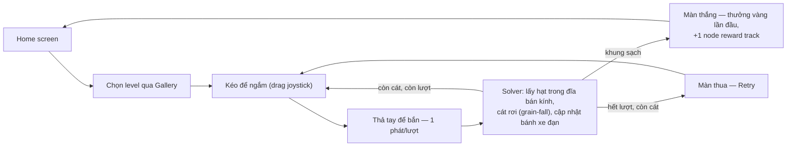
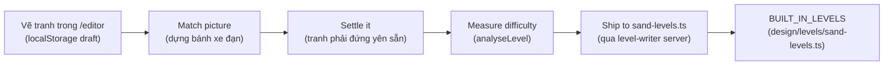

# Game Design Document — 3D Sand Cannon Sort

> Trạng thái: khớp với source tại nhánh `main`, sau khi pivot sang gameplay "bắn theo bán kính"
> (mọi core cũ — xoay model, Goal/Batch, Weak Point, Rainbow Target — đã bị gỡ khỏi source, không
> phải chỉ tắt đi). Tài liệu này là **thiết kế**, không thay thế `README.md` (tổng quan kiến trúc)
> hay `docs/features/*.md` (spec kỹ thuật từng chức năng) — nó trỏ vào các file đó ở từng mục thay
> vì chép lại, để một con số/luật chỉ sống đúng một chỗ và không lệch nhau giữa hai tài liệu.

## 0. Cách đọc tài liệu này

Mỗi mục ghi rõ **vì sao** một quyết định được chọn trước khi nói **nó là gì** — một team đọc để làm
theo cần biết lý do để không vô tình phá luật khi mở rộng. Đọc theo vai trò, không cần đọc hết:

| Vai trò | Đọc trước | Đọc khi cần |
| --- | --- | --- |
| **Game Designer** (chủ tài liệu) | 1, 2, 3, 8, 9, 10, 16 | 4, 5, 7 |
| **Level Designer** | 5, 6, 7, 8 | 3, 9 |
| **Game Artist** | 2, 11, 12 | 5 (hình chìa khoá/wall/freeze) |
| **UI/UX Designer** | 2, 13 | 9, 10, 11 (nội dung hiện trên UI) |
| **Coder / Engineer** | 3, 4, 5, 6, 14, 15 | mọi mục — đây là tài liệu duy nhất tổng hợp *tại sao*, code chỉ có *thế nào* |

## Mục lục

1. [Tầm nhìn & Pillar](#1-tầm-nhìn--pillar)
2. [Core loop & player fantasy](#2-core-loop--player-fantasy)
3. [Luật lõi](#3-luật-lõi)
4. [Thông số & tuning](#4-thông-số--tuning)
5. [Map mechanic](#5-map-mechanic)
6. [Level authoring pipeline](#6-level-authoring-pipeline)
7. [Beat chart — quyển sổ 50 level](#7-beat-chart--quyển-sổ-50-level)
8. [Đường cong độ khó](#8-đường-cong-độ-khó)
9. [Booster](#9-booster)
10. [Economy](#10-economy)
11. [Cosmetic / Skin súng](#11-cosmetic--skin-súng)
12. [Art direction](#12-art-direction)
13. [UI/UX](#13-uiux)
14. [Kiến trúc & file map](#14-kiến-trúc--file-map)
15. [Testing & validation](#15-testing--validation)
16. [Open Decision, chưa làm & roadmap](#16-open-decision-chưa-làm--roadmap)
17. [Glossary](#17-glossary)

---

## 1. Tầm nhìn & Pillar

**3D Sand Cannon Sort** — puzzle casual, người chơi bắn đạn màu vào một bức tranh cát 3D để dọn
sạch nó trước khi hết lượt bắn. Không xoay model, không giải đố không gian — đơn giản đến mức chơi
được bằng một ngón tay, độ khó dồn hết vào **đọc tranh và tính lượt bắn**.

Ba pillar, mọi quyết định thiết kế bên dưới đều quay về được một trong ba:

1. **Minh bạch tuyệt đối** — điểm chạm là điểm chạm, đạn bắn trúng đúng cái mắt thấy. Đây không phải
   khẩu hiệu suông: bug crosshair-lệch-khối từng là bug nghiêm trọng nhất của bản tiền-pivot (raycast
   giả định sai mặt phẳng khi model xoay), và toàn bộ hệ thống cosmetic hiện tại vẫn giữ nguyên tắc
   "skin không bao giờ được là lý do một phát bắn trượt" (`costumes.ts` — rig chỉ trang trí, không
   bao giờ động vào `muzzleAnchor`).
2. **Một ngân sách duy nhất** — số lượt bắn (`shotLimit`) *là* độ khó của một màn, không phải một
   trong nhiều biến. Bánh xe đạn tuần hoàn (mục 3) đảm bảo không bao giờ có "đạn chết" (màu trong tay
   mà không còn gì để bắn) — nên người chơi thua vì tính sai, không bao giờ thua vì bị chặn bởi thứ
   họ không kiểm soát được.
3. **Mechanic là data, không phải nhánh code riêng** — Wall Obstacle, Lock & Key, Freeze Map, Wind
   đều là trường tuỳ chọn trong `SandLevelConfig`. Một level không khai báo trường đó đọc và chạy
   y hệt như trước khi cơ chế tồn tại. Điều này giữ cho core loop luôn là **một** bộ luật
   (`RADIUS_GAMEPLAY`, xem mục 3) dù roster có 3, 4 hay 10 mechanic — thêm mechanic mới không bao giờ
   được phép rẽ nhánh solver theo level.

---

## 2. Core loop & player fantasy

**Một câu pitch:** *"Một khẩu súng cát, một bức tranh, một bàn tay — bắn đúng màu, đúng chỗ, đúng số
lần, trước khi hết đạn."*



Vòng lặp không có bước "chờ" (không cooldown dài, không năng lượng/tim) — độ trễ duy nhất giữa hai
phát là `SHOT_COOLDOWN_MS` 400ms và thời gian đạn bay/cát settle thật (mục 4). Đây là lựa chọn có chủ
đích: game *market-style* (xem mục 3) ăn tiền vào nhịp bắn nhanh, một cơ chế chờ dài sẽ phá nhịp đó.

**Ai chơi game này:** người chơi puzzle casual quen thể loại "sand sort" thị trường (Sort It 3D,
Screw Sort, ...) — kỳ vọng luật đơn giản nhìn là hiểu, phiên chơi ngắn (một màn vài chục giây tới vài
phút), tiến triển hiện ngay trên UI (Gallery khoá/mở theo level, reward track theo mỗi màn thắng).

---

## 3. Luật lõi

Nguồn code duy nhất: `RadiusGameplayPolicy` trong `app/game/sand-types.ts`, hằng số
`RADIUS_GAMEPLAY`. **Toàn bộ 50 level chạy dưới đúng một policy này** — đổi một quyết định thiết kế
là đổi một dòng trong object đó, không sửa rải rác trong solver. Chi tiết đầy đủ:
[docs/features/radius-shot-rule.md](docs/features/radius-shot-rule.md).

### 3.1. Phát bắn: một đĩa, không phải cả vùng

Bắn trúng lấy **mọi hạt cùng màu trong một đĩa bán kính `sortRadius` quanh điểm chạm** — không xoá
cả connected body. Bắn giữa mảng khoét thủng một lỗ tròn; bắn rìa chỉ gặm vài hạt.

> **Vì sao đi ngược brief gốc:** brief `sand_cannon_concept.md` §5 chốt một phát trúng màu xoá toàn
> bộ body liền màu và cấm rõ việc chỉ xoá theo bán kính. Bản này làm đúng điều bị cấm đó — một quyết
> định có chủ ý sau khi so ba gameplay cạnh nhau (bắn cả vùng + cohesion, bắn cả vùng + grain-fall,
> bắn theo đĩa), không phải sơ suất. Bắn-theo-đĩa là thứ khiến "đọc tranh, chọn điểm" trở thành kỹ
> năng thật thay vì chỉ nhắm đại vào bất kỳ đâu trong một mảng.

### 3.2. Bánh xe đạn (không phải hàng đợi hữu hạn)

`ammoQueue` chỉ là **thứ tự khởi đầu**. Bắn xong, nếu màu đó vẫn còn cát trên board thì viên đạn quay
lại cuối hàng; màu sạch hẳn thì rời bánh xe luôn. Hệ quả trực tiếp: **không bao giờ có đạn chết** — vì
vậy ngân sách duy nhất khiến người chơi thua là số lượt bắn, chứ không phải bị kẹt vì cầm nhầm màu.

### 3.3. Miss vẫn tốn lượt, trượt khung thì không

Phát bắn không lấy được gì (đĩa không chạm màu đang cầm) **vẫn tiêu một lượt** — cả đĩa rung để báo.
Bắn hụt hẳn ra ngoài khung hoặc trúng thành khung thì **không** tốn lượt. Lý do: một cú bắn *có chạm*
board là một quyết định của người chơi (chọn sai chỗ), một cú *không chạm gì* là input lỗi/tay trượt,
hai loại lỗi khác nhau nên bị phạt khác nhau.

### 3.4. Win / Fail

Win kiểm tra trước, fail kiểm tra sau — **phát cuối dọn sạch khung là thắng**, không phải hoà. Thắng
khi `remainingCells === 0`. Thua khi hết lượt mà *sau khi* phát cuối đã resolve và cát đã rơi/settle
xong vẫn còn cát trên khung.

### 3.5. Nhịp một phát một lượt

Chỉ bắn được ở state `READY`. Không bắn được khi đang `PROJECTILE_FLYING`, `HIT_RESOLUTION`, hay
`SETTLING` — đảm bảo người chơi luôn thấy trọn vẹn hệ quả của phát trước khi ra quyết định kế tiếp
(quay lại pillar #1: minh bạch).

### 3.6. Adjacency & tie-break trượt cát

- `adjacencyMode: ORTHOGONAL_4` — chỉ chạm cạnh mới nối, chạm góc không nối, không merge.
- `slideTieBreak: LEFT_FIRST_TEMP` — khi một hạt cát trượt chéo mà cả hai bên đều trống: **trái luôn
  thắng**. Một rule toàn cục, không phải ngẫu nhiên — cùng một bức tranh luôn rơi ra đúng một kết quả
  (settle solver là deterministic, xem mục 4 & [settle-solver.md](docs/features/settle-solver.md)).

### 3.7. Bảng đầy đủ `RadiusGameplayPolicy`

| Trường | Giá trị | Open Decision (brief) |
| --- | --- | --- |
| `adjacencyMode` | `ORTHOGONAL_4` | 1 & 2 |
| `settlePolicy` | `GRAIN_FALL_TEMP` (rơi từng hạt, không cohesion) | 3 |
| `slideTieBreak` | `LEFT_FIRST_TEMP` | 4 & 5 |
| `missAmmoPolicy` | `MISS_IS_FREE_TEMP`* | 6 & 7 |
| `deadBulletPolicy` | `VALIDATOR_ONLY_TEMP` (editor chặn lúc author, không fallback runtime) | 12 |
| `shotRule` | `RADIUS_SORT_TEMP` | ngoài brief, xem 3.1 |
| `ammoRule` | `CYCLE_UNTIL_COLOR_CLEARED_TEMP` | ngoài brief, xem 3.2 |
| `nextPreviewCount` | `3` | 9 |
| `cannonConfigRef` | `"prototype-classic-cannon"` | §20 — ballistics kế thừa nguyên bản pre-pivot |

\* Tên hằng số `MISS_IS_FREE_TEMP` dễ gây nhầm — đọc kỹ 3.3: bản thân từ "miss" ở đây nghĩa là *bắn
trúng board mà không trúng màu*, khác với *bắn hụt khung*.

Mọi trường có hậu tố `_TEMP` là một **Open Decision trong brief chưa chốt hẳn**, không phải hardcode
tuỳ tiện — đổi một quyết định thiết kế là sửa đúng giá trị này, không sửa rải rác. Toàn bộ danh sách
Open Decision với số thứ tự khớp brief gốc ở
[radius-shot-rule.md](docs/features/radius-shot-rule.md#mọi-trường-của-radiusgameplaypolicy).

---

## 4. Thông số & tuning

### 4.1. Cannon & input (kế thừa nguyên bản pre-pivot, §20 cấm tự chế số mới)

| Thông số | Giá trị | Ý nghĩa |
| --- | --- | --- |
| `FIXED_LAUNCH_SPEED` | 19 | Tốc độ đạn rời nòng. Đã tăng từ 13.2 gốc vì phản hồi "bắn chậm" — solver ngắm lại từ đầu mỗi phát nên tăng tốc không ảnh hưởng độ chính xác |
| `SHOT_COOLDOWN_MS` | 400 ms | Khoảng nghỉ tối thiểu giữa hai phát |
| `PROJECTILE_RADIUS` | 0.15 | Dung sai va chạm: nếu tâm ngắm rơi vào pixel trống, dò pixel có cát gần nhất trong bán kính này |
| `JOYSTICK_RADIUS` | 64 px | Tầm di chuyển của **núm** joystick ảo (khoá ở rìa pad) |
| `JOYSTICK_RESPONSE_RADIUS` | 256 px | Khoảng kéo thật để đáp ứng ngắm đạt 100% — rộng hơn hẳn `JOYSTICK_RADIUS` để một pad nhỏ, dễ nhìn vẫn ánh xạ đủ mượt sang toàn dải ngắm |
| `AIM_OUTSIDE_ZONE_CANCEL_MS` | 1700 ms | Grace period: kéo lệch ra ngoài `.aim-zone` không huỷ phát bắn ngay, chỉ huỷ nếu ở ngoài liên tục quá thời gian này |
| Control sensitivity | 0.5 – 2.0 (`MIN/MAX_CONTROL_SENSITIVITY`) | Slider trong Settings, scale trực tiếp phản ứng ngắm |

### 4.2. Board & simulation

| Thông số | Giá trị | Ý nghĩa |
| --- | --- | --- |
| `pixelScale` | thường `5` (author 12×14 → board pixel 60×70); level lớn dùng trực tiếp 60×70/70×80/80×90/80×93 ở `pixelScale: 1` | Hệ số phóng nguyên từ blueprint tác giả vẽ lên board pixel thật — phóng đều theo bội số nguyên nên không đổi puzzle (số vùng, độ liền kề giữ nguyên) |
| Ngân sách pixel editor | ~4.500 px | Editor tự chọn `pixelScale` lớn nhất giữ board dưới ngưỡng này, cho override tay |
| `sortRadius` | 2 – 18 ô blueprint tuỳ level (xem mục 8) | Bán kính đĩa lấy hạt, đơn vị blueprint cell, scale cùng board |
| Trần bán kính Radius Overcharge | `hypot(frame.width, frame.height)` | Nhân đôi `sortRadius` không bao giờ vượt đường chéo khung — quá điểm đó không ô nào xa hơn để "mua thêm" |

### 4.3. Vì sao board là canvas 2D chứ không phải mesh 3D

Quyết định kỹ thuật này có hệ quả thiết kế trực tiếp: **độ phân giải nhìn thấy = độ phân giải quyết
định luật**, không có lớp "giả mịn cho đẹp" nào tách khỏi logic. Một level 80×90 = 7.200 ô là 7.200
pixel canvas thật, connectivity/radius/win-lose chạy thẳng trên đúng lưới đó. Điều này quan trọng với
Level Designer: **kích thước blueprint không phải chỉ số thẩm mỹ, nó chính là độ chi tiết mà bán kính
đạn phải cắt qua.** Chi tiết kỹ thuật:
[rendering-pixel-board.md](docs/features/rendering-pixel-board.md).

---

## 5. Map mechanic

Nhắc lại pillar #3: mỗi mechanic dưới đây là **field tuỳ chọn**, không đọc trường thì level chạy y
hệt bản không có mechanic nào. Bảng tổng quan:

| Mechanic | Ký tự trong `rows` | Lần đầu xuất hiện | Trạng thái |
| --- | --- | --- | --- |
| Wall Obstacle | `W` | Level 11 (arc "Wall Obstacle") | Ship, dùng ở arc 2 và arc tổng hợp |
| Lock & Key | chữ thường (`r`,`g`,...) = cát khoá; `K` = chìa khoá | Level 21 (arc "Lock & Key") | Ship, dùng ở arc 3 và arc tổng hợp |
| Freeze Map | `@` | Level 31 (arc "Freeze Map") | Ship, dùng ở arc 4 và arc tổng hợp |
| Wind | field `wind` (không phải ký tự tranh) | — | **Đã cài đặt đầy đủ trong engine, chưa có level nào ship dùng tới** — chỉ sống trong fixture test (`crosswind`), sẵn sàng cho arc mới |

### 5.1. Wall Obstacle (`W`)

Ô chắn cứng: không phải cát, không tính vào điều kiện thắng, không bao giờ bị bắn trúng hay rơi.
Đứng yên vĩnh viễn, chỉ làm giá đỡ/chướng ngại cho cát xung quanh settle theo hình nó tạo ra.

**Vì sao có mechanic này:** đây là mechanic *không gian* đầu tiên khác hẳn Level 1-10 (vốn chỉ thử
màu và ngân sách) — ép người chơi tính đường bắn quanh một khung cứng, không còn là một bức tranh
phẳng đơn thuần. Nguồn: `WALL_LETTER` (`sand-rules.ts`), `wallBevelRgb` (`sand-color.ts`) — hiện
**chưa có file doc kỹ thuật riêng** trong `docs/features/`.

### 5.2. Lock & Key

Cát khoá (chữ thường trong tranh) lơ lửng — vẫn có màu, chiếm ô, đỡ cát khác, tính vào điều kiện
thắng — nhưng **không rơi và đĩa bắn không nhìn thấy**, cho tới khi một chìa khoá pixel cứng rơi/trượt
tới chạm nó thì cả vùng khoá đó tan cùng lúc. Một màu bị khoá **toàn bộ** tự động bị loại khỏi bánh xe
đạn (`shootableColors`) và quay lại ngay khi khoá mở — không bao giờ tạo ra đạn chết.

Chìa khoá là một silhouette vẽ tay (`KEY_SPRITE`), không phải hình tròn — nó **trượt**, không lăn.
`keyFriction` (0–1) chỉnh độ ì khi trượt ngang (0 = trượt ngay, 1 = chờ vài pass); không bao giờ ảnh
hưởng tốc độ rơi thẳng, đúng như ma sát thật chỉ cản chuyển động dọc bề mặt tiếp xúc.

**Vì sao có mechanic này:** thêm một trục thời gian/trình tự vào puzzle vốn chỉ có trục không gian —
level 25/27/29 xếp nhiều ổ khoá theo tầng để ép người chơi giải phóng đúng thứ tự. Chi tiết đầy đủ
(silhouette, cách vẽ trong editor, lưu ý khi tự dựng level có khoá):
[lock-and-key.md](docs/features/lock-and-key.md).

### 5.3. Freeze Map (`@`)

Trigger: viên đạn nào chạm tới (bất kể màu gì) sẽ tiêu nó và **đóng băng cả khung** trong
`freezeDuration` lượt kế tiếp (tính cả lượt vừa bắn trúng) — cát không rơi/settle trong lúc đó, HUD
hiện thanh Freeze đếm ngược từng lượt.

**Vì sao có mechanic này:** một cơ chế *thời gian/nhịp độ* — buộc người chơi cân nhắc **khi nào** bắn
trigger (đóng băng có thể có lợi để "khoá" một cấu hình cát đang thuận lợi, hoặc bất lợi nếu bắn nhầm
lúc chưa cần) thay vì chỉ đọc không gian tĩnh. Nguồn: `SandFreezeTrigger`, `freezeDuration`
(`sand-types.ts`) — **chưa có file doc kỹ thuật riêng**.

### 5.4. Wind (đã cài, chưa ship)

Một vòng lặp các pha gió (`direction`/`durationMs`/`cooldownMs`/`power`/`zone`) thổi cát trong lúc
settle. Đã cài đặt và test đầy đủ (`docs/features/wind.md`) nhưng **chưa có trong `BUILT_IN_LEVELS`
nào** — dự trữ cho một arc tương lai (mechanic thứ 5) khi cần thêm biến số mới mà không đụng vào bốn
mechanic đã ship.

---

## 6. Level authoring pipeline

### 6.1. Bảng mã màu (blueprint palette)

24 màu cát, mỗi màu một chữ cái trong `rows`; chữ thường của 12 chữ đầu = màu đó bị khoá
(Lock & Key). `K` = chìa khoá, `W` = Wall Obstacle, `@` = Freeze trigger — ba ký tự này **không** là
màu, không dùng được trong `ammoQueue`.

| Chữ | Màu | Hex | Chữ | Màu | Hex |
| --- | --- | --- | --- | --- | --- |
| `R` | red | `#ff546c` | `T` | teal | `#1fb6a6` |
| `G` | green | `#67e0ba` | `U` | skyblue | `#3d9be0` |
| `Y` | yellow | `#f4d65e` | `I` | indigo | `#6c5ce0` |
| `B` | blue | `#9692b8` | `F` | magenta | `#e0459e` |
| `P` | purple | `#a28fea` | `E` | crimson | `#e8433f` |
| `O` | orange | `#f69509` | `H` | darkbrown | `#6b4021` |
| `C` | cyan | `#00a9f7` | `J` | violet | `#9b4fd1` |
| `M` | pink | `#ff97b2` | `Q` | navy | `#2f4b8f` |
| `L` | lime | `#c1ec35` | `V` | emerald | `#2fae5f` |
| `N` | brown | `#998757` | `X` | rust | `#d1541f` |
| `S` | white | `#ede7d9` | `Z` | mint | `#b8f2dd` |
| `D` | black | `#59565c` | | | |

12 màu đầu (`R G Y B P O C M L N S D`) là bảng gốc; 12 màu sau (`A T U I F E H J Q V X Z`, thêm
`A` = grass `#4fd07a`) mở rộng để tranh nhiều màu vẫn phân biệt được — chọn để lấp đúng khoảng hue
trống của bảng gốc thay vì thêm pastel trung tính ngẫu nhiên. Toàn bộ nguồn:
`SAND_COLOR_BY_LETTER`/`SAND_COLOR_HEX` (`sand-rules.ts`, `SandCannonEngine.ts`).

### 6.2. Hai cách viết một level

1. **Editor `/editor`** (khuyến nghị — dùng cho gần như mọi level trong 50 level ship sẵn): vẽ
   tranh pixel ở **đúng độ phân giải board thật** (không còn blueprint thu nhỏ), dựng bánh xe đạn,
   đo độ khó thật bằng **Measure difficulty**, rồi **Ship to sand-levels.ts** ghi thẳng vào source —
   không copy-paste tay. Cần chạy song song `npm run level-writer` (server Node nhỏ ghi file, vì
   target build là Cloudflare Workers không có filesystem). Toàn bộ tính năng:
   [level-editor.md](docs/features/level-editor.md).
2. **Viết tay** một object `SandLevelConfig` (spread `RADIUS_GAMEPLAY`) và đẩy vào `BUILT_IN_LEVELS`
   — chỉ nên dùng khi cần review diff chi tiết hoặc sửa nhỏ một level có sẵn. Format đầy đủ:
   [level-format.md](docs/features/level-format.md).



### 6.3. Hai lỗi editor bắt buộc phải chặn

Cả hai đều là **ván không thể thắng nhưng game không hề báo gì** nếu viết tay không qua editor:

- Màu có trong tranh nhưng không có trong bánh xe đạn → vùng cát đó không bao giờ được bắn tới.
- Màu có trong bánh xe đạn nhưng không có trong tranh → viên đạn mở màn không có gì để bắn.

Editor coi cả hai là **error** (không phải warning) — level còn error không hiện trong level
switcher của game; nút **Fix wheel** tự sửa bằng cách suy bánh xe lại từ tranh.

### 6.4. Tranh phải "đứng yên sẵn"

Cát vẽ lơ lửng sẽ sụp ngay frame đầu — cái người chơi thấy sẽ không phải cái tác giả vẽ. Editor có
nút **Settle it** thả tranh về đúng trạng thái nghỉ (không thêm/bớt hạt nào); viết tay thì tự kiểm
bằng `runGrainSettle(bodies, frame)`. Xem [settle-solver.md](docs/features/settle-solver.md).

---

## 7. Beat chart — quyển sổ 50 level

`BUILT_IN_LEVELS` (`design/levels/sand-levels.ts`) ship **50 level**, chia **6 arc** — mỗi arc giới
thiệu đúng một biến số mới, arc cuối trộn chung mọi thứ đã học. Đây là cấu trúc curriculum kiểu
"dạy-một-thứ-mỗi-lần" chuẩn casual puzzle, không ngẫu nhiên.

| Arc | Level | Dạy gì | avg `shotLimit` | range `shotLimit` | avg `sortRadius` |
| --- | --- | --- | --- | --- | --- |
| 0. Nhập môn | 1–3 | Ngắm-bắn (L1, 1 màu, `shotLimit: ∞`) → hàng đợi đạn (L2, 3 màu, `∞`) → ngân sách lượt lần đầu (L3) | 26.0* | 26 | 2.3 |
| 1. Beatchart gốc | 4–10 | Tranh nhiều màu/nhiều vùng, chưa mechanic phụ | 39.3 | 30–45 | 13.3 |
| 2. Wall Obstacle | 11–20 | Tính đường bắn quanh chướng ngại cứng | 42.5 | 30–55 | 10.6 |
| 3. Lock & Key | 21–30 | Trình tự mở khoá, đỉnh ở L29 (3 ổ khoá xếp tầng) | 49.0 | 35–65 | 13.0 |
| 4. Freeze Map | 31–40 | Chọn thời điểm bắn trigger đóng băng | 45.2 | 30–65 | 12.1 |
| 5. Tổng hợp | 41–50 | Trộn Wall + Lock & Key + Freeze Map cùng một tranh | 56.5 | 40–80 | 13.0 |

\* Trung bình chỉ tính Level 3 (26 lượt) — Level 1 & 2 dùng `shotLimit: Infinity` có chủ đích (xem
8.1), không phải giá trị đo được.

**Vì sao đúng thứ tự này:** mỗi arc mở ra khi cơ chế trước đã "ngấm" — arc 2 (Wall) không cần logic
mới (chỉ là một loại ô), arc 3 (Lock & Key) đứng sau vì nó thêm hẳn một chiều thời gian, arc 4
(Freeze) đứng sau Lock & Key vì cả hai đều là "chờ đúng lúc" nhưng Freeze đơn giản hơn (một trigger,
không xếp tầng) — xếp trước Lock&Key sẽ dạy khái niệm khó trước khái niệm dễ. Arc 5 không dạy gì mới,
chỉ kiểm tra ba mechanic **phối hợp** với nhau thay vì đứng một mình (nguồn: comment thiết kế ngay
trong `sand-levels.ts`, dòng gần `Levels 21-30` và `Levels 11-20`).

Level đủ chi tiết (id, kích thước khung, bán kính, ngân sách lượt, có freeze/key friction hay không)
nằm ở [Phụ lục A](#phụ-lục-a-bảng-đầy-đủ-50-level) cuối tài liệu — dùng để đối chiếu khi thêm level
mới vào một arc có sẵn.

---

## 8. Đường cong độ khó

### 8.1. Độ khó của một level radius là gì

> `shotLimit` **là** độ khó — chọn nó bằng cảm tính là chọn độ khó bằng cảm tính.
> — [difficulty-measurement.md](docs/features/difficulty-measurement.md)

Vì bánh xe đạn không bao giờ tạo đạn chết (mục 3.2) và bán kính/hình dạng tranh quyết định số lượt
*tối thiểu* cần để dọn sạch, ngân sách lượt còn lại (slack) so với mức tối thiểu đó chính là độ khó.
Có **hai** hệ thống đo, dùng cho hai việc khác nhau:

| Hệ thống | Dùng để | Cách đo |
| --- | --- | --- |
| `analyseLevel` (nút **Measure difficulty**) | Chốt `shotLimit` cho **một** level cụ thể trước khi ship | Chạy 2 model *thật* trên đúng solver game: `playStrong` (luôn chọn đĩa lấy nhiều hạt nhất → sàn tối thiểu) và `playCareless` (bắn đại, 8 lần, seed cố định → ngân sách có phạt được cẩu thả không) |
| `computeLevelDifficulty` | Xếp hạng **cả danh sách** level trong editor + input công thức thưởng vàng (mục 10) | Heuristic rẻ, không chạy solver — 5 tiêu chí trọng số bằng nhau (`size`, `colors`, `interleaving`, `ammo`, `radius`), quy về điểm 0–100 |

### 8.2. Verdict của `analyseLevel` — checklist khi ship một level

| Verdict | Điều kiện | Hành động |
| --- | --- | --- |
| `unclearable` | `strongShots === null` (không giải nổi) hoặc `slack < 0` | **Chặn ship** — sửa tranh/bán kính/ngân sách |
| `too-tight` | `0 ≤ slack < 3` | Nên nới `shotLimit`, trừ khi cố ý làm level "khó gắt" cuối một arc |
| `too-easy` | Chơi ẩu thắng cả 8/8 lần | Nên siết `shotLimit` hoặc tăng độ phức tạp tranh |
| `good` | Còn lại | Ship được |

Editor gợi ý `suggestedShotLimit = strongShots + 6` — đủ dư để người chơi giỏi đọc sai một-hai nước
đi vẫn qua màn, nhưng không dư tới mức game tự chơi hộ.

### 8.3. Đường cong thật của 50 level (proxy: `shotLimit`)

Sparkline dưới đây vẽ trực tiếp từ `shotLimit` của cả 50 level (khối thấp = ngân sách chặt/dễ hụt
hơn so với độ phức tạp tranh, khối cao = ngân sách rộng hơn — **không** đọc thẳng "cao = khó", đọc
theo mục 8.1: độ khó thật là *slack*, `shotLimit` chỉ là nửa phép tính nhìn thấy được mà không cần
chạy solver):

```
··▁▂▃▂▃▃▃▃▂▄▂▃▅▃▃▂▅▃▂▃▃▄▃▅▄▅▆▃▂▃▃▃▄▄▃▂▆▃▅▃▄▃▅▆▇▅█▄
         1         2         3         4         5   (chục level)
```

(`··` = Level 1–2 dùng `shotLimit: Infinity`, cố ý không nằm trong thang đo — xem 8.1.) Đọc theo
arc (bảng ở mục 7): mỗi arc mới **hạ nhẹ** ngân sách trung bình xuống so với đỉnh arc trước (relief
khi học khái niệm mới — arc 4 Freeze mở đầu ở 30, thấp hơn hẳn đỉnh 65 của arc 3 Lock & Key), rồi
**leo dần** tới một đỉnh test-độ-thành-thạo cuối arc (L29 = 65 lượt/3 ổ khoá xếp tầng, L49 = 80
lượt/màn tổng hợp khó nhất roster). Đây là đường cong dạng răng cưa đi lên (sawtooth ascending), kiểu
chuẩn của casual puzzle theo arc, không phải một dốc tuyến tính đơn điệu.

### 8.4. Quy trình cho Level Designer khi thêm level mới

1. Vẽ trong editor, dựng bánh xe đạn bằng **Match picture**.
2. **Settle it** — đảm bảo tranh đứng yên sẵn.
3. **Measure difficulty** — đọc verdict, không tự đoán `shotLimit`.
4. So `strongShots`/`suggestedShotLimit` với arc đang nhắm ở bảng mục 7 (hoặc Phụ lục A) — level mới
   nên nằm trong hoặc gần range `shotLimit` của arc đó, trừ khi cố ý làm một "đỉnh" cuối arc.
5. Ship. Điểm `computeLevelDifficulty` (0–100) tự động quyết định thưởng vàng — không cần gán tay
   (mục 10.3).

---

## 9. Booster

Ba loại, mua bằng Vàng trong Shop, **mutually exclusive** — chỉ một loại armed tại một thời điểm; bấm
lại nút đang armed thì huỷ (không tốn viên). Charge trừ **ngay khi đạn rời nòng**, không phải lúc arm
— arm rồi restart level trước khi bắn thì không mất viên.

| Booster | Hiệu ứng | Giá | Ghi chú thiết kế |
| --- | --- | --- | --- |
| **Radius Overcharge** | Nhân đôi `sortRadius` cho một phát, chặn ở đường chéo khung | 100 vàng | Vẫn phải đúng màu đang cầm; đạn phình to dần lúc bay, đạt max size đúng lúc chạm khung |
| **Prism Shot** | Bỏ điều kiện đúng màu — lấy **mọi** màu trong đĩa, có thể xoá nhiều body khác màu cùng lúc | 100 vàng | Đạn đổi màu theo vòng quang phổ, để lại vệt cầu vồng khi bay |
| **Chain Sort** | Bỏ hẳn đĩa bán kính — lan theo **đúng một màu** ra mọi ô liền kề (8 hướng, kể cả chạm góc), không giới hạn số ô | 150 vàng | Đắt hơn vì không có trần: một mảng khổng lồ dọn sạch trong một phát. Không có ring aim hiển thị (không có bán kính cố định để vẽ) |

Mỗi loại có **1 viên miễn phí lúc mới chơi** (`STARTER_BOOSTER_CHARGES`) — để người chơi khám phá
bằng cách dùng thử, không phải đọc mô tả rồi đoán. Số viên/giá đều hand-tune qua
`public/design/economy.csv`, không hardcode (mục 10.4). Field `requiresBooster` trên level (đánh dấu
"level này bắt buộc dùng đúng booster X mới qua") đã có trong data model nhưng **chưa có gì đọc**,
chờ một solver/validator sau này. Chi tiết đầy đủ:
[booster-radius-prism-spec.md](docs/features/booster-radius-prism-spec.md).

---

## 10. Economy

Toàn bộ **client-only** (`localStorage`), không tài khoản/server. Ba loại "tiền":

| Currency | Nguồn kiếm | Dùng để | Trạng thái |
| --- | --- | --- | --- |
| **Vàng (Gold)** | Thắng level lần đầu (mục 10.3) + Daily Login | Mua lượt booster | Thật, đang hoạt động |
| **Blue Emerald** | **Chỉ** từ Reward Track (mục 10.5) — không bao giờ thưởng trực tiếp khi thắng level | Mua skin súng (mục 11) | Thật, đang hoạt động |
| **Gems** | — | Tab "Gems" trong Shop | **Chưa hoạt động** — số hiển thị cho có (`STARTER_GEMS = 240`), chưa nối với IAP thật, chưa có gì tiêu/kiếm được nó. Chỗ dành cho hard currency tương lai |

### 10.1. Ví khởi đầu

| Hằng số | Mặc định | Key CSV (`economy.csv`) |
| --- | --- | --- |
| `STARTER_GOLD` | 100 | `starterGold` |
| `STARTER_GEMS` | 240 (display-only) | — |
| `STARTER_EMERALDS` | 0 (cố ý — phải tự kiếm cycle đầu) | — |
| Booster khởi đầu | 1 viên mỗi loại | `starterBoosterRadiusOvercharge/PrismShot/ChainSort` |

### 10.2. Giá booster

| Booster | Giá | Key CSV |
| --- | --- | --- |
| Radius Overcharge | 100 | `boosterPriceRadiusOvercharge` |
| Prism Shot | 100 | `boosterPricePrismShot` |
| Chain Sort | 150 | `boosterPriceChainSort` |

### 10.3. Thưởng vàng theo level

```
levelGoldReward(score) = round((20 + score) / 5) * 5
```

`score` là điểm `computeLevelDifficulty` (0–100, mục 8.1) tính trên `raw` level (scale blueprint,
không phải pixel board). Kết quả nằm trong **20–120 vàng**, làm tròn bội số 5. Trả **đúng một lần**
khi thắng lần đầu trên trình duyệt — chơi lại không farm thêm được, vì số thưởng chỉ có ý nghĩa khi
nó thật sự đo theo độ khó. Level nào cần số khác công thức thì thêm dòng vào
`public/design/level-rewards.csv` (override tay, không bắt buộc điền hết). Chi tiết:
[level-rewards.md](docs/features/level-rewards.md).

### 10.4. Cách hand-tune không đụng code

Mọi con số ở mục 10.1–10.3 đều **fallback** — số thật đi qua `public/design/economy.csv` /
`level-rewards.csv` trước (`economy-config.ts` fetch + poll lại mỗi 4 giây khi tab mở), chỉ rơi về
hằng số khi sheet không có dòng cho key đó. Designer sửa CSV, lưu, F5 hoặc chờ 4s là thấy số mới —
không cần build lại. Xem [design/economy/README.md](design/economy/README.md).

### 10.5. Reward Track — nguồn Blue Emerald duy nhất

Một thanh 5-node ở màn Home, đầy khi **thắng đủ 5 level** (kể cả chơi lại — không phải chỉ level
chưa từng thắng, vì bar sẽ đứng im khi hết level mới), node thứ 5 mở **chest** trả Blue Emerald rồi
vòng tiếp tục — **không loop về đầu**, cycle sau luôn trả nhiều hơn cycle trước:

| Cycle | 1 | 2 | 3 | 4 | 5 | 6+ |
| --- | --- | --- | --- | --- | --- | --- |
| Emerald | 500 | 600 | 750 | 900 | 1.250 | `round(last × 1.25^n / 50) × 50` |

500 (cycle 1) được neo đúng bằng giá Rune Cannon (mục 11) — 5 màn thắng = đủ tiền skin đầu tiên, số
đọc thành "một chu kỳ" thay vì một con số người chơi phải tự làm phép tính.

### 10.6. Daily Login

Chu kỳ 7 ngày **lặp lại**, không leo thang mãi — cố tình nhỏ hơn thưởng một level dễ (20–30 vàng hầu
hết các ngày): đây là bonus vì ghé qua, bảng level mới là cách kiếm vàng chính.

| Ngày | 1 | 2 | 3 | 4 | 5 | 6 | 7 |
| --- | --- | --- | --- | --- | --- | --- | --- |
| Vàng | 10 | 15 | 20 | 25 | 30 | 40 | 80 |

Streak vỡ (bỏ ≥ 2 ngày) thì **reset về ngày 0** — cố ý, để streak có ý nghĩa thật. Tính theo ngày
local của máy người chơi, không phải UTC.

---

## 11. Cosmetic / Skin súng

4 skin cho khẩu súng cát — **không bao giờ đổi ballistics/aim** (pillar #1, mục 1): rig chỉ trang trí
quanh `muzzleAnchor`, mọi phát bắn của mọi skin bay đúng cùng một quỹ đạo.

| Skin | Tagline | Flavor VFX | Cách mở | Giá |
| --- | --- | --- | --- | --- |
| **Field Cannon** | "Load. Aim. Boom." | `classic` — chỉ khói/tung cát nền | Mặc định, mọi người chơi có sẵn | Miễn phí |
| **Rune Cannon** | "Charge. Sparkle. Repeat." | `magic` — lấp lánh + overlay rune quanh bán kính | Mua bằng Blue Emerald | 500 💎 |
| **Hero Cannon** | "Quest. Aim. Onward." | `classic` | Thưởng miễn phí khi clear **Level 20** lần đầu | — (progression) |
| **Frost Cannon** | "Chill. Aim. Shatter." | `frost` — lấp lánh trắng-cyan riêng | Thưởng miễn phí khi clear **Level 40** lần đầu | — (progression) |

**Vì sao 2/4 skin gắn với mốc level thay vì mua:** Hero Cannon (L20) và Frost Cannon (L40) trùng đúng
ranh giới arc "Wall Obstacle → Lock & Key" và "Freeze Map → Tổng hợp" (mục 7) — skin đọc như một huy
hiệu "đã qua chặng này", không phải một món hàng, nên card của nó trong Gallery hiện badge
Progression thay vì nút Buy. Nguồn: `costumes.ts` (registry rig + giá), `SandGame.tsx` (màn Skin,
Gallery milestone card).

---

## 12. Art direction

*(Đọc kỹ nếu bạn là Game Artist — đây là kỹ thuật vẽ, không phải chỉ bảng màu.)*

### 12.1. Board là texture canvas 2D, khung/súng vẫn 3D thật

Bức tranh cát **không** là mesh gồm hàng nghìn khối. Nó là một `HTMLCanvasElement` tô bằng
`CanvasRenderingContext2D`, dán lên **một** `THREE.PlaneGeometry` trong khung 3D
(`texture.magFilter/minFilter = NearestFilter` giữ cạnh pixel sắc nét, không blur khi phóng to).
Khung, cannon, ánh sáng, camera vẫn 3D thật — chỉ riêng nội dung tranh chuyển từ mesh sang texture
phẳng. Artist vẽ concept tranh nên nghĩ ở đúng độ phân giải board thật (thường 60×70 tới 80×93 pixel)
— không có lớp "mịn hơn cho đẹp" nào tồn tại phía sau.

### 12.2. Texture cát: HSV jitter cố định từng pixel

Mỗi pixel lệch nhẹ so với màu gốc của ô, **cố định một lần khi sinh ra** (không animate) — kỹ thuật
mượn từ UniSand (MIT):

- Saturation jitter: **±0.03**
- Lightness jitter: **±0.025**
- Hue: **không bao giờ bị đụng** — một jitter đủ lớn để thấy sẽ bắt đầu đọc thành màu gameplay khác,
  cấm tuyệt đối vì phá pillar #1 (minh bạch màu).

Biên độ này đã bị chỉnh nhỏ hơn giá trị gốc UniSand (từng thử ±0.1 rồi ±0.06/±0.05) — phản hồi người
chơi là "nhiễu quá" với bảng 24 màu hiện tại (một số cặp như đỏ/hồng đứng gần nhau về hue, jitter
rộng làm chúng lấn màu nhau).

### 12.3. Bảng 24 màu

Xem bảng đầy đủ ở [mục 6.1](#61-bảng-mã-màu-blueprint-palette). Ghi chú cho artist khi vẽ concept
mới hoặc đề xuất thêm màu: 12 màu gốc (`R G Y B P O C M L N S D`) là bảng tham chiếu ban đầu; 12 màu
sau chọn để lấp đúng khoảng hue mà bảng gốc còn trống (`grass`/`skyblue` lấp hai khoảng bảng gốc chưa
có; `teal`/`indigo` chia đôi hai đầu ấm-lạnh; `magenta`/`crimson` cho cụm tím/đỏ một primary bão hoà
đầy đủ mà bản gốc (`purple`/`red`) cố tình không có) — **không** thêm màu ngẫu nhiên, luôn kiểm nó có
lấp một khoảng hue còn trống hay chỉ lặp lại một màu đã có ở độ bão hoà khác.

### 12.4. Wall / Key / Freeze — cùng một kỹ thuật bevel, khác tông màu

Cả ba mechanic-object vẽ bằng đúng một công thức "sáng cạnh thiếu hàng xóm, tối cạnh có hàng xóm"
(giả lập ánh sáng chiếu từ góc trên-trái) — khác nhau đúng một chỗ: base RGB.

| Object | Base RGB | Delta bevel | Vì sao tông này |
| --- | --- | --- | --- |
| Wall Obstacle | `rgb(30,30,34)` gần đen | ±34 | Đá/kim loại chết, tương phản thấp — chướng ngại, không phải vật cần chú ý |
| Key (chìa khoá) | `rgb(255,214,84)` vàng gold | ±46 | Kim loại quý bóng — cần nổi bật, biên độ rộng hơn vì "độ bóng đồng xu" đọc rõ hơn khi tương phản cao |
| Freeze trigger | `rgb(92,200,232)` xanh băng | ±46 | Cố tình cách xa cả đen (Wall) lẫn vàng (Key) để không bao giờ nhầm ba loại object với nhau ở cùng kích thước nhỏ |

Cát bị khoá (Lock & Key) vẽ **tối đi**, không đổi hue — màu bên dưới vẫn phải đọc được vì đó chính là
màu đạn sẽ phát khi khoá mở.

### 12.5. VFX booster

- **Radius Overcharge**: đạn rời nòng ở size thường, phình to dần suốt quãng bay, đạt max đúng lúc
  chạm khung — max size khớp chính xác mép ngoài vòng ring hiệu lực của phát đó (không phải hằng số
  cố định), nên vòng preview trước khi bắn và kích thước đạn lúc chạm khung không bao giờ lệch nhau.
- **Prism Shot**: đạn đổi màu theo vòng quang phổ suốt đường bay, để lại vệt mảnh vỡ cùng màu rơi
  rớt phía sau (dùng chung particle pool với hiệu ứng "shard" của skin magic/frost).
- **Chain Sort**: không có ring aim (không có bán kính cố định để vẽ), art hiện dùng chung icon Prism
  Shot tạm thời — mọi booster khác Radius Overcharge tự động rơi vào nhánh art "Prism" trong
  `BoosterIcon`, nên thêm asset icon riêng cho Chain Sort không cần sửa code, chỉ cần thay điều kiện.

---

## 13. UI/UX

### 13.1. Bản đồ màn hình


Bốn tab (Shop/Skin/Gallery/Modes) đều là **full-screen takeover**, không phải bottom-sheet nhỏ —
quyết định giữ từ phiên redesign trước: một bottom-sheet nhỏ không đủ chỗ cho showroom 3D skin hay
lưới Gallery nhiều cột.

### 13.2. HUD trong màn chơi

| Thành phần | Mô tả | Vì sao |
| --- | --- | --- |
| Ammo badge | Số đạn/màu đạn hiện tại | Luôn hiện kể cả level ẩn mọi UI khác (`ftueGesture`) |
| `.shots-upcoming` | Dải chấm màu xem trước `nextPreviewCount` (mặc định 3) viên kế tiếp | Ẩn hoàn toàn trên Level 1 (`nextPreviewCount: 0`) — level 1 toàn một màu, dải chấm chỉ dạy "không dạy gì" |
| Nút booster | Chỉ icon, **không chữ** | Tái dùng hệ màu gameplay, tránh HUD rối chữ; khi armed có ring overlay quay/nhấp nháy liên tục quanh buồng đạn + đầu nòng, để trạng thái armed không bao giờ trông "đứng yên/dễ quên" |
| Freeze bar | Thanh đếm ngược N lượt khi Freeze Map đang active | Chỉ hiện khi level có trigger `@` |
| `.aim-zone` + `.aim-joystick` | Joystick ảo kéo-thả, span toàn bộ scene (không chỉ một góc màn hình) | Cho phép chạm/kéo bắt đầu ở bất kỳ đâu trên tranh, không ép người chơi nhắm đúng một điểm cố định mới bắt đầu kéo được |

### 13.3. Input & feedback

- Kéo để ngắm, thả để bắn — một cử chỉ, không nút bắn riêng.
- Grace period 1.7s khi kéo lệch ra ngoài `.aim-zone` (mục 4.1) — tay trượt ra mép màn hình khi đang
  kéo không bị tính là huỷ ngay.
- `AIM_TOUCHED` phát **ngay khi chạm**, trước khi khoá con trỏ — để FTUE gesture (13.4) tắt đúng lúc
  người chơi vừa chạm, không phải sau khi bắn xong.
- Slider sensitivity 0.5–2.0 trong Settings, scale trực tiếp phản ứng ngắm — không có "aim assist"
  ẩn nào khác đứng sau slider này.

### 13.4. FTUE — hai cơ chế khác nhau, đừng nhầm

| Cơ chế | Field | Hiện khi nào | Tắt khi nào |
| --- | --- | --- | --- |
| `tutorial` | `{ title, steps }` | Lần đầu mở level đó | Vĩnh viễn sau lần xem đầu (lưu theo `id` trong `localStorage`) |
| `ftueGesture` | `boolean` | Icon tay-kéo đè lên joystick thật (không phải hộp chữ) | Tắt ngay khi chạm lần đầu (`AIM_TOUCHED`) trong phiên đó — **nhưng hiện lại**: mỗi khi app bị kill & mở lại (`sessionStorage`), hoặc sau `FTUE_GESTURE_REPLAY_AFTER_MS` = 6 giờ kể từ lần hiện gần nhất dù chưa kill app (`localStorage`) |

Chỉ Level 1 (`defaultLevel`) bật `ftueGesture` — cố tình chỉ một màu cát để bài học duy nhất là
"ngắm-và-bắn" không bị pha loãng bởi bất kỳ HUD/luật nào khác (ẩn cả khay booster suốt level đó).

### 13.5. Ngôn ngữ

Song ngữ **Anh/Việt** (`app/i18n.ts`), Anh là mặc định. Toàn bộ copy người chơi thấy là một interface
`Strings` phẳng, hai object `EN`/`VI` literal thoả interface đó — TypeScript tự chặn nếu một key bị
thiếu ở một trong hai ngôn ngữ, nên không có chuyện một màn hình bị lệch ngôn ngữ do quên dịch. Text
riêng cho dev/QA (menu Settings → GameDevOption: link editor, +500 vàng debug, nhảy thẳng tới level)
cố tình **không** nằm trong hệ thống dịch này — không phải copy người chơi thật sẽ thấy.

---

## 14. Kiến trúc & file map

Không lặp lại ở đây — bảng file đầy đủ (vai trò từng file, ranh giới logic/visual) đã có sẵn và luôn
cập nhật ở [README.md § Kiến trúc: logic tách khỏi visual](README.md#kiến-trúc-logic-tách-khỏi-visual).
Quy tắc quan trọng nhất cho Coder khi thêm bất cứ gì vào GDD này: `sand-rules.ts` không được biết gì
về three.js/DOM/đồng hồ — mọi luật (mục 3, 5, 8) phải chứng minh được bằng test thuần, không cần mở
trình duyệt.

---

## 15. Testing & validation

```bash
npm test
```

chạy 13 file test (`tests/*.test.ts`) khoá lại đúng những bất biến GDD này mô tả — không phải test
UI, mà test **luật**: `sand-radius`, `sand-mechanics`, `sand-walls`, `sand-boosters`,
`sand-freeze-key`, `sand-hidden-key`, `sand-win-leniency`, `sand-pixel-board`, `level-editor`,
`level-advisor`, `level-rewards`, `sand-economy`, `economy-config`. Bất kỳ thay đổi luật nào ở mục 3
hoặc mechanic ở mục 5 **phải** đi kèm test mới hoặc test cũ vẫn xanh — đây là cách duy nhất giữ
"mechanic là data" (pillar #3) không âm thầm hỏng khi roster lớn dần.

Ngoài test tự động, hai validator sống ngay trong editor (mục 6.3, 6.4) — **dead bullet cả hai
chiều** và **tranh chưa đứng yên** — là checklist bắt buộc trước khi ship bất kỳ level nào, kể cả
viết tay.

---

## 16. Open Decision, chưa làm & roadmap

### 16.1. Open Decision chưa chốt hẳn (không phải bug)

Mọi trường `_TEMP` trong bảng mục 3.7 là câu trả lời **tạm thời** cho một câu hỏi thiết kế còn mở
trong brief gốc — thay đổi một quyết định nghĩa là đổi đúng dòng đó trong `RADIUS_GAMEPLAY`, review
lại toàn bộ 50 level (vì `shotLimit` mỗi level được đo dưới đúng policy hiện tại, đổi policy có thể
làm sai độ khó đã cân).

### 16.2. Đã cài nhưng chưa ship

- **Wind** (mục 5.4) — engine xong, chưa có level dùng.
- **`requiresBooster`** (mục 9) — field đã có trên `SandLevelConfig`, chưa có solver/validator nào
  đọc nó.
- **Gems** (mục 10) — hiển thị số, chưa nối kiếm/tiêu/thanh toán thật.

### 16.3. Ngoài phạm vi MVP (theo brief §34)

Meta progression (ngoài ví vàng cơ bản), đổi/skip đạn, random queue, Z-layer gameplay, full granular
rigidbody simulation, âm thanh.

### 16.4. Gợi ý roadmap (không phải cam kết — cần Game Designer chốt trước khi giao Coder)

- Arc thứ 6 dùng Wind làm mechanic mới, hoặc trộn Wind vào arc tổng hợp hiện có (level 41-50 mở
  rộng/level 51+).
- Solver đọc `requiresBooster` để validator editor chặn ship một level "cần booster" mà không có
  nước đi nào thật sự bắt buộc dùng nó.
- Nối Gems với một luồng IAP thật khi monetization cần hard currency thứ hai.

---

## 17. Glossary

| Thuật ngữ | Nghĩa |
| --- | --- |
| **Body** | Vùng 4-connected cùng màu trong tranh — không khai báo riêng, tự suy ra từ `rows` |
| **Bánh xe đạn / wheel** | `ammoQueue` dưới luật cycle-until-cleared — viên bắn xong quay lại cuối hàng nếu màu chưa sạch |
| **Đĩa bán kính** | Vùng tròn bán kính `sortRadius` quanh điểm chạm, nơi phát bắn lấy hạt |
| **Slack** | `shotLimit − strongShots` — thước đo độ khó thật của `analyseLevel` |
| **Arc** | Một chặng 10 level dạy đúng một mechanic mới (mục 7) |
| **Grain-fall** | Chính sách settle: mỗi hạt cát rơi độc lập, không cohesion (Open Decision 3) |
| **FTUE** | First-Time User Experience — hai cơ chế riêng biệt, xem mục 13.4 |
| **Blueprint** | Kích thước tranh tác giả vẽ, trước khi `expandLevelForPixelBoard` phóng lên board pixel thật |

---

## Phụ lục A: Bảng đầy đủ 50 level

`w`/`h` = kích thước khung (ô pixel board, sau khi mở rộng theo `pixelScale`). `sortRadius` tính
theo cùng đơn vị. `freeze` = `freezeDuration` (lượt), trống nghĩa là level không có trigger `@`.
`keyFriction` trống nghĩa là level không có Lock & Key hoặc dùng mặc định 0.

| Level | Arc | w×h | sortRadius | shotLimit | freeze | keyFriction |
| --- | --- | --- | --- | --- | --- | --- |
| 1 | Nhập môn | 10×10 | 2 | ∞ | — | — |
| 2 | Nhập môn | 17×16 | 3 | ∞ | — | — |
| 3 | Nhập môn | 15×14 | 2 | 26 | — | — |
| 4 | Beatchart gốc | 80×90 | 16 | 30 | — | — |
| 5 | Beatchart gốc | 80×90 | 15 | 40 | — | — |
| 6 | Beatchart gốc | 80×90 | 12 | 35 | — | — |
| 7 | Beatchart gốc | 80×90 | 12 | 45 | — | — |
| 8 | Beatchart gốc | 80×90 | 12 | 40 | — | — |
| 9 | Beatchart gốc | 80×90 | 12 | 45 | — | — |
| 10 | Beatchart gốc | 60×70 | 14 | 40 | — | — |
| 11 | Wall Obstacle | 70×82 | 12 | 30 | — | — |
| 12 | Wall Obstacle | 80×90 | 12 | 50 | — | — |
| 13 | Wall Obstacle | 65×75 | 11 | 35 | — | — |
| 14 | Wall Obstacle | 70×80 | 5 | 40 | — | — |
| 15 | Wall Obstacle | 80×90 | 12 | 55 | — | — |
| 16 | Wall Obstacle | 50×60 | 10 | 45 | — | — |
| 17 | Wall Obstacle | 70×80 | 13 | 45 | — | — |
| 18 | Wall Obstacle | 60×70 | 10 | 30 | — | — |
| 19 | Wall Obstacle | 80×90 | 12 | 55 | — | — |
| 20 | Wall Obstacle | 50×60 | 9 | 40 | — | — |
| 21 | Lock & Key | 80×93 | 12 | 35 | — | 0.10 |
| 22 | Lock & Key | 80×90 | 12 | 45 | — | 0.10 |
| 23 | Lock & Key | 80×90 | 12 | 40 | — | 0.10 |
| 24 | Lock & Key | 80×90 | 12 | 50 | — | 0.10 |
| 25 | Lock & Key | 80×90 | 12 | 45 | — | 0.10 |
| 26 | Lock & Key | 80×90 | 12 | 55 | — | — |
| 27 | Lock & Key | 80×90 | 12 | 50 | — | 0.10 |
| 28 | Lock & Key | 80×90 | 17 | 60 | — | 0.10 |
| 29 | Lock & Key | 80×90 | 12 | 65 | — | 0.15 |
| 30 | Lock & Key | 80×90 | 17 | 45 | — | — |
| 31 | Freeze Map | 80×90 | 11 | 30 | 2 | — |
| 32 | Freeze Map | 80×90 | 14 | 45 | — | — |
| 33 | Freeze Map | 80×90 | 10 | 45 | — | — |
| 34 | Freeze Map | 80×90 | 12 | 45 | — | 0.10 |
| 35 | Freeze Map | 80×90 | 12 | 50 | — | 0.15 |
| 36 | Freeze Map | 80×90 | 7 | 47 | — | 0.15 |
| 37 | Freeze Map | 80×90 | 12 | 45 | — | 0.15 |
| 38 | Freeze Map | 80×90 | 16 | 35 | — | — |
| 39 | Freeze Map | 80×90 | 12 | 65 | — | 0.15 |
| 40 | Freeze Map | 60×70 | 15 | 45 | — | — |
| 41 | Tổng hợp | 80×90 | 15 | 55 | — | 0.15 |
| 42 | Tổng hợp | 80×90 | 11 | 45 | 6 | 0.10 |
| 43 | Tổng hợp | 80×90 | 8 | 50 | 5 | 0.10 |
| 44 | Tổng hợp | 60×70 | 18 | 40 | — | — |
| 45 | Tổng hợp | 80×90 | 12 | 55 | — | 0.10 |
| 46 | Tổng hợp | 80×90 | 11 | 65 | 5 | 0.10 |
| 47 | Tổng hợp | 80×90 | 15 | 70 | 6 | 0.10 |
| 48 | Tổng hợp | 70×80 | 18 | 55 | — | 0.10 |
| 49 | Tổng hợp | 80×90 | 12 | 80 | 6 | — |
| 50 | Tổng hợp | 60×71 | 10 | 50 | — | — |

*(Trích trực tiếp từ `design/levels/sand-levels.ts` bằng script đọc field — đối chiếu lại nếu roster
đổi; đây là dữ liệu tại thời điểm tài liệu được viết, không phải giá trị "đúng mãi mãi".)*
