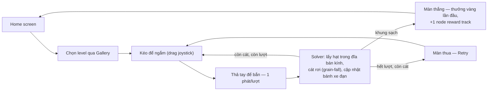
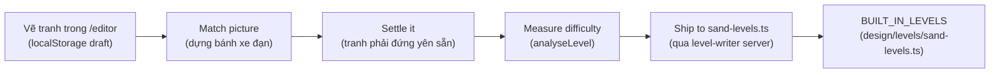
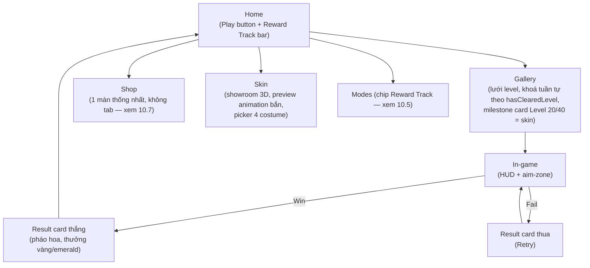

# Game Design Document — 3D Sand Cannon Sort

> Trạng thái: khớp với source tại nhánh `main`, sau khi pivot sang gameplay "bắn theo bán kính"
> (mọi core cũ — xoay model, Goal/Batch, Weak Point, Rainbow Target — đã bị gỡ khỏi source, không
> phải chỉ tắt đi). Tài liệu này là **thiết kế**, không thay thế `README.md` (tổng quan kiến trúc)
> hay `docs/features/*.md` (spec kỹ thuật từng chức năng) — nó trỏ vào các file đó ở từng mục thay
> vì chép lại, để một con số/luật chỉ sống đúng một chỗ và không lệch nhau giữa hai tài liệu.

## 0. Cách đọc tài liệu này

Mỗi mục ghi rõ **vì sao** một quyết định được chọn trước khi nói **nó là gì** — một team đọc để làm
theo cần biết lý do để không vô tình phá luật khi mở rộng. Đọc theo vai trò, không cần đọc hết:

| Vai trò | Đọc trước | Đọc khi cần |
| --- | --- | --- |
| **Game Designer** (chủ tài liệu) | 1, 2, 3, 8, 9, 10, 16 | 4, 5, 7 |
| **Level Designer** | 5, 6, 7, 8 | 3, 9 |
| **Game Artist** | 2, 11, 12 | 5 (hình chìa khoá/wall/freeze) |
| **UI/UX Designer** | 2, 13 | 9, 10, 11 (nội dung hiện trên UI) |
| **Coder / Engineer** | 3, 4, 5, 6, 14, 15 | mọi mục — đây là tài liệu duy nhất tổng hợp *tại sao*, code chỉ có *thế nào* |

## Mục lục

1. [Tầm nhìn & Pillar](#1-tầm-nhìn--pillar)
2. [Core loop & player fantasy](#2-core-loop--player-fantasy)
3. [Luật lõi](#3-luật-lõi)
4. [Thông số & tuning](#4-thông-số--tuning)
5. [Map mechanic](#5-map-mechanic)
6. [Level authoring pipeline](#6-level-authoring-pipeline)
7. [Beat chart — quyển sổ 50 level](#7-beat-chart--quyển-sổ-50-level)
8. [Đường cong độ khó](#8-đường-cong-độ-khó)
9. [Booster](#9-booster)
10. [Economy](#10-economy)
11. [Cosmetic / Skin súng](#11-cosmetic--skin-súng)
12. [Art direction](#12-art-direction)
13. [UI/UX](#13-uiux)
14. [Kiến trúc & file map](#14-kiến-trúc--file-map)
15. [Testing & validation](#15-testing--validation)
16. [Open Decision, chưa làm & roadmap](#16-open-decision-chưa-làm--roadmap)
17. [Glossary](#17-glossary)

---

## 1. Tầm nhìn & Pillar

**3D Sand Cannon Sort** — puzzle casual, người chơi bắn đạn màu vào một bức tranh cát 3D để dọn
sạch nó trước khi hết lượt bắn. Không xoay model, không giải đố không gian — đơn giản đến mức chơi
được bằng một ngón tay, độ khó dồn hết vào **đọc tranh và tính lượt bắn**.

Ba pillar, mọi quyết định thiết kế bên dưới đều quay về được một trong ba:

1. **Minh bạch tuyệt đối** — điểm chạm là điểm chạm, đạn bắn trúng đúng cái mắt thấy. Đây không phải
   khẩu hiệu suông: bug crosshair-lệch-khối từng là bug nghiêm trọng nhất của bản tiền-pivot (raycast
   giả định sai mặt phẳng khi model xoay), và toàn bộ hệ thống cosmetic hiện tại vẫn giữ nguyên tắc
   "skin không bao giờ được là lý do một phát bắn trượt" (`costumes.ts` — rig chỉ trang trí, không
   bao giờ động vào `muzzleAnchor`).
2. **Một ngân sách duy nhất** — số lượt bắn (`shotLimit`) *là* độ khó của một màn, không phải một
   trong nhiều biến. Bánh xe đạn tuần hoàn (mục 3) đảm bảo không bao giờ có "đạn chết" (màu trong tay
   mà không còn gì để bắn) — nên người chơi thua vì tính sai, không bao giờ thua vì bị chặn bởi thứ
   họ không kiểm soát được.
3. **Mechanic là data, không phải nhánh code riêng** — Wall Obstacle, Lock & Key, Freeze Map, Wind
   đều là trường tuỳ chọn trong `SandLevelConfig`. Một level không khai báo trường đó đọc và chạy
   y hệt như trước khi cơ chế tồn tại. Điều này giữ cho core loop luôn là **một** bộ luật
   (`RADIUS_GAMEPLAY`, xem mục 3) dù roster có 3, 4 hay 10 mechanic — thêm mechanic mới không bao giờ
   được phép rẽ nhánh solver theo level.

---

## 2. Core loop & player fantasy

**Một câu pitch:** *"Một khẩu súng cát, một bức tranh, một bàn tay — bắn đúng màu, đúng chỗ, đúng số
lần, trước khi hết đạn."*



Vòng lặp không có bước "chờ" (không cooldown dài, không năng lượng/tim) — độ trễ duy nhất giữa hai
phát là `SHOT_COOLDOWN_MS` 400ms và thời gian đạn bay/cát settle thật (mục 4). Đây là lựa chọn có chủ
đích: game *market-style* (xem mục 3) ăn tiền vào nhịp bắn nhanh, một cơ chế chờ dài sẽ phá nhịp đó.

**Ai chơi game này:** người chơi puzzle casual quen thể loại "sand sort" thị trường (Sort It 3D,
Screw Sort, ...) — kỳ vọng luật đơn giản nhìn là hiểu, phiên chơi ngắn (một màn vài chục giây tới vài
phút), tiến triển hiện ngay trên UI (Gallery khoá/mở theo level, reward track theo mỗi màn thắng).

---

## 3. Luật lõi

Nguồn code duy nhất: `RadiusGameplayPolicy` trong `app/game/sand-types.ts`, hằng số
`RADIUS_GAMEPLAY`. **Toàn bộ 50 level chạy dưới đúng một policy này** — đổi một quyết định thiết kế
là đổi một dòng trong object đó, không sửa rải rác trong solver. Chi tiết đầy đủ:
[docs/features/radius-shot-rule.md](docs/features/radius-shot-rule.md).

### 3.1. Phát bắn: một đĩa, không phải cả vùng

Bắn trúng lấy **mọi hạt cùng màu trong một đĩa bán kính `sortRadius` quanh điểm chạm** — không xoá
cả connected body. Bắn giữa mảng khoét thủng một lỗ tròn; bắn rìa chỉ gặm vài hạt.

> **Vì sao đi ngược brief gốc:** brief `sand_cannon_concept.md` §5 chốt một phát trúng màu xoá toàn
> bộ body liền màu và cấm rõ việc chỉ xoá theo bán kính. Bản này làm đúng điều bị cấm đó — một quyết
> định có chủ ý sau khi so ba gameplay cạnh nhau (bắn cả vùng + cohesion, bắn cả vùng + grain-fall,
> bắn theo đĩa), không phải sơ suất. Bắn-theo-đĩa là thứ khiến "đọc tranh, chọn điểm" trở thành kỹ
> năng thật thay vì chỉ nhắm đại vào bất kỳ đâu trong một mảng.

### 3.2. Bánh xe đạn (không phải hàng đợi hữu hạn)

`ammoQueue` chỉ là **thứ tự khởi đầu**. Bắn xong, nếu màu đó vẫn còn cát trên board thì viên đạn quay
lại cuối hàng; màu sạch hẳn thì rời bánh xe luôn. Hệ quả trực tiếp: **không bao giờ có đạn chết** — vì
vậy ngân sách duy nhất khiến người chơi thua là số lượt bắn, chứ không phải bị kẹt vì cầm nhầm màu.

### 3.3. Miss vẫn tốn lượt, trượt khung thì không

Phát bắn không lấy được gì (đĩa không chạm màu đang cầm) **vẫn tiêu một lượt** — cả đĩa rung để báo.
Bắn hụt hẳn ra ngoài khung hoặc trúng thành khung thì **không** tốn lượt. Lý do: một cú bắn *có chạm*
board là một quyết định của người chơi (chọn sai chỗ), một cú *không chạm gì* là input lỗi/tay trượt,
hai loại lỗi khác nhau nên bị phạt khác nhau.

**Phản hồi hình ảnh (2026-09e):** cả hai loại lỗi này (`NO_MATCH` lẫn `MISS`) giờ dùng chung một hiệu
ứng `.miss-flash` — vignette đỏ nhạt (từ tông `--danger`) phủ từ rìa màn hình vào, chớp rồi tắt trong
0.5s, cát ở giữa tranh giữ nguyên. Thay hẳn 3 toast chữ cũ (từng phân biệt no-color-in-range/hit-frame/
missed-frame) — không phân biệt lỗi nào bằng chữ nữa, chỉ một tín hiệu hình ảnh tức thời duy nhất, để
người chơi không phải rời mắt khỏi tranh đọc chữ. **Phủ trọn toàn màn hình, kể cả đè lên HUD (2026-09n):**
ban đầu `.miss-flash` sống bên trong `.scene-wrap` (dải cảnh 3D, đã bị chính nó inset xuống dưới thanh
HUD trên cùng) nên vignette không bao giờ chạm tới góc chứa số đạn/nút Settings dù `inset: 0`. Dời hẳn
node này ra làm con trực tiếp của `.game-frame` (ngang hàng `.hud-top-left`/`.settings-wrap`), nâng
z-index lên trên cả hai — giờ `inset: 0` phủ đúng nghĩa toàn bộ khung hình chơi, rìa nào cũng đỏ, kể cả
đè lên số đạn và nút Settings trong thoáng chốc của cú chớp.

### 3.4. Win / Fail

Win kiểm tra trước, fail kiểm tra sau — **phát cuối dọn sạch khung là thắng**, không phải hoà. Thắng
khi `remainingCells === 0`. Thua khi hết lượt mà *sau khi* phát cuối đã resolve và cát đã rơi/settle
xong vẫn còn cát trên khung.

### 3.5. Nhịp một phát một lượt

Chỉ bắn được ở state `READY`. Không bắn được khi đang `PROJECTILE_FLYING`, `HIT_RESOLUTION`, hay
`SETTLING` — đảm bảo người chơi luôn thấy trọn vẹn hệ quả của phát trước khi ra quyết định kế tiếp
(quay lại pillar #1: minh bạch).

### 3.6. Adjacency & tie-break trượt cát

- `adjacencyMode: ORTHOGONAL_4` — chỉ chạm cạnh mới nối, chạm góc không nối, không merge.
- `slideTieBreak: LEFT_FIRST_TEMP` — khi một hạt cát trượt chéo mà cả hai bên đều trống: **trái luôn
  thắng**. Một rule toàn cục, không phải ngẫu nhiên — cùng một bức tranh luôn rơi ra đúng một kết quả
  (settle solver là deterministic, xem mục 4 & [settle-solver.md](docs/features/settle-solver.md)).

### 3.7. Bảng đầy đủ `RadiusGameplayPolicy`

| Trường | Giá trị | Open Decision (brief) |
| --- | --- | --- |
| `adjacencyMode` | `ORTHOGONAL_4` | 1 & 2 |
| `settlePolicy` | `GRAIN_FALL_TEMP` (rơi từng hạt, không cohesion) | 3 |
| `slideTieBreak` | `LEFT_FIRST_TEMP` | 4 & 5 |
| `missAmmoPolicy` | `MISS_IS_FREE_TEMP`* | 6 & 7 |
| `deadBulletPolicy` | `VALIDATOR_ONLY_TEMP` (editor chặn lúc author, không fallback runtime) | 12 |
| `shotRule` | `RADIUS_SORT_TEMP` | ngoài brief, xem 3.1 |
| `ammoRule` | `CYCLE_UNTIL_COLOR_CLEARED_TEMP` | ngoài brief, xem 3.2 |
| `nextPreviewCount` | `3` | 9 |
| `cannonConfigRef` | `"prototype-classic-cannon"` | §20 — ballistics kế thừa nguyên bản pre-pivot |

\* Tên hằng số `MISS_IS_FREE_TEMP` dễ gây nhầm — đọc kỹ 3.3: bản thân từ "miss" ở đây nghĩa là *bắn
trúng board mà không trúng màu*, khác với *bắn hụt khung*.

Mọi trường có hậu tố `_TEMP` là một **Open Decision trong brief chưa chốt hẳn**, không phải hardcode
tuỳ tiện — đổi một quyết định thiết kế là sửa đúng giá trị này, không sửa rải rác. Toàn bộ danh sách
Open Decision với số thứ tự khớp brief gốc ở
[radius-shot-rule.md](docs/features/radius-shot-rule.md#mọi-trường-của-radiusgameplaypolicy).

---

## 4. Thông số & tuning

### 4.1. Cannon & input (kế thừa nguyên bản pre-pivot, §20 cấm tự chế số mới)

| Thông số | Giá trị | Ý nghĩa |
| --- | --- | --- |
| `FIXED_LAUNCH_SPEED` | 19 | Tốc độ đạn rời nòng. Đã tăng từ 13.2 gốc vì phản hồi "bắn chậm" — solver ngắm lại từ đầu mỗi phát nên tăng tốc không ảnh hưởng độ chính xác |
| `SHOT_COOLDOWN_MS` | 400 ms | Khoảng nghỉ tối thiểu giữa hai phát |
| `PROJECTILE_RADIUS` | 0.15 | Dung sai va chạm: nếu tâm ngắm rơi vào pixel trống, dò pixel có cát gần nhất trong bán kính này |
| `JOYSTICK_RADIUS` | 64 px | Tầm di chuyển của **núm** joystick ảo (khoá ở rìa pad) |
| `JOYSTICK_RESPONSE_RADIUS` | 256 px, hạ trần theo `JOYSTICK_RESPONSE_RADIUS_SCREEN_FRACTION` (0.42 × cạnh ngắn hơn của `.scene-host`) | Khoảng kéo thật để đáp ứng ngắm đạt 100% mỗi TRỤC (xem ghi chú dưới) |
| `AIM_OUTSIDE_ZONE_CANCEL_MS` | 1700 ms | Grace period: kéo lệch ra ngoài `.aim-zone` không huỷ phát bắn ngay, chỉ huỷ nếu ở ngoài liên tục quá thời gian này |
| Control sensitivity | 0.5 – 2.0 (`MIN/MAX_CONTROL_SENSITIVITY`) | Slider trong Settings, scale trực tiếp phản ứng ngắm |

**Sửa joystick không bao giờ chạm được góc tranh, đặc biệt tranh lớn/gần vuông như 80×90 (2026-09).**
Trên request ("người chơi không thể drag joystick kéo radius tới toàn bộ màn hình được, luôn bị giới
hạn"). Hai lỗi riêng biệt, cả hai đều trong `SandCannonEngine.ts`:

- **Tầm với của cursor tính theo tỉ lệ cố định của viewport** (`AIM_CURSOR_HORIZONTAL/UP/DOWN_RATIO`),
  không theo kích thước thật của khung tranh trên màn hình — với tranh gần vuông lấp gần hết cả
  `FIT_WIDTH` lẫn `FIT_HEIGHT` cùng lúc (80×90 là ví dụ điển hình), mép tranh vượt xa tầm cursor được
  phép tới. Sửa: `cursorForCurrentStick()` giờ chiếu 4 mép khung thật ra toạ độ màn hình
  (`screenPointForWorld`/`worldPointForGrid`) mỗi lần cập nhật, tầm với luôn khớp đúng khung đang hiển
  thị bất kể size/aspect ratio nào.
- **Lỗi gốc, nghiêm trọng hơn:** `aimStick` cũ là một vector đơn (hướng kéo × độ mạnh, độ dài ≤ 1) rồi
  mới nhân riêng theo trục ngang/dọc — nghĩa là vùng cursor có thể tới chỉ là một HÌNH ELLIPSE nội tiếp
  trong khung chữ nhật, 4 góc thật của khung nằm ngoài ellipse đó và **không bao giờ với tới được dù kéo
  bao xa**. Sửa: tách hẳn phản hồi theo từng trục (`axisResponse()`, tính riêng từ độ lệch có dấu của
  từng trục thay vì độ lớn vector chung) — kéo đủ xa CẢ HAI trục cùng lúc (thẳng về phía góc) giờ cho cả
  hai trục đạt ±1 cùng lúc, cursor chạm đúng góc khung.

Test: verify sống trên viewport mobile 375×812, level 80×90 — kéo chéo ~155-160px từ điểm chạm chạm
đúng góc trên-trái khung (khớp pixel với toạ độ tính tay), `is-target-valid` bật đúng, bắn thật dọn cát
đúng góc đó.

### 4.2. Board & simulation

| Thông số | Giá trị | Ý nghĩa |
| --- | --- | --- |
| `pixelScale` | thường `5` (author 12×14 → board pixel 60×70); level lớn dùng trực tiếp 60×70/70×80/80×90/80×93 ở `pixelScale: 1` | Hệ số phóng nguyên từ blueprint tác giả vẽ lên board pixel thật — phóng đều theo bội số nguyên nên không đổi puzzle (số vùng, độ liền kề giữ nguyên) |
| Ngân sách pixel editor | ~4.500 px | Editor tự chọn `pixelScale` lớn nhất giữ board dưới ngưỡng này, cho override tay |
| `sortRadius` | 2 – 18 ô blueprint tuỳ level (xem mục 8) | Bán kính đĩa lấy hạt, đơn vị blueprint cell, scale cùng board |
| Trần bán kính Radius Overcharge | `hypot(frame.width, frame.height)` | Nhân đôi `sortRadius` không bao giờ vượt đường chéo khung — quá điểm đó không ô nào xa hơn để "mua thêm" |

### 4.3. Vì sao board là canvas 2D chứ không phải mesh 3D

Quyết định kỹ thuật này có hệ quả thiết kế trực tiếp: **độ phân giải nhìn thấy = độ phân giải quyết
định luật**, không có lớp "giả mịn cho đẹp" nào tách khỏi logic. Một level 80×90 = 7.200 ô là 7.200
pixel canvas thật, connectivity/radius/win-lose chạy thẳng trên đúng lưới đó. Điều này quan trọng với
Level Designer: **kích thước blueprint không phải chỉ số thẩm mỹ, nó chính là độ chi tiết mà bán kính
đạn phải cắt qua.** Chi tiết kỹ thuật:
[rendering-pixel-board.md](docs/features/rendering-pixel-board.md).

---

## 5. Map mechanic

Nhắc lại pillar #3: mỗi mechanic dưới đây là **field tuỳ chọn**, không đọc trường thì level chạy y
hệt bản không có mechanic nào. Bảng tổng quan:

| Mechanic | Ký tự trong `rows` | Lần đầu xuất hiện | Trạng thái |
| --- | --- | --- | --- |
| Wall Obstacle | `W` | Level 11 (arc "Wall Obstacle") | Ship, dùng ở arc 2 và arc tổng hợp |
| Lock & Key | chữ thường (`r`,`g`,...) = cát khoá; `K` = chìa khoá | Level 21 (arc "Lock & Key") | Ship, dùng ở arc 3 và arc tổng hợp |
| Freeze Map | `@` | Level 31 (arc "Freeze Map") | Ship, dùng ở arc 4 và arc tổng hợp |
| Wind | field `wind` (không phải ký tự tranh) | — | **Đã cài đặt đầy đủ trong engine, chưa có level nào ship dùng tới** — chỉ sống trong fixture test (`crosswind`), sẵn sàng cho arc mới |

### 5.1. Wall Obstacle (`W`)

Ô chắn cứng: không phải cát, không tính vào điều kiện thắng, không bao giờ bị bắn trúng hay rơi.
Đứng yên vĩnh viễn, chỉ làm giá đỡ/chướng ngại cho cát xung quanh settle theo hình nó tạo ra.

**Vì sao có mechanic này:** đây là mechanic *không gian* đầu tiên khác hẳn Level 1-10 (vốn chỉ thử
màu và ngân sách) — ép người chơi tính đường bắn quanh một khung cứng, không còn là một bức tranh
phẳng đơn thuần. Nguồn: `WALL_LETTER` (`sand-rules.ts`), `wallBevelRgb` (`sand-color.ts`) — hiện
**chưa có file doc kỹ thuật riêng** trong `docs/features/`.

### 5.2. Lock & Key

Cát khoá (chữ thường trong tranh) lơ lửng — vẫn có màu, chiếm ô, đỡ cát khác, tính vào điều kiện
thắng — nhưng **không rơi và đĩa bắn không nhìn thấy**, cho tới khi một chìa khoá pixel cứng rơi/trượt
tới chạm nó thì cả vùng khoá đó tan cùng lúc. Một màu bị khoá **toàn bộ** tự động bị loại khỏi bánh xe
đạn (`shootableColors`) và quay lại ngay khi khoá mở — không bao giờ tạo ra đạn chết.

Chìa khoá là một silhouette vẽ tay (`KEY_SPRITE`), không phải hình tròn — nó **trượt**, không lăn.
`keyFriction` (0–1) chỉnh độ ì khi trượt ngang (0 = trượt ngay, 1 = chờ vài pass); không bao giờ ảnh
hưởng tốc độ rơi thẳng, đúng như ma sát thật chỉ cản chuyển động dọc bề mặt tiếp xúc.

**Vì sao có mechanic này:** thêm một trục thời gian/trình tự vào puzzle vốn chỉ có trục không gian —
level 25/27/29 xếp nhiều ổ khoá theo tầng để ép người chơi giải phóng đúng thứ tự. Chi tiết đầy đủ
(silhouette, cách vẽ trong editor, lưu ý khi tự dựng level có khoá):
[lock-and-key.md](docs/features/lock-and-key.md).

### 5.3. Freeze Map (`@`)

Trigger: viên đạn nào chạm tới (bất kể màu gì) sẽ tiêu nó và **đóng băng cả khung** trong
`freezeDuration` lượt kế tiếp (tính cả lượt vừa bắn trúng) — cát không rơi/settle trong lúc đó, HUD
hiện thanh Freeze đếm ngược từng lượt.

**Vì sao có mechanic này:** một cơ chế *thời gian/nhịp độ* — buộc người chơi cân nhắc **khi nào** bắn
trigger (đóng băng có thể có lợi để "khoá" một cấu hình cát đang thuận lợi, hoặc bất lợi nếu bắn nhầm
lúc chưa cần) thay vì chỉ đọc không gian tĩnh. Nguồn: `SandFreezeTrigger`, `freezeDuration`
(`sand-types.ts`) — **chưa có file doc kỹ thuật riêng**.

### 5.4. Wind (đã cài, chưa ship)

Một vòng lặp các pha gió (`direction`/`durationMs`/`cooldownMs`/`power`/`zone`) thổi cát trong lúc
settle. Đã cài đặt và test đầy đủ (`docs/features/wind.md`) nhưng **chưa có trong `BUILT_IN_LEVELS`
nào** — dự trữ cho một arc tương lai (mechanic thứ 5) khi cần thêm biến số mới mà không đụng vào bốn
mechanic đã ship.

---

## 6. Level authoring pipeline

### 6.1. Bảng mã màu (blueprint palette)

24 màu cát, mỗi màu một chữ cái trong `rows`; chữ thường của 12 chữ đầu = màu đó bị khoá
(Lock & Key). `K` = chìa khoá, `W` = Wall Obstacle, `@` = Freeze trigger — ba ký tự này **không** là
màu, không dùng được trong `ammoQueue`.

| Chữ | Màu | Hex | Chữ | Màu | Hex |
| --- | --- | --- | --- | --- | --- |
| `R` | red | `#ff546c` | `T` | teal | `#1fb6a6` |
| `G` | green | `#67e0ba` | `U` | skyblue | `#3d9be0` |
| `Y` | yellow | `#f4d65e` | `I` | indigo | `#6c5ce0` |
| `B` | blue | `#9692b8` | `F` | magenta | `#e0459e` |
| `P` | purple | `#a28fea` | `E` | crimson | `#e8433f` |
| `O` | orange | `#f69509` | `H` | darkbrown | `#6b4021` |
| `C` | cyan | `#00a9f7` | `J` | violet | `#9b4fd1` |
| `M` | pink | `#ff97b2` | `Q` | navy | `#2f4b8f` |
| `L` | lime | `#c1ec35` | `V` | emerald | `#2fae5f` |
| `N` | brown | `#998757` | `X` | rust | `#d1541f` |
| `S` | white | `#ede7d9` | `Z` | mint | `#b8f2dd` |
| `D` | black | `#59565c` | | | |

12 màu đầu (`R G Y B P O C M L N S D`) là bảng gốc; 12 màu sau (`A T U I F E H J Q V X Z`, thêm
`A` = grass `#4fd07a`) mở rộng để tranh nhiều màu vẫn phân biệt được — chọn để lấp đúng khoảng hue
trống của bảng gốc thay vì thêm pastel trung tính ngẫu nhiên. Toàn bộ nguồn:
`SAND_COLOR_BY_LETTER`/`SAND_COLOR_HEX` (`sand-rules.ts`, `SandCannonEngine.ts`).

### 6.2. Hai cách viết một level

1. **Editor `/editor`** (khuyến nghị — dùng cho gần như mọi level trong 50 level ship sẵn): vẽ
   tranh pixel ở **đúng độ phân giải board thật** (không còn blueprint thu nhỏ), dựng bánh xe đạn,
   đo độ khó thật bằng **Measure difficulty**, rồi **Ship to sand-levels.ts** ghi thẳng vào source —
   không copy-paste tay. Cần chạy song song `npm run level-writer` (server Node nhỏ ghi file, vì
   target build là Cloudflare Workers không có filesystem). Toàn bộ tính năng:
   [level-editor.md](docs/features/level-editor.md).
2. **Viết tay** một object `SandLevelConfig` (spread `RADIUS_GAMEPLAY`) và đẩy vào `BUILT_IN_LEVELS`
   — chỉ nên dùng khi cần review diff chi tiết hoặc sửa nhỏ một level có sẵn. Format đầy đủ:
   [level-format.md](docs/features/level-format.md).



### 6.3. Hai lỗi editor bắt buộc phải chặn

Cả hai đều là **ván không thể thắng nhưng game không hề báo gì** nếu viết tay không qua editor:

- Màu có trong tranh nhưng không có trong bánh xe đạn → vùng cát đó không bao giờ được bắn tới.
- Màu có trong bánh xe đạn nhưng không có trong tranh → viên đạn mở màn không có gì để bắn.

Editor coi cả hai là **error** (không phải warning) — level còn error không hiện trong level
switcher của game; nút **Fix wheel** tự sửa bằng cách suy bánh xe lại từ tranh.

### 6.4. Tranh phải "đứng yên sẵn"

Cát vẽ lơ lửng sẽ sụp ngay frame đầu — cái người chơi thấy sẽ không phải cái tác giả vẽ. Editor có
nút **Settle it** thả tranh về đúng trạng thái nghỉ (không thêm/bớt hạt nào); viết tay thì tự kiểm
bằng `runGrainSettle(bodies, frame)`. Xem [settle-solver.md](docs/features/settle-solver.md).

---

## 7. Beat chart — quyển sổ 50 level

`BUILT_IN_LEVELS` (`design/levels/sand-levels.ts`) ship **50 level**, chia **6 arc** — mỗi arc giới
thiệu đúng một biến số mới, arc cuối trộn chung mọi thứ đã học. Đây là cấu trúc curriculum kiểu
"dạy-một-thứ-mỗi-lần" chuẩn casual puzzle, không ngẫu nhiên.

| Arc | Level | Dạy gì | avg `shotLimit` | range `shotLimit` | avg `sortRadius` |
| --- | --- | --- | --- | --- | --- |
| 0. Nhập môn | 1–3 | Ngắm-bắn (L1, 1 màu, `shotLimit: ∞`) → hàng đợi đạn (L2, 3 màu, `∞`) → ngân sách lượt lần đầu (L3) | 26.0* | 26 | 2.3 |
| 1. Beatchart gốc | 4–10 | Tranh nhiều màu/nhiều vùng, chưa mechanic phụ | 39.3 | 30–45 | 13.3 |
| 2. Wall Obstacle | 11–20 | Tính đường bắn quanh chướng ngại cứng | 42.5 | 30–55 | 10.6 |
| 3. Lock & Key | 21–30 | Trình tự mở khoá, đỉnh ở L29 (3 ổ khoá xếp tầng) | 49.0 | 35–65 | 13.0 |
| 4. Freeze Map | 31–40 | Chọn thời điểm bắn trigger đóng băng | 45.2 | 30–65 | 12.1 |
| 5. Tổng hợp | 41–50 | Trộn Wall + Lock & Key + Freeze Map cùng một tranh | 56.5 | 40–80 | 13.0 |

\* Trung bình chỉ tính Level 3 (26 lượt) — Level 1 & 2 dùng `shotLimit: Infinity` có chủ đích (xem
8.1), không phải giá trị đo được.

**Vì sao đúng thứ tự này:** mỗi arc mở ra khi cơ chế trước đã "ngấm" — arc 2 (Wall) không cần logic
mới (chỉ là một loại ô), arc 3 (Lock & Key) đứng sau vì nó thêm hẳn một chiều thời gian, arc 4
(Freeze) đứng sau Lock & Key vì cả hai đều là "chờ đúng lúc" nhưng Freeze đơn giản hơn (một trigger,
không xếp tầng) — xếp trước Lock&Key sẽ dạy khái niệm khó trước khái niệm dễ. Arc 5 không dạy gì mới,
chỉ kiểm tra ba mechanic **phối hợp** với nhau thay vì đứng một mình (nguồn: comment thiết kế ngay
trong `sand-levels.ts`, dòng gần `Levels 21-30` và `Levels 11-20`).

Level đủ chi tiết (id, kích thước khung, bán kính, ngân sách lượt, có freeze/key friction hay không)
nằm ở [Phụ lục A](#phụ-lục-a-bảng-đầy-đủ-50-level) cuối tài liệu — dùng để đối chiếu khi thêm level
mới vào một arc có sẵn.

---

## 8. Đường cong độ khó

### 8.1. Độ khó của một level radius là gì

> `shotLimit` **là** độ khó — chọn nó bằng cảm tính là chọn độ khó bằng cảm tính.
> — [difficulty-measurement.md](docs/features/difficulty-measurement.md)

Vì bánh xe đạn không bao giờ tạo đạn chết (mục 3.2) và bán kính/hình dạng tranh quyết định số lượt
*tối thiểu* cần để dọn sạch, ngân sách lượt còn lại (slack) so với mức tối thiểu đó chính là độ khó.
Có **hai** hệ thống đo, dùng cho hai việc khác nhau:

| Hệ thống | Dùng để | Cách đo |
| --- | --- | --- |
| `analyseLevel` (nút **Measure difficulty**) | Chốt `shotLimit` cho **một** level cụ thể trước khi ship | Chạy 2 model *thật* trên đúng solver game: `playStrong` (luôn chọn đĩa lấy nhiều hạt nhất → sàn tối thiểu) và `playCareless` (bắn đại, 8 lần, seed cố định → ngân sách có phạt được cẩu thả không) |
| `computeLevelDifficulty` | Xếp hạng **cả danh sách** level trong editor + input công thức thưởng vàng (mục 10) | Heuristic rẻ, không chạy solver — 5 tiêu chí trọng số bằng nhau (`size`, `colors`, `interleaving`, `ammo`, `radius`), quy về điểm 0–100 |

### 8.2. Verdict của `analyseLevel` — checklist khi ship một level

| Verdict | Điều kiện | Hành động |
| --- | --- | --- |
| `unclearable` | `strongShots === null` (không giải nổi) hoặc `slack < 0` | **Chặn ship** — sửa tranh/bán kính/ngân sách |
| `too-tight` | `0 ≤ slack < 3` | Nên nới `shotLimit`, trừ khi cố ý làm level "khó gắt" cuối một arc |
| `too-easy` | Chơi ẩu thắng cả 8/8 lần | Nên siết `shotLimit` hoặc tăng độ phức tạp tranh |
| `good` | Còn lại | Ship được |

Editor gợi ý `suggestedShotLimit = strongShots + 6` — đủ dư để người chơi giỏi đọc sai một-hai nước
đi vẫn qua màn, nhưng không dư tới mức game tự chơi hộ.

### 8.3. Đường cong thật của 50 level (proxy: `shotLimit`)

Sparkline dưới đây vẽ trực tiếp từ `shotLimit` của cả 50 level (khối thấp = ngân sách chặt/dễ hụt
hơn so với độ phức tạp tranh, khối cao = ngân sách rộng hơn — **không** đọc thẳng "cao = khó", đọc
theo mục 8.1: độ khó thật là *slack*, `shotLimit` chỉ là nửa phép tính nhìn thấy được mà không cần
chạy solver):

```
··▁▂▃▂▃▃▃▃▂▄▂▃▅▃▃▂▅▃▂▃▃▄▃▅▄▅▆▃▂▃▃▃▄▄▃▂▆▃▅▃▄▃▅▆▇▅█▄
         1         2         3         4         5   (chục level)
```

(`··` = Level 1–2 dùng `shotLimit: Infinity`, cố ý không nằm trong thang đo — xem 8.1.) Đọc theo
arc (bảng ở mục 7): mỗi arc mới **hạ nhẹ** ngân sách trung bình xuống so với đỉnh arc trước (relief
khi học khái niệm mới — arc 4 Freeze mở đầu ở 30, thấp hơn hẳn đỉnh 65 của arc 3 Lock & Key), rồi
**leo dần** tới một đỉnh test-độ-thành-thạo cuối arc (L29 = 65 lượt/3 ổ khoá xếp tầng, L49 = 80
lượt/màn tổng hợp khó nhất roster). Đây là đường cong dạng răng cưa đi lên (sawtooth ascending), kiểu
chuẩn của casual puzzle theo arc, không phải một dốc tuyến tính đơn điệu.

### 8.4. Quy trình cho Level Designer khi thêm level mới

1. Vẽ trong editor, dựng bánh xe đạn bằng **Match picture**.
2. **Settle it** — đảm bảo tranh đứng yên sẵn.
3. **Measure difficulty** — đọc verdict, không tự đoán `shotLimit`.
4. So `strongShots`/`suggestedShotLimit` với arc đang nhắm ở bảng mục 7 (hoặc Phụ lục A) — level mới
   nên nằm trong hoặc gần range `shotLimit` của arc đó, trừ khi cố ý làm một "đỉnh" cuối arc.
5. Ship. Điểm `computeLevelDifficulty` (0–100) tự động quyết định thưởng vàng — không cần gán tay
   (mục 10.3).

---

## 9. Booster

Ba loại, mua bằng Vàng trong Shop, **mutually exclusive** — chỉ một loại armed tại một thời điểm; bấm
lại nút đang armed thì huỷ (không tốn viên). Charge trừ **ngay khi đạn rời nòng**, không phải lúc arm
— arm rồi restart level trước khi bắn thì không mất viên.

| Booster | Hiệu ứng | Giá | Ghi chú thiết kế |
| --- | --- | --- | --- |
| **Radius Overcharge** | Nhân đôi `sortRadius` cho một phát, chặn ở đường chéo khung | 100 vàng | Vẫn phải đúng màu đang cầm; đạn phình to dần lúc bay, đạt max size đúng lúc chạm khung |
| **Prism Shot** | Bỏ điều kiện đúng màu — lấy **mọi** màu trong đĩa, có thể xoá nhiều body khác màu cùng lúc | 100 vàng | Đạn đổi màu theo vòng quang phổ, để lại vệt cầu vồng khi bay |
| **Chain Sort** | Bỏ hẳn đĩa bán kính — lan theo **đúng một màu** ra mọi ô liền kề (8 hướng, kể cả chạm góc), không giới hạn số ô | 150 vàng | Đắt hơn vì không có trần: một mảng khổng lồ dọn sạch trong một phát. Không có ring aim hiển thị (không có bán kính cố định để vẽ) |

Mỗi loại có **1 viên miễn phí lúc mới chơi** (`STARTER_BOOSTER_CHARGES`) — để người chơi khám phá
bằng cách dùng thử, không phải đọc mô tả rồi đoán. Số viên/giá đều hand-tune qua
`public/design/economy.csv`, không hardcode (mục 10.4). Field `requiresBooster` trên level (đánh dấu
"level này bắt buộc dùng đúng booster X mới qua") đã có trong data model nhưng **chưa có gì đọc**,
chờ một solver/validator sau này. Chi tiết đầy đủ:
[booster-radius-prism-spec.md](docs/features/booster-radius-prism-spec.md).

**Chain Sort ẩn tới level 5 (2026-09e):** hằng số `CHAIN_SORT_UNLOCK_LEVEL_ID = 5` — nút Chain Sort
trong khay booster lúc chơi (`level.id >= 5`) lẫn ô Chain Sort trong Shop (`hasClearedLevel(4)`) đều ẩn
cho tới khi level 5 mở khoá. Radius Overcharge/Prism Shot không bị ảnh hưởng, hiện từ đầu game — hai
booster này có tutorial riêng ở level 3 (xem 13.4), còn Chain Sort có tutorial riêng ở chính level 5,
nên ẩn nó đi tới lúc đó tránh một nút chưa ai dạy cách dùng nằm sờ sờ trong tray/Shop từ sớm.

**Level 1-2: khay booster hiện nhưng trống trơn, không ẩn cả khay (2026-09i):** trước đây level 1
(`ftueGesture: true`) và level 2 (`hideBoosterHud: true`) ẩn hẳn `.booster-hud` — giờ khay LUÔN mount
khi đang chơi, chỉ riêng danh sách nút bên trong nó trống (không có Radius/Prism/Chain Sort nào) cho hai
level này. Lý do: layout HUD tổng thể (khoảng trống dành cho khay ở đáy màn hình) giữ nguyên ngay từ
level 1, không bị dịch lên/xuống một lần nữa khi booster thật sự mở khoá ở level 3. `.booster-hud` có
`min-height: 70px` (2026-09j, sửa lỗi tray trống bị co lại thấp hơn khi không có nút bên trong) để
size/vị trí luôn giống hệt nhau dù có 0, 2 hay 3 nút — đã xác nhận `getBoundingClientRect()` khớp tuyệt
đối giữa level 1 (0 nút) và level có nút thật. **Chỉ trống ở LƯỢT ĐẦU (2026-09k):** cùng `onboardingLockLifted`
dùng cho Settings/nút ✕ (xem 13.6) — một khi level 3 đã dọn xong một lần, chơi lại level 1/2 từ Gallery
sẽ thấy khay có đủ nút thật ngay từ đầu, không còn trống nữa.

---

## 10. Economy

Toàn bộ **client-only** (`localStorage`), không tài khoản/server. Ba loại "tiền" (Gems đã bỏ hẳn,
2026-09d — xem §10.7):

| Currency | Nguồn kiếm | Dùng để | Trạng thái |
| --- | --- | --- | --- |
| **Vàng (Gold)** | Thắng level lần đầu (mục 10.3) + Daily Login | Mua lượt booster | Thật, đang hoạt động |
| **Blue Emerald** | Reward Track (mục 10.5, nguồn FREE duy nhất) + một ít trong Bundle của Shop (mục 10.7) | Mua skin súng (mục 11) | Thật, đang hoạt động |
| **Hearts (Tim)** | Hồi theo thời gian (mục 16.6) + mua trực tiếp/trong Bundle ở Shop (mục 10.7) | 1 lượt chơi (Play/Restart) | Thật, đang hoạt động |

### 10.1. Ví khởi đầu

| Hằng số | Mặc định | Key CSV (`economy.csv`) |
| --- | --- | --- |
| `STARTER_GOLD` | 100 | `starterGold` |
| `STARTER_GEMS` | 240 (display-only) | — |
| `STARTER_EMERALDS` | 0 (cố ý — phải tự kiếm cycle đầu) | — |
| Booster khởi đầu | 1 viên mỗi loại | `starterBoosterRadiusOvercharge/PrismShot/ChainSort` |

### 10.2. Giá booster

| Booster | Giá | Key CSV |
| --- | --- | --- |
| Radius Overcharge | 100 | `boosterPriceRadiusOvercharge` |
| Prism Shot | 100 | `boosterPricePrismShot` |
| Chain Sort | 150 | `boosterPriceChainSort` |

### 10.3. Thưởng vàng theo level

```
levelGoldReward(score) = round((5 + score * 0.3) / 5) * 5
```

`score` là điểm `computeLevelDifficulty` (0–100, mục 8.1) tính trên `raw` level (scale blueprint,
không phải pixel board). Kết quả nằm trong **5–35 vàng**, làm tròn bội số 5. Trả **đúng một lần**
khi thắng lần đầu trên trình duyệt — chơi lại không farm thêm được, vì số thưởng chỉ có ý nghĩa khi
nó thật sự đo theo độ khó. Level nào cần số khác công thức thì thêm dòng vào
`public/design/level-rewards.csv` (override tay, không bắt buộc điền hết). Chi tiết:
[level-rewards.md](docs/features/level-rewards.md).

**Mục tiêu cân bằng (2026-09):** chơi khoảng **5 level (lần đầu thắng)** là đủ mua **1 lượt Radius
Overcharge/Prism Shot** (100 vàng) — công thức trên được neo sao cho một level độ khó trung bình
(score 50) trả đúng 20 vàng = 100 ÷ 5.

### 10.3b. Thưởng mốc hàng chục (10/20/30/40/50)

Cộng THÊM vào thưởng thường của level đó (công thức trên hoặc CSV override), chỉ ở **lần thắng đầu
tiên**, tại 5 level mốc hàng chục — số tăng dần qua từng mốc, luôn rơi vào khoảng **2/3 đến 3/4 giá
một booster**, để mỗi mốc đọc thành "gần đủ mua nguyên một booster" chứ không phải một khoản lặt vặt:

| Level mốc | 10 | 20 | 30 | 40 | 50 |
| --- | --- | --- | --- | --- | --- |
| Bonus (vàng) | 65 | 75 | 90 | 100 | 115 |
| ≈ tỉ lệ so với giá booster | 2/3 × 100 | 3/4 × 100 | 3/4 × 120 | 2/3 × 150 | 3/4 × 150 |

Override từng mốc qua `economy.csv` (`levelMilestoneBonus10`..`levelMilestoneBonus50`). Gallery
hiển thị pill = thưởng thường + bonus mốc, kể cả trước khi level đó unlock, như một mồi nhử.

### 10.4. Cách hand-tune không đụng code

Mọi con số ở mục 10.1–10.3 đều **fallback** — số thật đi qua `public/design/economy.csv` /
`level-rewards.csv` trước (`economy-config.ts` fetch + poll lại mỗi 4 giây khi tab mở), chỉ rơi về
hằng số khi sheet không có dòng cho key đó. Designer sửa CSV, lưu, F5 hoặc chờ 4s là thấy số mới —
không cần build lại. Xem [design/economy/README.md](design/economy/README.md).

### 10.5. Reward Track — nguồn Blue Emerald duy nhất

Một thanh 5-node ở màn Home, đầy khi **thắng đủ 5 level** (kể cả chơi lại — không phải chỉ level
chưa từng thắng, vì bar sẽ đứng im khi hết level mới), node thứ 5 mở **chest** trả Blue Emerald rồi
vòng tiếp tục — **không loop về đầu**, cycle sau luôn trả nhiều hơn cycle trước:

| Cycle | 1 | 2 | 3 | 4 | 5 | 6+ |
| --- | --- | --- | --- | --- | --- | --- |
| Emerald | 500 | 600 | 750 | 900 | 1.250 | `round(last × 1.25^n / 50) × 50` |

500 (cycle 1) được neo đúng bằng giá Rune Cannon (mục 11) — 5 màn thắng = đủ tiền skin đầu tiên, số
đọc thành "một chu kỳ" thay vì một con số người chơi phải tự làm phép tính.

**Đá emerald đứng yên thật sự sau khi rơi, không "chốt" lại một nhịp nữa (2026-09h):** màn mở chest 3D
(`chest-model.ts`) tung 8 viên đá bay ra, nảy rồi dừng theo vật lý thật. Trước đây, ngay khi một viên đủ
chậm để dừng, nó đứng tạm ở độ cao/góc xoay giữa chừng rồi một bước riêng sau đó mới lerp/slerp về đúng
độ cao và tư thế nghỉ cuối — viên đá trông như đã rơi xong, đứng yên, rồi bỗng tự dịch chuyển thêm một
nhịp để "chốt" vào chỗ cuối, đọc như một lỗi hoạt hình hơn là một viên đá thật sự dừng lại. Giờ gộp làm
một bước: đủ chậm để dừng là chốt thẳng vào vị trí/tư thế nghỉ cuối cùng ngay lập tức, không còn giai
đoạn "đứng tạm rồi chỉnh tiếp".

### 10.6. Daily Login

Gắn liền với **lịch thật** (2026-09 rework), không còn là chu kỳ 7 ngày tự lặp không quan tâm hôm nay
là thứ mấy: thưởng của **hôm nay** tính thẳng từ thứ thật trong tuần (Thứ Hai → Chủ Nhật, theo đồng
hồ máy người chơi), và modal hiển thị nguyên một **lưới lịch tháng hiện tại** — mỗi ô là một ngày
thật, số ngày hiện dạng ordinal ("1st"/"2nd"/"13th"), ✓ chỉ hiện trên đúng ngày đã claim thật (không
suy luận từ "trước hôm nay").

**Vàng cố định T2-T6, T7/CN không còn vàng — chỉ booster (2026-09e/f):**

| Thứ | T2 | T3 | T4 | T5 | T6 | T7 | CN |
| --- | --- | --- | --- | --- | --- | --- | --- |
| Vàng | 10 | 10 | 10 | 10 | 10 | 0 | 0 |
| Ưu đãi thêm | — | — | — | — | — | +1 Radius Overcharge | +1 Prism Shot |

5 ngày đầu tuần (T2–T6) trả CÙNG một mức vàng cố định (10 — một phần thưởng của `levelGoldReward(50)`,
level khó trung bình), không còn tăng dần theo ngày như bản trước. T7/CN (cuối tuần) KHÔNG trả vàng gì
cả (`DAILY_LOGIN_REWARDS[5]`/`[6]` = 0) — phần thưởng duy nhất của 2 ngày này là 1 lượt booster miễn
phí, và hai ngày lấy phiên NHAU thay vì cùng một loại: Thứ Bảy tặng Radius Overcharge, Chủ Nhật tặng
Prism Shot (`WEEKEND_BOOSTER_PERK`, `economy.ts`).

**Ngày 13 hàng tháng — "ngày may mắn" tặng Chain Sort:** bất kể rơi vào thứ nào, ngày 13 dương lịch mỗi
tháng luôn tặng thêm 1 lượt Chain Sort (`CHAIN_SORT_BONUS_DAY_OF_MONTH`, hàm `dailyLoginBoosterPerk` —
`economy.ts`) — thắng cả luật cuối tuần (ngày 13 trùng T7/CN vẫn ra Chain Sort thay vì Radius/Prism), và
cộng thêm vào vàng bình thường nếu ngày 13 rơi vào ngày thường.

**Hình thức lưới (2026-09e/f):** không còn số vàng in trên ô nào — icon coin (không kèm số) chỉ hiện ở
ô ngày thường không có booster, vì mọi ngày thường giờ trả cùng một mức nên con số không nói lên gì
thêm. Icon booster (khi có) to và nằm giữa ô, không còn là badge nhỏ ở góc.

**Khối lịch là hình chữ nhật vuông vức, lưới mỏng (13/09).** Trên request ("shape lịch là hình chữ
nhật... không còn bo góc", rồi "grid mỏng hơn và các ô vuông ko còn bo góc", rồi "độ dày grid ngoài
cùng phải mỏng hơn nữa", rồi "mỏng, dày thêm xíu nữa"): khối nền đen/nâu bao cả lưới bỏ hẳn bo góc; viền
ngoài cùng của khối đó (trước là padding dày 8px) mỏng lại còn 3px sau vài lượt chỉnh; đường lưới giữa
các ô mỏng từ 4px xuống 1px; từng ô vuông bỏ luôn bo góc riêng — một lưới ô vuông liền mạch thay vì dãy
chip bo tròn.

Streak (chuỗi ngày liên tiếp claim, hiển thị dưới lưới khi ≥ 2) vỡ khi bỏ lỡ ≥ 2 ngày thì **reset về
0** — cố ý, để streak có ý nghĩa thật; giữ nguyên nếu claim liên tục hoặc gap tới hôm nay ≤ 1 ngày.
Tính theo ngày local của máy người chơi, không phải UTC.

**Buộc tắt khi chuyển hub, kèm chấm đỏ nhắc nếu chưa nhận (2026-09l):** trước đây modal Daily Login
không hề gắn với tab hub đang mở — bấm thanh tác vụ dưới để sang Shop/Skin/Gallery/Modes trong lúc
modal đang hiện thì nó cứ đứng yên đè lên trên màn vừa chuyển sang. Giờ bấm bất kỳ tab nào khác (thật
sự đổi tab, không phải bấm lại đúng tab đang mở) trong lúc modal đang mở sẽ **buộc đóng nó ngay lập
tức**. Nếu lúc đóng cưỡng bức đó phần thưởng hôm nay **vẫn chưa được nhận**, bật đèn báo `.hub-nav-dot`
đỏ trên tab Home VÀ một chấm đỏ tương tự trên chính nút quà tặng góc phải trên cùng (nút mở lại modal)
— cả hai đều tắt ngay khi người chơi bấm nhận thưởng thật sự, không phải chỉ mở lại modal xem qua. Đóng
bằng cách thường (nút ✕ hoặc bấm ra ngoài) không bật hai chấm đỏ này — chỉ trường hợp bị "kéo đi" giữa
chừng bởi một cú bấm khác mới cần nhắc lại.

### 10.7. Shop — 1 màn thống nhất, Gems đã bỏ hẳn (2026-09d)

**Bỏ Gems khỏi toàn bộ game**, không chỉ khỏi Shop — `Wallet.gems`/`STARTER_GEMS`/`getGems()` xoá
hẳn khỏi `economy.ts` (Gems trước đó vốn đã "hiển thị số, chưa nối kiếm/tiêu/thanh toán thật" — không
có logic thật nào bị mất). Shop đổi từ 2 tab (Gems / Coins) sang **1 màn duy nhất, cuộn dọc, không
tab** — thứ tự từ trên xuống:

1. **Special Offers** — 2 ưu đãi giới hạn, giờ bán Coins + Hearts + một ít Blue Emerald (thay vì
   Coins + Gems trước đây).
2. **Bundles** — 5 mốc giá ($0.99 → $49.99), mỗi mốc bán CẢ BA: Coins (giữ nguyên số cũ), Hearts
   (tăng dần theo giá, tối đa `MAX_HEARTS` — không mốc nào bán quá số tim bể chứa có thể giữ), một ít
   Blue Emerald (không đủ mua nguyên 1 skin ở mốc rẻ, đáng kể ở mốc đắt).
3. **Coins** — mua xu trực tiếp, **6 mốc** ($0.99, $4.99, $9.99, $19.99, $49.99, $99.99 — bỏ mốc
   $1.99/440 xu, 2026-09ad: "loại bỏ gói 1.99 trong shop").
4. **Hearts** — mục mua riêng, y hệt layout Coins, **2 mốc** (1 tim $0.99, 5 tim "Full refill" $2.99 —
   cùng đợt bỏ mốc $1.99/3 tim).

Layout Coins/Hearts: **3 gói/dòng** (2026-09ad, trước đó 2/dòng) — `.pack-grid` `grid-template-
columns: repeat(3, 1fr)`.
5. **Boosters** — chuyển xuống **cuối cùng** (trước đây là tab "Coins" riêng) — đây là luồng mua duy
   nhất thật sự tiêu tiền chơi được (vàng), tách biệt hẳn với mọi thứ real-money bán ở trên.

Không có control nào ở đây nối payment processor thật — mọi nút giá (trừ Boosters) chỉ hiện toast
"chưa hoạt động" (`notifyIapComingSoon`), y như thiết kế cũ.

**Khoá kéo ngang (2026-09-13).** `.shop-scroll` chỉ đặt `overflow-y: auto`, để `overflow-x` rơi về mặc
định `visible` — theo spec CSS, một trục `visible` cạnh trục kia không `visible` tự tính lại thành
`auto`, nên bất kỳ phần tử con nào lỡ rộng hơn khung dù chỉ vài px (glow/shadow của một offer card,
badge tràn nhẹ ra ngoài khung của nó) cũng biến thành kéo ngang được — trên request "trong giao diện
shop, người chơi có thể kéo left right và tôi không thích điều đó… chỉ kéo xuống thôi". Sửa bằng khai
báo thẳng `overflow-x: hidden` + `touch-action: pan-y` trên `.shop-scroll`.

---

## 11. Cosmetic / Skin súng

7 skin cho khẩu súng cát — **không bao giờ đổi ballistics/aim** (pillar #1, mục 1): rig chỉ trang trí
quanh `muzzleAnchor`, mọi phát bắn của mọi skin bay đúng cùng một quỹ đạo.

Bảng dưới liệt kê đúng thứ tự hiện trong khay Skin screen (`COSTUME_ORDER`, `costumes.ts`) — trên
request ("luôn cho progression skin gần skin mặc định, còn skin mua bằng blue emerald sẽ sắp xếp
sau"): skin mặc định dẫn đầu, 2 skin progression (mở bằng cách chơi, không mua được) bám ngay sau nó,
rồi mới tới các skin mua thật bằng Blue Emerald, xếp theo giá tăng dần.

| # | Skin | Tagline | Flavor VFX | Cách mở | Giá |
| --- | --- | --- | --- | --- | --- |
| 1 | **Field Cannon** | "Load. Aim. Boom." | `classic` — chỉ khói/tung cát nền | Mặc định, mọi người chơi có sẵn | Miễn phí |
| 2 | **Hero Cannon** | "Quest. Aim. Onward." | `classic` | Thưởng miễn phí khi clear **Level 20** lần đầu | — (progression) |
| 3 | **Frost Cannon** | "Chill. Aim. Shatter." | `frost` — lấp lánh trắng-cyan riêng | Thưởng miễn phí khi clear **Level 40** lần đầu | — (progression) |
| 4 | **Rune Cannon** | "Charge. Sparkle. Repeat." | `magic` — lấp lánh + overlay rune quanh bán kính | Mua bằng Blue Emerald | 500 💎 |
| 5 | **Web-Slinger Cannon** | "Sling. Aim. Web 'em up." | `classic` + bling riêng (đỏ/bạc, qua `sparkleBlingColors` theo id) | Mua bằng Blue Emerald | 1000 💎 |
| 6 | **Viking Cannon** | "Raid. Aim. Plunder." | `classic` + bling riêng (đồng/vàng, qua `sparkleBlingColors` theo id) | Mua bằng Blue Emerald | 1300 💎 |
| 7 | **Cat Cannon** | "Pounce. Aim. Purr." | `classic` + bling riêng (pastel hồng/cam/kem, qua `sparkleBlingColors` theo id) | Mua bằng Blue Emerald | 1800 💎 |

**Web-Slinger Cannon: thiết kế nhện gốc, không phải nhân vật có bản quyền (2026-09).** Chủ đề nhện/mạng
nhện gợi hứng từ "spiderman" theo yêu cầu, nhưng KHÔNG dùng tên, logo hay bộ đồ của bất kỳ nhân vật nào
có bản quyền — tránh rủi ro vi phạm IP cho một món hàng bán thật bằng Blue Emerald. `buildSpiderCannon`
(`costumes.ts`) tự thiết kế hình khối riêng thay vì chỉ đổi màu: 6 chân nhện gập khớp (2 đoạn mỗi chân,
có "đầu gối") vòng quanh bệ thay cho vành trơn; một mạng nhện dạng nan hoa (ring + 8 spoke) thay cho
vành trim mượt các skin khác dùng; một cặp mắt kính trắng cỡ lớn gắn trên housing — chi tiết duy nhất
gợi "nhện" ngay từ cái nhìn đầu mà không sao chép mặt nạ của nhân vật cụ thể nào; và hai răng nanh cong
kẹp hai bên đầu nòng thay vành trim thường. Giá 1000 💎.

**Viking Cannon: bệ dạng thùng gỗ (LatheGeometry), không chỉ đổi màu (2026-09).** Chủ đề Viking/châu Âu
trung cổ, dùng mô-típ chung (sừng, xích, đầu rồng, khiên) chứ không gắn với một biểu tượng văn hoá cụ
thể nào có bản quyền. `buildVikingCannon` (`costumes.ts`): bệ đổi hẳn từ hình trụ sang dáng thùng rượu
phình giữa, thắt hai đầu, dựng bằng `LatheGeometry` (kỹ thuật hình khối duy nhất dùng profile-xoay,
chưa skin nào khác dùng) kèm đai sắt + đinh tán quanh vành; một cặp sừng cong thon 3 đoạn gắn trên
housing (phụ kiện riêng, cùng vai trò chân nhện của Web-Slinger); một khiên tròn (đĩa sơn đỏ + viền
đồng + núm giữa) gắn mặt trước housing; một dải đinh tán xoắn ốc quấn quanh nòng thay vành trim thẳng;
và đầu nòng tạo hình đầu rồng cách điệu (mõm gỗ + sừng tai + mắt) ôm quanh lỗ nòng — lỗ nòng chính là
"miệng rồng" chứ không phải hình khối riêng che khuất đường đạn. Giá 1300 💎.

**Cat Cannon: housing trở thành khuôn mặt mèo thật, bảng màu pastel tự chọn (2026-09).** Chủ đề mèo dễ
thương theo yêu cầu, màu pastel hồng/trắng/cam tự thiết kế — không gắn với giống mèo hay nhân vật cụ thể
nào. `buildCatCannon` (`costumes.ts`): housing (quả cầu turret) đổi hẳn thành khuôn mặt — hai tai tam
giác (cone 3 cạnh) có tai trong hồng lồng bên trong, hai mắt tròn to kèm đốm sáng (chi tiết "dễ thương"
dễ nhận nhất), mũi hồng nhỏ, và 6 sợi ria (3 mỗi bên); một cái đuôi cong vút lên từ bệ súng theo 4 đốt
thon dần (phụ kiện riêng, cùng vai trò sừng Viking/chân Web-Slinger), có khoang kem ở chóp và 2 vòng sọc
tabby; bệ súng viền quanh bằng 6 cụm dấu chân mèo (đệm chính + 3 ngón) thay vành trơn; và đầu nòng tạo
hình một bàn chân mèo thật (đệm chân + 4 ngón chân) ôm quanh lỗ nòng thay vành trim thường. Giá 1800 💎
— đắt nhất hiện có.

**Cat Cannon: bỏ màu xám khỏi bảng màu (2026-09).** Trên request ("tui muốn ụ súng màu khác ngoài
xám") — nòng súng và 2 vòng sọc trên đuôi (trước dùng pastel xám `0xcfcdd6`) đổi sang một tông hồng đậm
hơn (`rose`, `0xffaed0`), khác với hồng tươi (`pink`, `0xffb9d6`) dùng cho tai trong/mũi/đệm chân — để cả
bộ chỉ còn hồng/cam/kem, không còn mảng màu trung tính nào.

**Vì sao 2/7 skin gắn với mốc level thay vì mua:** Hero Cannon (L20) và Frost Cannon (L40) trùng đúng
ranh giới arc "Wall Obstacle → Lock & Key" và "Freeze Map → Tổng hợp" (mục 7) — skin đọc như một huy
hiệu "đã qua chặng này", không phải một món hàng, nên card của nó trong Gallery hiện badge
Progression thay vì nút Buy. Nguồn: `costumes.ts` (registry rig + giá), `SandGame.tsx` (màn Skin,
Gallery milestone card).

**Frost Cannon: hình khối riêng, không chỉ đổi màu (2026-09m).** Bản trước chỉ đổi palette lên đúng ba
khối classic (pedestal/housing/barrel hình trụ-cầu-trụ y hệt) cộng vài icicle nhỏ rắc quanh viền — đọc
như "cannon cũ sơn lại", không đủ khác. `buildFrostCannon` (`costumes.ts`) giờ đổi hẳn HÌNH KHỐI, không
chỉ chất liệu: pedestal đổi từ hình trụ tròn trơn (40 cạnh, giống 3 skin kia) sang hình trụ 8 cạnh có
mặt phẳng (đọc như khối băng được chặt ra, không phải đĩa tiện tròn); housing đổi từ khối cầu trơn sang
`IcosahedronGeometry` (khối đa diện mặt phẳng, như một mắt băng bị đẽo); thêm hẳn một mũi băng lớn bất
đối xứng nhô ra từ một cạnh bệ (phụ kiện riêng của skin này, cùng vai trò với dải hạt phát sáng của Rune
Cannon hay túi da của Hero Cannon) kèm một mảnh nhỏ tựa vào gốc nó; và dải "băng bám" dọc một bên nòng
súng — 7 gai băng lệch cỡ, lệch pha, mọc dọc một dải góc hẹp (không còn 2 vòng nhẫn phát sáng đối xứng
như trước) để đọc đúng như băng tích tụ tự nhiên, không phải một vòng trim gắn thêm. Icicle quanh viền
bệ và cụm pha lê ở đầu nòng của bản trước vẫn giữ nguyên.

---

## 12. Art direction

*(Đọc kỹ nếu bạn là Game Artist — đây là kỹ thuật vẽ, không phải chỉ bảng màu.)*

### 12.1. Board là texture canvas 2D, khung/súng vẫn 3D thật

Bức tranh cát **không** là mesh gồm hàng nghìn khối. Nó là một `HTMLCanvasElement` tô bằng
`CanvasRenderingContext2D`, dán lên **một** `THREE.PlaneGeometry` trong khung 3D
(`texture.magFilter/minFilter = NearestFilter` giữ cạnh pixel sắc nét, không blur khi phóng to).
Khung, cannon, ánh sáng, camera vẫn 3D thật — chỉ riêng nội dung tranh chuyển từ mesh sang texture
phẳng. Artist vẽ concept tranh nên nghĩ ở đúng độ phân giải board thật (thường 60×70 tới 80×93 pixel)
— không có lớp "mịn hơn cho đẹp" nào tồn tại phía sau.

### 12.2. Texture cát: HSV jitter cố định từng pixel

Mỗi pixel lệch nhẹ so với màu gốc của ô, **cố định một lần khi sinh ra** (không animate) — kỹ thuật
mượn từ UniSand (MIT):

- Saturation jitter: **±0.03**
- Lightness jitter: **±0.025**
- Hue: **không bao giờ bị đụng** — một jitter đủ lớn để thấy sẽ bắt đầu đọc thành màu gameplay khác,
  cấm tuyệt đối vì phá pillar #1 (minh bạch màu).

Biên độ này đã bị chỉnh nhỏ hơn giá trị gốc UniSand (từng thử ±0.1 rồi ±0.06/±0.05) — phản hồi người
chơi là "nhiễu quá" với bảng 24 màu hiện tại (một số cặp như đỏ/hồng đứng gần nhau về hue, jitter
rộng làm chúng lấn màu nhau).

### 12.3. Bảng 24 màu

Xem bảng đầy đủ ở [mục 6.1](#61-bảng-mã-màu-blueprint-palette). Ghi chú cho artist khi vẽ concept
mới hoặc đề xuất thêm màu: 12 màu gốc (`R G Y B P O C M L N S D`) là bảng tham chiếu ban đầu; 12 màu
sau chọn để lấp đúng khoảng hue mà bảng gốc còn trống (`grass`/`skyblue` lấp hai khoảng bảng gốc chưa
có; `teal`/`indigo` chia đôi hai đầu ấm-lạnh; `magenta`/`crimson` cho cụm tím/đỏ một primary bão hoà
đầy đủ mà bản gốc (`purple`/`red`) cố tình không có) — **không** thêm màu ngẫu nhiên, luôn kiểm nó có
lấp một khoảng hue còn trống hay chỉ lặp lại một màu đã có ở độ bão hoà khác.

**`customPalette` riêng theo level — chỉ Zen Mode (2026-09e):** 24 Ô MÀU (`SandColor`, dùng cho
matching/ammo wheel) vẫn hữu hạn và dùng chung cho mọi level — nhưng từ bản Zen Mode "100% chính xác",
HEX MÀ MỖI Ô ĐÓ VẼ RA không còn bắt buộc giống nhau giữa các level nữa.
`SandLevelConfig.customPalette?: Partial<Record<SandColor, number>>` ghi đè riêng cho một level, chỉ
ảnh hưởng render (sand tint, radius ring, crosshair, đạn bay) — matching/`rows` không đổi gì. Chỉ
level Zen import từ ảnh mới set field này (`imageToRows` tính màu TRUNG BÌNH THẬT của các pixel ảnh
gốc rơi vào từng ô, không phải màu candy chia sẻ); 50 level chính không bao giờ set, luôn vẽ bằng
`SAND_COLOR_HEX` chung để giữ phong cách hình ảnh nhất quán giữa các level như trước giờ.

### 12.4. Wall / Key / Freeze — cùng một kỹ thuật bevel, khác tông màu

Cả ba mechanic-object vẽ bằng đúng một công thức "sáng cạnh thiếu hàng xóm, tối cạnh có hàng xóm"
(giả lập ánh sáng chiếu từ góc trên-trái) — khác nhau đúng một chỗ: base RGB.

| Object | Base RGB | Delta bevel | Vì sao tông này |
| --- | --- | --- | --- |
| Wall Obstacle | `rgb(30,30,34)` gần đen | ±34 | Đá/kim loại chết, tương phản thấp — chướng ngại, không phải vật cần chú ý |
| Key (chìa khoá) | `rgb(255,214,84)` vàng gold | ±46 | Kim loại quý bóng — cần nổi bật, biên độ rộng hơn vì "độ bóng đồng xu" đọc rõ hơn khi tương phản cao |
| Freeze trigger | `rgb(92,200,232)` xanh băng | ±46 | Cố tình cách xa cả đen (Wall) lẫn vàng (Key) để không bao giờ nhầm ba loại object với nhau ở cùng kích thước nhỏ |

Cát bị khoá (Lock & Key) vẽ **tối đi**, không đổi hue — màu bên dưới vẫn phải đọc được vì đó chính là
màu đạn sẽ phát khi khoá mở.

### 12.5. VFX booster

- **Radius Overcharge**: đạn rời nòng ở size thường, phình to dần suốt quãng bay, đạt max đúng lúc
  chạm khung — max size khớp chính xác mép ngoài vòng ring hiệu lực của phát đó (không phải hằng số
  cố định), nên vòng preview trước khi bắn và kích thước đạn lúc chạm khung không bao giờ lệch nhau.
- **Prism Shot**: đạn đổi màu theo vòng quang phổ suốt đường bay, để lại vệt mảnh vỡ cùng màu rơi
  rớt phía sau (dùng chung particle pool với hiệu ứng "shard" của skin magic/frost).
- **Chain Sort**: không có ring aim (không có bán kính cố định để vẽ), art hiện dùng chung icon Prism
  Shot tạm thời — mọi booster khác Radius Overcharge tự động rơi vào nhánh art "Prism" trong
  `BoosterIcon`, nên thêm asset icon riêng cho Chain Sort không cần sửa code, chỉ cần thay điều kiện.

### 12.6. Shop — tia sáng xoay sau mỗi hình minh họa, mạnh theo giá tiền (2026-09)

Mỗi hình minh hoạ gói mua (Coins/Hearts/Offers/Bundles) có một vòng tia sáng xoay (`repeating-conic-
gradient` + `mask-image` radial để tia mờ dần ra ngoài, `@keyframes shop-ray-spin` xoay chậm 14s/vòng),
**9 tia** (chu kỳ 40°: 14° sáng + 26° tối), ôm sát hình chứ không tràn ra ngoài card. Độ đậm/độ vươn xa
của tia tăng dần theo **vị trí trong danh sách giá** (không phải số tiền tuyệt đối):

```
intensity(index, total) = 0.3 + (index / (total-1)) × 0.7      // 30%..100%
```

Đúng mọi danh sách vì cả 4 (`COIN_PACKS`, `HEART_PACKS`, `visibleOffers`, `BUNDLES`) đều đã sắp theo giá
tăng dần — không cần parse `"$X.XX"` ngược lại thành số.

### 12.7. Cụm cát cô lập nhỏ (1-4 hạt) tự glow màu của nó, có breath effect (2026-09-13)

Trên request: "Đối với những hạt cát có cụm ít, từ 1-4 grain và không có phần cát cùng màu kế bên HOẶC
tất cả cát xung quanh nó đều là khác màu, hãy cho 1 màu glow xung quanh nó theo màu của nó, glow hiện
có breath effect" — một cụm cát nhỏ, cô lập khỏi mọi hạt cùng màu, tự phát sáng viền quanh nó bằng
đúng màu của nó, độ sáng nhấp nháy đều như đang "thở" — đọc như một gợi ý thị giác "mục tiêu dễ, cô
đơn" giữa một board đông đúc, không phải một cơ chế gameplay mới (không đổi luật `resolveShot`/settle
nào cả, thuần render).

**Phát hiện cụm — flood fill sống mỗi frame, không dùng `bodyId`:** `redrawSand()`
(`SandCannonEngine.ts`) chạy một lượt flood fill riêng trên `this.cells`, gộp theo màu + kề cạnh 4
hướng (cùng `NEIGHBOR_OFFSETS` cơ chế bevel Wall/Key/Freeze đã dùng) — cụm nào ≤4 hạt (`CLUSTER_
GLOW_MAX_SIZE`) được đánh dấu để glow. Cố tình KHÔNG dùng `cell.bodyId` có sẵn (dù đúng theo lý thuyết
mọi cụm liền màu đã là một body): `bodyId` chỉ đồng bộ lại đúng lúc bước settle `REINDEX` chạy, có thể
"cũ" trong lúc cát đang thật sự rơi/settle giữa hai lần REINDEX — một flood fill tươi mỗi frame luôn
đúng, cùng độ phức tạp O(số hạt) redrawSand vốn đã trả cho mọi pass khác trong hàm.

**Vẽ halo — 2 lớp, chỉ vào ô trống thật sự:** với mỗi hạt trong cụm hợp lệ, tô nửa trong suốt màu của
nó lên halo quanh nó — ring 1 (8 ô sát cạnh, Chebyshev distance 1) đậm hơn ring 2 (1 ô xa thêm), một
gradient 2 bậc thay cho gaussian blur thật (texture cát dùng `THREE.NearestFilter`, không có blur mượt
nào để tận dụng). Bỏ qua bất kỳ ô nào đã có chủ — cát (bất kỳ màu/cụm nào), Wall Obstacle, Freeze
trigger (cả ba vẽ base layer OPAQUE trước đó) — glow chỉ hiện trong khoảng trống thật của khung tranh,
không bao giờ đè màu lên pixel khác đã có sẵn; padlock/key vẽ sau vẫn tự nhiên thắng nếu trùng ô.

**Breath effect — chu kỳ sine độc lập, luôn chạy:** không mượn `idleHighlightStrength` (cơ chế "shoot
here" cũ chỉ chạy sau một khoảng idle nhất định, và chỉ cho đúng màu đạn đang cầm) — cụm nhỏ cô lập
GLOW LIÊN TỤC bất kể người chơi có đang thao tác hay không, bất kể màu gì. `clusterGlowElapsed` tự
cộng dồn trong `step()` mỗi fixed tick, `breathe = 0.5 + 0.5·sin(elapsed × 0.5Hz × 2π)` — một chu kỳ
sáng-tối-sáng trọn vẹn mỗi ~2s, biên độ 35%-100% (`CLUSTER_GLOW_FLOOR`/`CEILING`) — glow không bao giờ
tắt hẳn, chỉ mờ đi rồi sáng lại.

**Test:** `tsc --noEmit` sạch, `npm test` 175/175 (thuần render, không đụng file nào trong `sand-rules.ts`
nên không test nào cần đổi). Verify sống trên dev server: hook debug tạm đếm được cụm nhỏ hợp lệ + số ô
halo vẽ ra khớp kỳ vọng trên level 20 (mưa/mây rải rác), giá trị breathing dao động đúng 0.35 → 1.0 →
0.35 qua nhiều lần lấy mẫu.

---

## 13. UI/UX

### 13.1. Bản đồ màn hình



Bốn tab (Shop/Skin/Gallery/Modes) đều là **full-screen takeover**, không phải bottom-sheet nhỏ —
quyết định giữ từ phiên redesign trước: một bottom-sheet nhỏ không đủ chỗ cho showroom 3D skin hay
lưới Gallery nhiều cột.

### 13.2. HUD trong màn chơi

| Thành phần | Mô tả | Vì sao |
| --- | --- | --- |
| Ammo badge | Số đạn/màu đạn hiện tại | Luôn hiện kể cả level ẩn mọi UI khác (`ftueGesture`) |
| `.shots-upcoming` | Dải chấm màu xem trước `nextPreviewCount` (mặc định 3) viên kế tiếp | Ẩn hoàn toàn trên Level 1 (`nextPreviewCount: 0`) — level 1 toàn một màu, dải chấm chỉ dạy "không dạy gì" |
| Nút booster | Chỉ icon, **không chữ** | Tái dùng hệ màu gameplay, tránh HUD rối chữ; khi armed có ring overlay quay/nhấp nháy liên tục quanh buồng đạn + đầu nòng, để trạng thái armed không bao giờ trông "đứng yên/dễ quên" |
| `.booster-hud-gold` — chip vàng góc trái-trên khay booster (2026-09) | Icon coin + số vàng hiện có, chỉ để đọc (không phải nút mua) | Trên request ("Góc trái bên cùng của tray sẽ hiện coin currency hud") — người chơi hết charge giữa màn nhìn thấy ngay có đủ vàng "mua 1 ngay" hay không mà không cần rời màn chơi |
| Badge giá trên nút booster hết charge (`.booster-badge.is-price`) | Nằm DƯỚI icon booster (không phải trên như badge đếm charge bình thường), kèm icon coin nhỏ cạnh số giá | Trên request ("giá tiền sẽ để phía dưới biểu tượng booster thay vì ở trên... nên có biểu tượng coinIcon kế bên nó") — để badge giá không bị đọc nhầm thành số charge còn lại |
| Freeze bar | Thanh đếm ngược N lượt khi Freeze Map đang active | Chỉ hiện khi level có trigger `@` |
| `.aim-zone` + `.aim-joystick` | Joystick ảo kéo-thả, span toàn bộ scene (không chỉ một góc màn hình) | Cho phép chạm/kéo bắt đầu ở bất kỳ đâu trên tranh, không ép người chơi nhắm đúng một điểm cố định mới bắt đầu kéo được |
| `.settle-badge` — 3 chấm nhấp nháy, giữa khung tranh và ụ súng (2026-09i) | Trong lúc đạn bay/đang resolve/cát settle, 3 chấm nhấp nháy (`settle-dot-grow`, mỗi chấm lệch pha 0.15s) hiện đúng ở dải trời trống giữa mép dưới khung tranh và ụ súng — cùng toạ độ `top: 56%` mà `.ftue-gesture` (mục 13.6/level 1) đã dùng cho đúng dải này, không phải một trị số pixel mới. Khung tranh không đổi màu/opacity gì nữa — giữ nguyên màu gốc trong mọi trạng thái | Đưa 3 chấm trở lại sau một chuỗi thử nghiệm khác trên chính khung tranh (mix sang màu bầu trời, "kính trắng" có lưới kiểu Minecraft glass pane, rồi phủ trắng đều ở opacity thấp — tất cả đã revert); vị trí mới (giữa khung và súng) thay cho vị trí cũ (phía trên khung, `top: 70px`) |

### 13.3. Input & feedback

- Kéo để ngắm, thả để bắn — một cử chỉ, không nút bắn riêng.
- Grace period 1.7s khi kéo lệch ra ngoài `.aim-zone` (mục 4.1) — tay trượt ra mép màn hình khi đang
  kéo không bị tính là huỷ ngay.
- **Rìa khung tranh có luật riêng, tách khỏi luật `.aim-zone` ở trên (2026-09ac).** Kéo tới vị trí NGOÀI
  khung tranh (nhưng vẫn còn trong `.aim-zone`) thì: (1) **không thể bắn được** — thả joystick ở đó chỉ
  huỷ, không còn ra một phát miss như trước; (2) giữ nguyên ở đó không thả trong **2.5s** cũng tự huỷ
  (`AIM_INVALID_TARGET_CANCEL_MS`, riêng với timer 1.7s ở trên). Quay lại vào trong khung trước khi hết
  giờ thì huỷ luôn bộ đếm, không chỉ reset. Cùng cờ `is-target-valid` crosshair đã dùng để tô màu
  (`solved?.grid` khác null + đã armed) — giờ cờ đó còn quyết định luôn có bắn được hay không, không chỉ
  đổi màu.
- `AIM_TOUCHED` phát **ngay khi chạm**, trước khi khoá con trỏ — để FTUE gesture (13.4) tắt đúng lúc
  người chơi vừa chạm, không phải sau khi bắn xong.
- Slider sensitivity 0.5–2.0 trong Settings, scale trực tiếp phản ứng ngắm — không có "aim assist"
  ẩn nào khác đứng sau slider này.

### 13.4. FTUE — ba cơ chế khác nhau, đừng nhầm

| Cơ chế | Field | Hiện khi nào | Tắt khi nào |
| --- | --- | --- | --- |
| `tutorial` | `{ title, steps }` | Lần đầu mở level đó | Vĩnh viễn sau lần xem đầu (lưu theo `id` trong `localStorage`) |
| `ftueGesture` | `boolean` | Icon tay-kéo đè lên joystick thật (không phải hộp chữ) | Tắt ngay khi chạm lần đầu (`AIM_TOUCHED`) trong phiên đó — **nhưng hiện lại**: mỗi khi app bị kill & mở lại (`sessionStorage`), hoặc sau `FTUE_GESTURE_REPLAY_AFTER_MS` = 6 giờ kể từ lần hiện gần nhất dù chưa kill app (`localStorage`) |
| Tutorial booster (freeze/`ftueBoosterDemo`/`ftueChainSortDemo`) | field theo từng level | Level có field tương ứng, mỗi lần vào (không chỉ lần đầu — không lưu `localStorage`) | Hết chuỗi bước của level đó, trả lại quyền điều khiển ngay trên board hiện tại |

Chỉ Level 1 (`defaultLevel`) bật `ftueGesture` — cố tình chỉ một màu cát để bài học duy nhất là
"ngắm-và-bắn" không bị pha loãng bởi bất kỳ HUD/luật nào khác (ẩn cả khay booster suốt level đó).

**Tutorial booster — CẢ BỐN cơ chế (kể cả Freeze Orb) giờ dạy theo đúng một cách (2026-09-13, trước đó
là 2026-09o/2026-09e):**

- **Radius Overcharge / Prism Shot (level 3) — người chơi tự bắn thật.** `boosterFtueStep` đi qua
  `intro-radius → shoot-radius → intro-prism → shoot-prism → null`. Bước `intro-*` là overlay tối +
  spotlight xuyên thấu đúng nút booster thật, nhưng có `.is-noninteractive` (`pointer-events: none`) —
  không có "tap to continue" nào cả, chạm xuyên overlay tới thẳng nút thật trong tray (arm thật, không
  demo). Bước `shoot-*` không hiện gì — người chơi tự ngắm/tự bắn một phát thật; phát hiện "xong" bằng
  `state.phase === "READY"` VÀ `state.shotsUsed` vượt mốc lúc bắt đầu bước, giữ `BOOSTER_TRY_SETTLE_HOLD_MS`
  = 1 giây rồi mới sang bước kế. Hết `shoot-prism` thì về thẳng `null` — không có bước "outro", board
  giữ nguyên trạng thái vừa bắn, Shop's booster hint dot bật ngay lúc đó.
- **Chain Sort (level 5) — giờ giống hệt cặp trên (2026-09o), không còn scripted demo.** Trên request
  "Tôi muốn flow tutorial giới thiệu chainsort cũng sẽ giống như 2 booster trước đó" — bỏ hẳn bản cũ
  "bắn kịch bản, giữ nguyên kết quả 3s, hiện lại caption 3s nữa, không tap thì lặp lại từ đầu"
  (`BOOSTER_DEMO_REVEAL_MS`/`BOOSTER_DEMO_CAPTION_HOLD_MS`, cả hai đã xoá luôn cùng đợt này).
  `chainSortFtueStep` giờ chỉ còn `intro → shoot → null`, tái dùng NGUYÊN VẸN cùng cặp effect
  arm-detection/settle-detection (và cùng `shootStepBaselineShotsRef`) `boosterFtueStep` đã dùng — spot
  lệch giữa mọi thứ chỉ là armedBooster/type kiểm tra "chainSort" thay vì "radiusOvercharge"/"prismShot".
  Vì Chain Sort không có ring aim cố định (không có bán kính để vẽ, xem mục 9), spotlight của nó vẫn chỉ
  khoanh đúng NÚT trong tray, không khoanh vùng ảnh hưởng trên board — giống hệt cách Radius/Prism cũng
  chỉ khoanh nút, không khoanh cả ring bán kính.
- **Freeze Orb (level 31) — giờ cũng người chơi tự bắn thật (2026-09-13), không còn scripted demo 5
  bước.** Trên request "bây giờ flow hướng dẫn freeze orb sẽ giống như hướng dẫn 3 booster trước đó" —
  bỏ hẳn bản cũ `intro → demo-freeze → explain-thaw → demo-clear → outro` (hai bước "demo-*" tự bắn hộ
  bằng `runScriptedShotSequence`, nay đã xoá luôn khỏi `SandCannonEngine.ts`). `freezeFtueStep` giờ chỉ
  còn `intro → shoot → null`. Khác với ba cơ chế kia (mục tiêu là một NÚT UI, chạm xuyên overlay là đủ),
  Freeze Orb là một Ô TRÊN BOARD — không có "nút thật" để chạm xuyên tới, nên bước `intro` vẫn là overlay
  chặn hẳn (`pointer-events: auto`, tap-to-continue) như bản cũ, spotlight khoanh đúng ô trigger. Bước
  `shoot` mới là phần khác biệt: người chơi tự ngắm/tự bắn, nhưng **một phát KHÔNG trúng đúng ô freeze
  trigger sẽ không được tính là một phát** — `SandCannonEngine.setFtueFreezeAimActive(true)` chặn
  `handleImpact` gọi `resolveShot` thật mỗi khi ô hạ cánh không phải ô trigger (không đụng đạn/queue/
  `shotsUsed`), phát ra sự kiện `FREEZE_FTUE_NUDGE` để React hiện toast `ftueFreezeNudge` nhắc bắn lại
  đúng ô. Bắn trúng ô trigger mới đi qua `resolveShot` như một phát thật, tự nhiên kích hoạt Freeze —
  cùng cặp effect arm-detection/settle-detection (giữ `BOOSTER_TRY_SETTLE_HOLD_MS`) rồi trả lại quyền
  điều khiển, không có bước "outro" nữa.
- **Khoá joystick trong lúc overlay đang mở (2026-09-13) — sửa lỗ hổng cũ.** Trước đây overlay
  `is-noninteractive` của cặp Radius/Prism và Chain Sort chỉ tắt `pointer-events` trên CHÍNH overlay để
  chạm xuyên tới nút thật — nhưng vì `pointer-events: none` xuyên qua MỌI toạ độ, một cú chạm/kéo ngay
  trên `.aim-zone` (nằm dưới overlay) vẫn vô tình kéo được cannon trong lúc đang ở bước giới thiệu, dù ý
  đồ là "chỉ được nhấn nút, không được bắn". Sửa bằng `SandCannonEngine.setAimLocked(boolean)` — một cờ
  riêng `canStartAim()` kiểm tra, độc lập với việc overlay có chặn `pointer-events` hay không — bật đúng
  lúc `freezeFtueStep === "intro"` hoặc `boosterFtueStep`/`chainSortFtueStep` đang ở bước `intro-*`,
  nên `.aim-zone` từ chối mọi lần chạm trong khi nút booster/orb thật vẫn nhận chạm bình thường.

**Lớp tối `.ftue-freeze-spotlight` phủ trọn toàn màn hình, kể cả HUD (2026-09n):** cả ba overlay
tutorial dùng chung công thức này (freeze-orb level 31, cặp booster level 3, Chain Sort level 5) trước
đây sống bên trong `.scene-wrap` (dải cảnh 3D, tự inset xuống dưới HUD trên cùng) nên lớp tối — dù
box-shadow spread rất lớn — không bao giờ chạm tới góc chứa số đạn/nút Settings. Dời cả ba ra làm con
trực tiếp của `.game-frame` (cùng cách sửa `.miss-flash` đã áp dụng), nâng z-index để phủ đúng toàn màn
hình — HUD giờ cũng tối đi trong lúc overlay đang mở, khớp đúng cảm giác "cả màn hình dừng lại, chỉ mỗi
nút được spotlight còn dùng được" mà một overlay dạng modal nên có.

### 13.5. Ngôn ngữ

Song ngữ **Anh/Việt** (`app/i18n.ts`), Anh là mặc định. Toàn bộ copy người chơi thấy là một interface
`Strings` phẳng, hai object `EN`/`VI` literal thoả interface đó — TypeScript tự chặn nếu một key bị
thiếu ở một trong hai ngôn ngữ, nên không có chuyện một màn hình bị lệch ngôn ngữ do quên dịch. Text
riêng cho dev/QA (menu Settings → GameDevOption: link editor, +500 vàng debug, nhảy thẳng tới level)
cố tình **không** nằm trong hệ thống dịch này — không phải copy người chơi thật sẽ thấy.

**"Unlock all content" — cấp phát toàn bộ trong 1 tap (2026-09g).** Thêm vào GameDevOption, đặt full-
width ngay trên "Reset entire game" (một nút CẤP, một nút XOÁ, cố tình đứng cạnh nhau): mở hết mọi
level trong Gallery, mở hết mọi skin cannon, và cấp 50 lượt mỗi loại booster, rồi reload. Mở hết level
kéo theo mở luôn Hearts + mọi Bundle/Special Offer có bán hearts (vì level mốc mở Hearts nằm trong số
đó) mà không cần chạm gì thêm. "Unlock all maps" dời lên ngang hàng với "Level editor" (hàng đầu của
lưới nút) — hai cách khác nhau để có ngay mọi level: build hoặc mở khoá.

### 13.6. Onboarding khoá cứng — level 1-3, mở game lần đầu (2026-09e)

- **Mở game lần đầu → vào thẳng Level 1.** Key `sand-cannon:v1:first-open-seen`
  (`hasOpenedBefore`/`markOpened`) — `useLayoutEffect` chạy đúng một lần lúc mount, chưa từng set thì
  gọi thẳng `startPlaying()` TRƯỚC KHI trình duyệt vẽ khung hình đầu, nên Home không hề lướt qua mắt
  người chơi; kèm luôn `ftueGesture` của Level 1 như hành động Play thật. Mọi lần mở lại sau (kể cả
  reload) hành xử như cũ — Home + nút Play. `resetEntireGame` xoá luôn key này để test lại được.
- **Nút ✕ (card "Frame Cleared"), nút Settings, và nội dung khay booster khoá suốt level 1-3 — CHỈ lượt
  chơi đầu tiên (2026-09k).** Hằng số `WIN_CLOSE_BUTTON_FROM_LEVEL_ID = 4`, nhưng điều kiện hiện lại
  không còn chỉ là `raw.id >= 4` (Settings thêm điều kiện `!playing` — ngoài lúc chơi, tab khác không
  đổi gì) — biến `onboardingLockLifted` = `raw.id >= 4 || hasClearedLevel(3)`. Lý do thêm nhánh
  `hasClearedLevel(3)`: nếu chỉ xét `raw.id`, một lượt CHƠI LẠI level 1-3 sau này (bấm từ Gallery, hoặc
  Play lại từ Home) sẽ bị khoá lại y hệt lần đầu — vô lý vì chuỗi onboarding đã xong từ lâu. Một khi
  level 3 đã được dọn xong dù chỉ một lần, `onboardingLockLifted` đúng vĩnh viễn từ đó — chơi lại level
  1/2/3 bao nhiêu lần sau đó cũng thấy Settings/nút ✕/khay booster đầy đủ như mọi level khác. Level 1-3
  luôn có Continue để đi tiếp nên không bao giờ bị kẹt, chỉ là không còn đường tắt thoát ra Home/Restart
  giữa chừng chuỗi onboarding LẦN ĐẦU. Không áp dụng cho Zen Mode.
- **Radius Level 1/2 nới rộng để phát súng đầu "quyền lực" hơn:** `sortRadius` Level 1 tăng 2 → 4,
  Level 2 tăng 3 → 3.5 (vẫn thấp hơn Level 1 vì đã có 3 màu thay vì 1) — xem Phụ lục A.
- Chuỗi onboarding này bao trọn tutorial booster thật của level 3 (mục 13.4) — tới lúc nút ✕ mở lại ở
  level 4, người chơi chắc chắn đã tự bắn thử cả Radius Overcharge lẫn Prism Shot.

### 13.7. Âm thanh & Haptics (2026-09)

Toàn bộ hệ thống dựng lại trong một chuỗi request liên tiếp — xem CHANGELOG-prototype.md #241 trở đi
cho từng bước. Đây là **luật ổn định sau cùng**, không phải nhật ký từng đợt sửa.

**Kiến trúc chung (`app/game/sound.ts`, `app/game/haptics.ts`):**

- Phần lớn hiệu ứng vẫn tổng hợp bằng oscillator/noise sống (`tone()`/`noiseHit()`), không phải audio
  file — giữ nguyên lý do gốc (không phụ thuộc binary asset). Ngoại lệ là **7 bản ghi âm thật** trong
  `public/sounds/`, mỗi file chỉ vì "một bản ghi thật không synth nào giả được": `sand-pour.mp3` (cát
  đổ), `bullet-on-sand.mp3` (bóng chạm cát), `button-click-menuhub.mp3` (bấm thanh tác vụ dưới đáy),
  `miss-shot.mp3` (bắn miss/không sort được gì), `treasure-chest-open.mp3` (mở progression chest),
  `bgm-freeze-orb.mp3` (nhạc nền lúc Freeze, loop), `bgm-hub.mp3` (nhạc nền xuyên suốt game, loop — mục
  riêng bên dưới).
- **Web Vibration API không có điều khiển biên độ** — chỉ có thời lượng xung (`navigator.vibrate`
  nhận số ms, không nhận "mạnh nhẹ"). Mọi chỗ "haptic mạnh/nhẹ" trong game đều biểu diễn bằng cách co
  giãn **độ dài xung**, sàn tối thiểu 8ms (`HAPTIC_MIN_PULSE_MS`) để không rơi dưới ngưỡng Android còn
  nhận ra được.
- **3 lớp âm lượng độc lập, nhân dồn vào nhau** (Settings → GameDevOption):
  1. `Music`/`SFX` slider (màn Settings chính) — cân bằng tổng thể nhạc nền vs. mọi hiệu ứng khác.
  2. `Sound Editor` (GameDevOption, dev-only) — mixer riêng cho **từng nguồn** (impact, wrongColor,
     bodyCleared, win, lose, sandLanded, sandPour, ambience/Freeze BGM, buttonClick, uiClick, purchase,
     chestOpen), scale 0–300%, mặc định 100% trừ `sandPour`/`sandLanded` (180%/160% — bản ghi tự nhiên
     đọc nhỏ hơn hẳn các tiếng tổng hợp cùng mức gain).
  3. Envelope riêng của từng tiếng (peak gain trong code).

**Quy tắc "một khoảnh khắc, một tiếng chính" — không chồng 2 nguồn cho cùng một sự kiện:** một phát bắn
không sort được gì (`NO_MATCH`) chỉ phát `miss-shot.mp3`, KHÔNG còn phát kèm tiếng chạm cát
(`bullet-on-sand.mp3`) như bản đầu — `SandCannonEngine.handleImpact` tính `resolveShot` xong mới quyết
định phát nhánh nào, không phát tiếng chạm chung chung trước khi biết kết quả nữa.

**Bắn trúng cát vs. bắn trúng khung tranh vs. bắn miss hoàn toàn — 3 tiếng khác nhau:**

| Kết quả | Tiếng | Ghi chú |
|---|---|---|
| Sort được (dù ít hay nhiều) | `impact` — sub-bass synth + `bullet-on-sand.mp3` | Cường độ scale theo mục dưới |
| Không sort được gì nhưng có chạm cát/ô trống trong khung (`NO_MATCH`) | `wrongColor` = `miss-shot.mp3` | Cắt đúng đoạn có tiếng thật trong file gốc (silence 2 đầu bị bỏ) |
| Trúng khung gỗ / sượt khung (`MISS`, `hitFrame`) | `bodyCleared` (nốt trầm G3/B3) | Đổi ý nghĩa so với tên gọi cũ — xem chú thích trong code |
| Bắn miss hoàn toàn, không chạm gì cả | Im lặng | Chưa có tiếng riêng, chưa ai yêu cầu |

**Cường độ impact (sound + haptic) scale theo lượng cát sort được — công thức chuẩn hoá theo % diện
tích vùng quét, KHÔNG dùng số ô tuyệt đối:**

```
disc_area  = π × sortRadius²          (radius của chính phát bắn đó, kể cả booster)
t          = min(1, số_ô_sort_được / disc_area)
intensity  = floor + t × (1 - floor)
```

Lý do bắt buộc dùng tỉ lệ % thay vì đếm ô tuyệt đối: board trong game dao động 10×10 đến 80×90 (chênh
lệch 70 lần diện tích), một hằng số ô cố định sẽ luôn bão hoà 100% ở board lớn và luôn kẹt sàn ở board
nhỏ. `sortRadius` mỗi level vốn đã được thiết kế tỉ lệ với board đó nên công thức tự thích ứng.
Áp dụng ĐỒNG THỜI cho cả tiếng (`sound("impact", scale)`) và haptic (`haptic("impact", scale)`) —
haptic co ngắn xung theo `scale`, không đổi khoảng nghỉ giữa các xung. `floor` **không giống nhau** giữa
2 loại (2026-09ac follow-up: "sound cát bắn tôi muốn range từ 50% tới 100%" — chỉ sound đổi, haptic
không ai yêu cầu nên giữ nguyên):

| | Floor | Trần |
|---|---|---|
| `sound("impact", scale)` | **50%** | 100% |
| `haptic("impact", scale)` | 10% | 100% |

**Freeze có nhạc nền riêng của nó, TÁCH KHỎI nhạc nền chung của game:** bản đầu có một drone tổng hợp
(2 oscillator + pad note ngẫu nhiên) phát suốt mọi level — bị bỏ hẳn ("nghe rất ù và chói tai").
`bgm-freeze-orb.mp3` (loop) CHỈ phát khi `state.freezeShotsRemaining > 0`, bật/tắt đúng lúc
`SandCannonEngine.syncFreezeVisuals()` phát hiện trạng thái đông/tan băng đổi (cùng thời điểm frame đổi
màu ripple) — không phát lại mỗi lượt bắn trong khi vẫn đang đông.

**Nhạc nền xuyên suốt game — `bgm-hub.mp3` (2026-09-13, trên request "Thêm BGM, tôi muốn có một bgm
phải Zen, thư giãn, và dễ chịu"):** một bản ambient/calm loop (Pixabay Content License, "Stress Relief"
— MarloweMusic), phát liên tục ở MỌI màn hình — mọi level, mọi menu — suốt cả phiên chơi, khác hẳn
`bgm-freeze-orb.mp3` chỉ phát đúng lúc Freeze đang chạy:

- `startHubAmbience()` (`app/game/sound.ts`) gọi đúng MỘT LẦN lúc `SandGame.tsx` mount (`useEffect`
  rỗng deps) — không theo `level`/`runId` như engine, vì bài nhạc này không thuộc về một level cụ thể
  nào. Cùng cơ chế "nhớ ý định, tự phát khi đủ điều kiện" `startFreezeAmbience` đã có: gọi được ngay cả
  trước khi AudioContext tồn tại/mở khoá (trình duyệt cấm phát âm thanh trước cử chỉ người dùng đầu
  tiên) — buffer tải sẵn, chỉ chờ cử chỉ đầu tiên là phát ra tiếng thật.
- **Ducking khi Freeze chạy, không dừng hẳn:** để hai bài nhạc không bao giờ chồng tiếng nhau,
  `startFreezeAmbience`/`stopFreezeAmbience` gọi `setHubAmbienceDucked(true/false)` — hạ gain
  `bgm-hub.mp3` về ~0 (fade 1s) đúng lúc Freeze bắt đầu, fade trả lại khi Freeze kết thúc, thay vì dừng
  hẳn nguồn phát rồi phát lại từ đầu bài.
- **Sửa luôn một bug có sẵn:** `musicBus` (gain node gốc mọi BGM đều đi qua) bị set cứng `gain.value = 0`
  từ trước — tàn dư từ lần bỏ drone tổng hợp cũ, chưa ai để ý vì `bgm-freeze-orb.mp3` là BGM thật duy
  nhất tồn tại nên chưa ai nghe thấy nó lẽ ra phải kêu. Đổi về `1` (passthrough thuần) khi thêm
  `bgm-hub.mp3` — nhờ vậy cả hai BGM giờ đều thực sự phát ra tiếng.

**Progression chest — tiếng phải khớp khung hình đầu tiên của animation nắp mở, và phải tắt được ngay
khi thoát:** `treasure-chest-open.mp3` (16s, có đuôi reverb dài) kích hoạt đúng lúc
`ChestStage.setPhase("opening")` reset đồng hồ animation nắp (0.55s), không sớm/muộn hơn. Vì file dài
hơn nhiều so với animation, có `stopChestOpen()` fade tắt trong ~100ms — gọi ngay khi bấm "Collect" để
rời màn hình, tránh tiếng đuôi reverb còn vang sau khi người chơi đã thoát.

**Nút bấm — 3 loại tiếng "cạch" khác nhau tuỳ ngữ cảnh, một listener `click` duy nhất phân loại (không
thread riêng vào từng `onClick`):**

| Loại nút | Tiếng | Vì sao |
|---|---|---|
| Thanh tác vụ (hub-nav) dưới đáy | `button-click-menuhub.mp3` | Yêu cầu riêng dùng đúng file này |
| Nút liên quan mua/giao dịch (`data-sound="purchase"`) | `purchase` — "kaching" 2 nốt nhanh | Đánh dấu trực tiếp bằng `data-sound` trên từng nút Buy/Yes-buy, không đoán qua class |
| Mọi nút khác | `uiClick` — tiếng "tách" giòn tổng hợp | Mặc định khi không khớp 2 loại trên |

### 13.8. Đóng dialog fade out ~0.4s, không tắt chớp nhoáng (2026-09ae)

**Luật:** mọi dialog đóng bằng Cancel/No/X (không phải chuyển màn/điều hướng) phải fade-out ~0.4s trước
khi biến mất, không được unmount ngay lập tức. Áp dụng cho 3 dialog có kiểu đóng "Cancel/No/X" thuần:
Settings, xác nhận mua booster, xác nhận mua skin.

**Cơ chế (`useFadeOutClose` trong `SandGame.tsx`):** React unmount phần tử điều kiện NGAY lúc state về
`null`/`false` — không có khung thời gian nào để CSS transition kịp chạy. Hook này giữ lại giá trị
non-null CUỐI CÙNG thêm `durationMs` (mặc định 400ms) nữa, trả về `{ value, closing }`:
- `value` — dữ liệu thật để JSX vẫn đọc được field trong lúc đang fade (vd. dialog xác nhận mua vẫn cần
  đọc tên/giá booster dù state gốc đã về `null`).
- `closing` — `true` suốt khung fade, dùng thêm class `is-closing` để CSS đổi từ animation vào
  (`overlay-in`/`result-pop`) sang animation ra (`overlay-out`/`result-pop-out`).

**Không cần sửa handler đóng nào cả** — mọi nút Cancel/No/X/tap-outside hiện có vẫn chỉ `setXxx(null)`
như cũ, hook tự bắt state đó đổi và tự thêm fade, "miễn phí" cho bất kỳ đường đóng nào đang có.

**Field nào đọc từ state gốc để tính toán (không chỉ hiển thị) phải đổi nguồn sang `.value` của hook**
— ví dụ `buyConfirmPrice`/`buyQtyCap` (giá & giới hạn số lượng của dialog mua booster) tính từ
`buyConfirmFade.value` chứ không phải `buyConfirm` gốc, nếu không sẽ hiện sai (giá về 0) ngay khi bắt
đầu fade vì state gốc đã `null` từ trước đó.

---

## 14. Kiến trúc & file map

Không lặp lại ở đây — bảng file đầy đủ (vai trò từng file, ranh giới logic/visual) đã có sẵn và luôn
cập nhật ở [README.md § Kiến trúc: logic tách khỏi visual](README.md#kiến-trúc-logic-tách-khỏi-visual).
Quy tắc quan trọng nhất cho Coder khi thêm bất cứ gì vào GDD này: `sand-rules.ts` không được biết gì
về three.js/DOM/đồng hồ — mọi luật (mục 3, 5, 8) phải chứng minh được bằng test thuần, không cần mở
trình duyệt.

---

## 15. Testing & validation

```bash
npm test
```

chạy 13 file test (`tests/*.test.ts`) khoá lại đúng những bất biến GDD này mô tả — không phải test
UI, mà test **luật**: `sand-radius`, `sand-mechanics`, `sand-walls`, `sand-boosters`,
`sand-freeze-key`, `sand-hidden-key`, `sand-win-leniency`, `sand-pixel-board`, `level-editor`,
`level-advisor`, `level-rewards`, `sand-economy`, `economy-config`. Bất kỳ thay đổi luật nào ở mục 3
hoặc mechanic ở mục 5 **phải** đi kèm test mới hoặc test cũ vẫn xanh — đây là cách duy nhất giữ
"mechanic là data" (pillar #3) không âm thầm hỏng khi roster lớn dần.

Ngoài test tự động, hai validator sống ngay trong editor (mục 6.3, 6.4) — **dead bullet cả hai
chiều** và **tranh chưa đứng yên** — là checklist bắt buộc trước khi ship bất kỳ level nào, kể cả
viết tay.

---

## 16. Open Decision, chưa làm & roadmap

### 16.1. Open Decision chưa chốt hẳn (không phải bug)

Mọi trường `_TEMP` trong bảng mục 3.7 là câu trả lời **tạm thời** cho một câu hỏi thiết kế còn mở
trong brief gốc — thay đổi một quyết định nghĩa là đổi đúng dòng đó trong `RADIUS_GAMEPLAY`, review
lại toàn bộ 50 level (vì `shotLimit` mỗi level được đo dưới đúng policy hiện tại, đổi policy có thể
làm sai độ khó đã cân).

### 16.2. Đã cài nhưng chưa ship

- **Wind** (mục 5.4) — engine xong, chưa có level dùng.
- **`requiresBooster`** (mục 9) — field đã có trên `SandLevelConfig`, chưa có solver/validator nào
  đọc nó.

### 16.3. Ngoài phạm vi MVP (theo brief §34)

Meta progression (ngoài ví vàng cơ bản), đổi/skip đạn, random queue, Z-layer gameplay, full granular
rigidbody simulation, âm thanh.

### 16.4. Gợi ý roadmap (không phải cam kết — cần Game Designer chốt trước khi giao Coder)

- Arc thứ 6 dùng Wind làm mechanic mới, hoặc trộn Wind vào arc tổng hợp hiện có (level 41-50 mở
  rộng/level 51+).
- Solver đọc `requiresBooster` để validator editor chặn ship một level "cần booster" mà không có
  nước đi nào thật sự bắt buộc dùng nó.
- Nối Shop với một luồng IAP thật (Special Offers, Bundles, Coins/Hearts packs — mục 10.7) khi
  monetization thật sự cần.

### 16.5. Modes (2026-09) — Zen Mode đã ship, Theme Mode còn placeholder

Tab "Modes" (`HUB_TABS`, trước đây tên "Customize", đã đổi tên từ trước) giờ có nội dung thật thay vì
"Not built yet" trống — hai thẻ:

- **Zen Mode — đã hoạt động thật.** Một danh sách level RIÊNG (`zenPlayables`, không chung với 50
  level chính), luôn **không giới hạn số đạn và không giới hạn lượt booster** — cơ chế dùng lại đúng
  hai giá trị "không giới hạn" đã có sẵn trong engine (`shotLimit: Infinity`, `forcedBoosterCharges`
  toàn `Infinity` cho cả 3 booster), không phải cơ chế mới. **Không trả vàng, không cộng Reward
  Track, không tính first-clear** — chơi lại thoải mái, không phải cách kiếm thêm ngoài mục 10. Nội
  dung khởi điểm: 3 tranh lấy lại từ danh sách chính (level 3/10/21), đổi tên thêm "(Zen)", tước hết
  field FTUE/tutorial. Level editor (`/editor`) có checkbox "🧘 Zen Mode level" — bật lên thì field
  Shots bị vô hiệu hoá (ghi "ignored"), draft lưu với `mode: "zen"` và chỉ xuất hiện trên danh sách
  Zen trong game, không lẫn vào danh sách chính. Chi tiết đầy đủ:
  [docs/features/zen-mode.md](docs/features/zen-mode.md).
  - **Ship level Zen vào file riêng, tách khỏi sand-levels.ts (2026-09-13).** Trước đây nút "Ship all
    levels" của editor gộp CẢ level Zen lẫn level chính vào chung một khối `EDITOR_LEVELS` trong
    `sand-levels.ts` — dù `collectPlayables` (SandGame.tsx) luôn lọc bỏ draft `mode: "zen"` khỏi danh
    sách chính nên chúng chỉ nằm đó như dữ liệu chết, sai luật (unlimited shots/booster) nếu lỡ lọt
    vào. Trên request "level editor cho Zen Mode, nó nên lưu vào 1 file ts riêng và các level trong
    zen mode sẽ dựa trên file đó": thêm `design/levels/zen-custom-levels.ts` với khối
    `EDITOR_ZEN_LEVELS` của riêng nó, `zen-levels.ts`'s `BUILT_IN_ZEN_LEVELS` spread khối này vào ngay
    sau 3 tranh hạt giống. `scripts/level-writer.mjs` có thêm route `POST /ship-zen-levels` (ghi
    riêng vào file này, không đụng `sand-levels.ts`), nút "Ship all levels to sand-levels.ts" trong
    editor giờ loại trừ hẳn draft `mode: "zen"` khỏi danh sách nó ship, thay bằng nút riêng "Ship all
    Zen levels to zen-custom-levels.ts" cho các draft Zen.
- **Theme Mode — vẫn là placeholder.** Ý tưởng: người chơi chọn một chủ đề (Nhật Bản, Việt Nam, …) để
  sort theo motif đó — cần nội dung tranh/asset thật theo từng chủ đề, chưa phải việc đổi code, nên
  thẻ này vẫn khoá, hiện đúng chữ "Not built yet." như tab Modes vốn có trước đây.
- **Nền màn Modes đổi màu nâu nhạt (2026-09-13).** Trên request "nền modes hub… tôi muốn nó có nâu
  nhạt" — `.modes-screen` không còn dùng chung `--hub-navy` (biến ivory dùng chung với Gallery/
  `.game-frame.is-hub`) nữa, override riêng `background: #e8d3ae` chỉ cho màn này.

Màn danh sách level Zen (không phải màn hai thẻ) có nút **Back** riêng (icon `backIcon.png`), không
chỉ dựa vào `.hub-nav` như Gallery/Shop/Skin — bấm lùi đúng một cấp, từ danh sách Zen về lại hai thẻ.
Màn hai thẻ (trạng thái đầu tiên khi mở tab Modes) **không có** nút back riêng (2026-09e) — `.hub-nav`
đã là cách rời tab Modes rồi, thêm một nút làm y hệt việc đó là thừa.

**Icon "?" giải thích các mode (2026-09e):** nút tròn góc phải `.modes-heading`, hiện ở CẢ HAI trạng
thái (màn hai thẻ lẫn danh sách Zen) — bấm mở một card overlay ngắn (`.modes-help-screen`, cùng họ với
`.settings-screen`) liệt kê từng mode bằng đúng copy đã có sẵn (`s.zenModeBlurb`/`s.notBuiltYet`, không
tạo câu mới trùng nghĩa). Đóng bằng nút X hoặc bấm ra ngoài card.

### 16.6. Hearts — lượt chơi có giới hạn, mở khoá ở level 10 (2026-09c)

Currency thứ tư, tách khỏi Wallet, hồi theo đồng hồ thật — xem
[docs/features/economy-and-wallet.md](docs/features/economy-and-wallet.md#hearts-lượt-chơi--2026-09c)
cho chi tiết đầy đủ. Tóm tắt:

| Thông số | Giá trị |
| --- | --- |
| Mở khoá | Thắng level 10 lần đầu (trước đó không tồn tại — không HUD, không tốn gì) |
| Tối đa | 5 tim |
| Hồi | 1 tim / 30 phút |
| Tốn 1 tim | Bấm Play (Home), "Play again" (FAIL), Restart (Settings) — CHỈ khi level đó chưa từng clear |
| KHÔNG tốn | Continue sang level kế sau WIN, `restart()` do FTUE tự chạy, mọi thứ trong Zen Mode, chơi lại một level ĐÃ TỪNG clear (13/09) |

**Chơi lại level đã clear không tốn tim (13/09).** Trên request ("Khi người chơi chơi lại màn từ
gallery, sẽ không tốn tim"): `tryStartAttempt` (gate dùng chung cho Play/Restart, `SandGame.tsx`) thêm
điều kiện `hasClearedLevel(raw.id)` — level nào đã clear ít nhất 1 lần thì Play/Restart trên chính level
đó (dù chọn lại từ Gallery, bấm "Play again", hay Restart) không trừ tim nữa; chỉ level thật sự CHƯA
từng thắng mới tốn tim. Hearts giờ chỉ là rào cản cho các lượt thử MỚI, không phạt việc quay lại chơi
cho vui một level đã qua.

HUD: chip tim cùng hàng với vàng/Blue Emerald, số tim hiện dạng badge đè lên icon, đếm ngược `m:ss`
tới tim kế tiếp hiện cạnh bên khi chưa đầy. Hết tim thì Play/Restart bị chặn, hiện toast đếm ngược
thay vì cho vào chơi.

**Chip tim cũng là lối tắt mua thêm, giống hệt vàng (13/09).** Trên request ("thêm icon dấu cộng nền
xanh lá vào heart currency, giống như coin currency, khi nhấn vào sẽ chuyển đến khu vực mua heart ở
trong shop UI"): chip tim đổi từ khối tĩnh sang một `<button>` thật (`openHeartPacks`, cùng khuôn
`openCoinPacks` của chip vàng) — bấm vào nhảy thẳng tới section "Hearts" trong Shop (10.7). Pill cạnh
icon giờ LUÔN hiện (không chỉ lúc thiếu tim) vì nó là chỗ đặt dấu `+` xanh lá dùng chung artwork với
chip vàng; tim đầy thì pill chỉ còn mỗi dấu `+`, không đếm ngược.

Việc thêm dấu `+` khiến hàng HUD (vàng + Blue Emerald + tim + nút Settings) — vốn đã sát giới hạn chiều
rộng thật của khung game (`max-width: 430px`, điện thoại thật thường hẹp hơn, 375px phổ biến) — tràn
ra ngoài, kéo theo một chuỗi sửa layout: chip Blue Emerald từng bị đè lên (thiếu `flex: none` nên bị ép
co nhỏ hơn nội dung thật khi hết chỗ), icon tim từng che luôn số đếm ngược cạnh nó (độ chồng icon lên
pill lệch với khoảng chừa chỗ chữ). Xử lý bằng cách siết khoảng cách/padding từng chip về mức tối thiểu,
thu nhỏ riêng icon tim (44px xuống 28px — chip tim mang nhiều nội dung nhất trong hàng: icon+badge số,
chữ đếm ngược, VÀ dấu `+`), và cố tình để dư 4px thật giữa icon tim và chữ (thay vì khớp đúng 0px theo
lý thuyết) vì render font/PNG không giống nhau tuyệt đối trên mọi thiết bị.

**Shop ẩn hẳn mọi mục liên quan Hearts trước khi mở khoá (2026-09e):** biến `visibleOffers` lọc khỏi
Special Offers (10.7) bất kỳ offer nào bán hearts trong khi `!heartsUnlocked`; mục Bundles (mọi bundle
đều bán hearts) và mục Hearts top-up ẩn hoàn toàn. Trước khi clear xong level 10, Shop chỉ còn Coins
rồi tới Boosters — không nhắc tới một currency người chơi còn chưa từng thấy trên HUD.

---

## 17. Glossary

| Thuật ngữ | Nghĩa |
| --- | --- |
| **Body** | Vùng 4-connected cùng màu trong tranh — không khai báo riêng, tự suy ra từ `rows` |
| **Bánh xe đạn / wheel** | `ammoQueue` dưới luật cycle-until-cleared — viên bắn xong quay lại cuối hàng nếu màu chưa sạch |
| **Đĩa bán kính** | Vùng tròn bán kính `sortRadius` quanh điểm chạm, nơi phát bắn lấy hạt |
| **Slack** | `shotLimit − strongShots` — thước đo độ khó thật của `analyseLevel` |
| **Arc** | Một chặng 10 level dạy đúng một mechanic mới (mục 7) |
| **Grain-fall** | Chính sách settle: mỗi hạt cát rơi độc lập, không cohesion (Open Decision 3) |
| **FTUE** | First-Time User Experience — hai cơ chế riêng biệt, xem mục 13.4 |
| **Blueprint** | Kích thước tranh tác giả vẽ, trước khi `expandLevelForPixelBoard` phóng lên board pixel thật |

---

## Phụ lục A: Bảng đầy đủ 50 level

`w`/`h` = kích thước khung (ô pixel board, sau khi mở rộng theo `pixelScale`). `sortRadius` tính
theo cùng đơn vị. `freeze` = `freezeDuration` (lượt), trống nghĩa là level không có trigger `@`.
`keyFriction` trống nghĩa là level không có Lock & Key hoặc dùng mặc định 0.

| Level | Arc | w×h | sortRadius | shotLimit | freeze | keyFriction |
| --- | --- | --- | --- | --- | --- | --- |
| 1 | Nhập môn | 10×10 | 4 | ∞ | — | — |
| 2 | Nhập môn | 17×16 | 3.5 | ∞ | — | — |
| 3 | Nhập môn | 15×14 | 2 | 26 | — | — |
| 4 | Beatchart gốc | 80×90 | 16 | 30 | — | — |
| 5 | Beatchart gốc | 80×90 | 15 | 40 | — | — |
| 6 | Beatchart gốc | 80×90 | 12 | 35 | — | — |
| 7 | Beatchart gốc | 80×90 | 12 | 45 | — | — |
| 8 | Beatchart gốc | 80×90 | 12 | 40 | — | — |
| 9 | Beatchart gốc | 80×90 | 12 | 45 | — | — |
| 10 | Beatchart gốc | 60×70 | 14 | 40 | — | — |
| 11 | Wall Obstacle | 70×82 | 12 | 30 | — | — |
| 12 | Wall Obstacle | 80×90 | 12 | 50 | — | — |
| 13 | Wall Obstacle | 65×75 | 11 | 35 | — | — |
| 14 | Wall Obstacle | 70×80 | 5 | 40 | — | — |
| 15 | Wall Obstacle | 80×90 | 12 | 55 | — | — |
| 16 | Wall Obstacle | 50×60 | 10 | 45 | — | — |
| 17 | Wall Obstacle | 70×80 | 13 | 45 | — | — |
| 18 | Wall Obstacle | 60×70 | 10 | 30 | — | — |
| 19 | Wall Obstacle | 80×90 | 12 | 55 | — | — |
| 20 | Wall Obstacle | 50×60 | 9 | 40 | — | — |
| 21 | Lock & Key | 80×93 | 12 | 35 | — | 0.10 |
| 22 | Lock & Key | 80×90 | 12 | 45 | — | 0.10 |
| 23 | Lock & Key | 80×90 | 12 | 40 | — | 0.10 |
| 24 | Lock & Key | 80×90 | 12 | 50 | — | 0.10 |
| 25 | Lock & Key | 80×90 | 12 | 45 | — | 0.10 |
| 26 | Lock & Key | 80×90 | 12 | 55 | — | — |
| 27 | Lock & Key | 80×90 | 12 | 50 | — | 0.10 |
| 28 | Lock & Key | 80×90 | 17 | 60 | — | 0.10 |
| 29 | Lock & Key | 80×90 | 12 | 65 | — | 0.15 |
| 30 | Lock & Key | 80×90 | 17 | 45 | — | — |
| 31 | Freeze Map | 80×90 | 11 | 30 | 2 | — |
| 32 | Freeze Map | 80×90 | 14 | 45 | — | — |
| 33 | Freeze Map | 80×90 | 10 | 45 | — | — |
| 34 | Freeze Map | 80×90 | 12 | 45 | — | 0.10 |
| 35 | Freeze Map | 80×90 | 12 | 50 | — | 0.15 |
| 36 | Freeze Map | 80×90 | 7 | 47 | — | 0.15 |
| 37 | Freeze Map | 80×90 | 12 | 45 | — | 0.15 |
| 38 | Freeze Map | 80×90 | 16 | 35 | — | — |
| 39 | Freeze Map | 80×90 | 12 | 65 | — | 0.15 |
| 40 | Freeze Map | 60×70 | 15 | 45 | — | — |
| 41 | Tổng hợp | 80×90 | 15 | 55 | — | 0.15 |
| 42 | Tổng hợp | 80×90 | 11 | 45 | 6 | 0.10 |
| 43 | Tổng hợp | 80×90 | 8 | 50 | 5 | 0.10 |
| 44 | Tổng hợp | 60×70 | 18 | 40 | — | — |
| 45 | Tổng hợp | 80×90 | 12 | 55 | — | 0.10 |
| 46 | Tổng hợp | 80×90 | 11 | 65 | 5 | 0.10 |
| 47 | Tổng hợp | 80×90 | 15 | 70 | 6 | 0.10 |
| 48 | Tổng hợp | 70×80 | 18 | 55 | — | 0.10 |
| 49 | Tổng hợp | 80×90 | 12 | 80 | 6 | — |
| 50 | Tổng hợp | 60×71 | 10 | 50 | — | — |

*(Trích trực tiếp từ `design/levels/sand-levels.ts` bằng script đọc field — đối chiếu lại nếu roster
đổi; đây là dữ liệu tại thời điểm tài liệu được viết, không phải giá trị "đúng mãi mãi".)*
